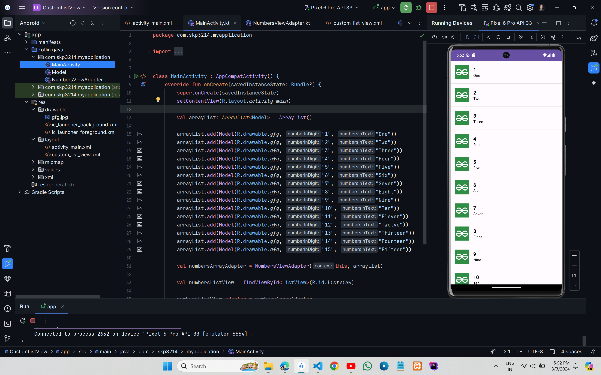

## Custome List Views Using Base Adapter



### XML Code

`activity_main.xml`

```xml
<?xml version="1.0" encoding="utf-8"?>
<ListView
    xmlns:android="http://schemas.android.com/apk/res/android"
    xmlns:tools="http://schemas.android.com/tools"
    android:id="@+id/listView"
    android:layout_width="match_parent"
    android:layout_height="match_parent"
    tools:context=".MainActivity">
</ListView>

```

`custome_list_view.xml`

```xml
<?xml version="1.0" encoding="utf-8"?>
<LinearLayout
    xmlns:android="http://schemas.android.com/apk/res/android"
    xmlns:tools="http://schemas.android.com/tools"
    android:layout_width="match_parent"
    android:layout_height="wrap_content"
    android:orientation="horizontal"
    tools:ignore="UselessParent">

    <ImageView
        android:id="@+id/imageView"
        android:layout_width="84dp"
        android:layout_height="84dp"
        android:padding="16dp"
        tools:ignore="ContentDescription" />

    <LinearLayout
        android:layout_width="match_parent"
        android:layout_height="match_parent"
        android:gravity="center_vertical"
        android:orientation="vertical">

        <TextView
            android:id="@+id/textView1"
            android:layout_width="match_parent"
            android:layout_height="wrap_content"
            android:layout_marginTop="16dp"
            android:gravity="bottom|left"
            android:textColor="@android:color/black"
            android:textSize="18sp"
            android:textStyle="bold"
            tools:ignore="RtlHardcoded" />

        <TextView
            android:id="@+id/textView2"
            android:layout_width="match_parent"
            android:layout_height="wrap_content"
            android:layout_marginBottom="16dp"
            android:gravity="top|left"
            android:textColor="@android:color/black"
            android:textSize="14sp"
            tools:ignore="RtlHardcoded" />

    </LinearLayout>

</LinearLayout>
```

### Kotlin Code

`MainActivity.kt`

```kotlin
import android.os.Bundle
import android.widget.ListView
import androidx.appcompat.app.AppCompatActivity


class MainActivity : AppCompatActivity() {
    override fun onCreate(savedInstanceState: Bundle?) {
        super.onCreate(savedInstanceState)
        setContentView(R.layout.activity_main)

        val arrayList: ArrayList<Model> = ArrayList()

        arrayList.add(Model(R.drawable.gfg, "1", "One"))
        arrayList.add(Model(R.drawable.gfg, "2", "Two"))
        arrayList.add(Model(R.drawable.gfg, "3", "Three"))
        arrayList.add(Model(R.drawable.gfg, "4", "Four"))
        arrayList.add(Model(R.drawable.gfg, "5", "Five"))
        arrayList.add(Model(R.drawable.gfg, "6", "Six"))
        arrayList.add(Model(R.drawable.gfg, "7", "Seven"))
        arrayList.add(Model(R.drawable.gfg, "8", "Eight"))
        arrayList.add(Model(R.drawable.gfg, "9", "Nine"))
        arrayList.add(Model(R.drawable.gfg, "10", "Ten"))
        arrayList.add(Model(R.drawable.gfg, "11", "Eleven"))
        arrayList.add(Model(R.drawable.gfg, "12", "Twelve"))
        arrayList.add(Model(R.drawable.gfg, "13", "Thirteen"))
        arrayList.add(Model(R.drawable.gfg, "14", "Fourteen"))
        arrayList.add(Model(R.drawable.gfg, "15", "Fifteen"))

        val numbersArrayAdapter = NumbersViewAdapter(this, arrayList)

        val numbersListView = findViewById<ListView>(R.id.listView)

        numbersListView.adapter = numbersArrayAdapter
    }
}
```

`Model.kt`

```kt
class Model(val numbersImageId: Int, val numberInDigit: String, val numbersInText: String)
```

`NumbersViewAdapter.kt`

```kt
package com.skp3214.myapplication

import android.content.Context
import android.view.LayoutInflater
import android.view.View
import android.view.ViewGroup
import android.widget.BaseAdapter
import android.widget.ImageView
import android.widget.TextView

class NumbersViewAdapter(context: Context, private val arrayList: ArrayList<Model>) : BaseAdapter() {

    private val inflater: LayoutInflater =LayoutInflater.from(context)

    override fun getCount(): Int {
        return arrayList.size
    }

    override fun getItem(position: Int): Model {
        return arrayList[position]
    }

    override fun getItemId(position: Int): Long {
        return position.toLong()
    }

    override fun getView(position: Int, convertView: View?, parent: ViewGroup): View {
        val view: View = convertView ?: inflater.inflate(R.layout.custom_list_view, parent, false)

        val currentNumberPosition = getItem(position)
        val numbersImage = view.findViewById<ImageView>(R.id.imageView)
        numbersImage.setImageResource(currentNumberPosition.numbersImageId)

        val textView1 = view.findViewById<TextView>(R.id.textView1)
        textView1.text = currentNumberPosition.numberInDigit

        val textView2 = view.findViewById<TextView>(R.id.textView2)
        textView2.text = currentNumberPosition.numbersInText

        return view
    }
}
```