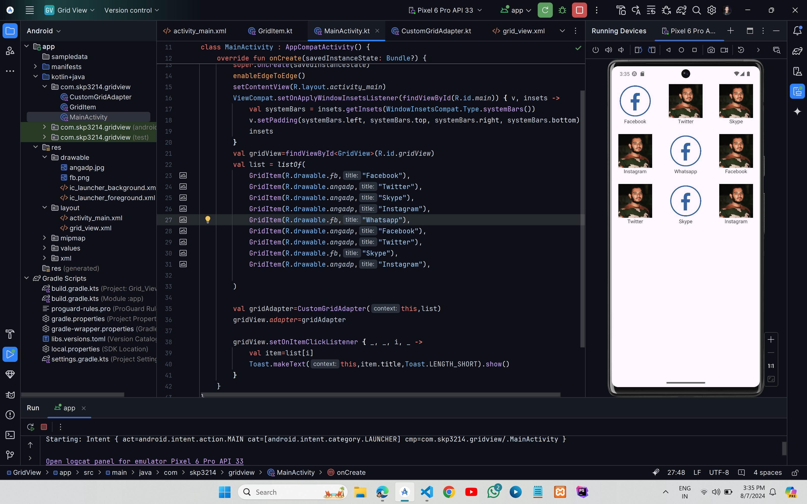

## Custom Grid View Using Base Adapter


### XML Code

### `activity_main.xml`

```xml
<?xml version="1.0" encoding="utf-8"?>
<RelativeLayout xmlns:android="http://schemas.android.com/apk/res/android"
    xmlns:tools="http://schemas.android.com/tools"
    android:id="@+id/main"
    android:layout_width="match_parent"
    android:layout_height="match_parent"
    tools:context=".MainActivity">

    <GridView
        android:id="@+id/gridView"
        android:layout_width="match_parent"
        android:layout_height="match_parent"
        android:numColumns="auto_fit"
        android:columnWidth="100dp"
        android:horizontalSpacing="10dp"
        android:stretchMode="columnWidth"
        android:verticalSpacing="10dp" />

</RelativeLayout>
```

### `grid_view.xml`

```xml
<?xml version="1.0" encoding="utf-8"?>
<LinearLayout xmlns:android="http://schemas.android.com/apk/res/android"
    android:layout_width="match_parent"
    android:layout_height="match_parent"
    android:orientation="vertical"
    android:padding="8dp"
    >

    <ImageView
        android:id="@+id/imageView"
        android:layout_width="96dp"
        android:layout_height="94dp"
        android:layout_gravity="center"
        android:contentDescription="TODO" />

    <TextView
        android:id="@+id/textView"
        android:layout_width="wrap_content"
        android:layout_height="wrap_content"
        android:layout_gravity="center"
        android:text="Item Name" />


</LinearLayout>
```
### Kotlin Code

### `MainActivity.kt`
```kt
import android.os.Bundle
import android.widget.GridView
import android.widget.Toast
import androidx.activity.enableEdgeToEdge
import androidx.appcompat.app.AppCompatActivity
import androidx.core.view.ViewCompat
import androidx.core.view.WindowInsetsCompat

class MainActivity : AppCompatActivity() {
    override fun onCreate(savedInstanceState: Bundle?) {
        super.onCreate(savedInstanceState)
        enableEdgeToEdge()
        setContentView(R.layout.activity_main)
        ViewCompat.setOnApplyWindowInsetsListener(findViewById(R.id.main)) { v, insets ->
            val systemBars = insets.getInsets(WindowInsetsCompat.Type.systemBars())
            v.setPadding(systemBars.left, systemBars.top, systemBars.right, systemBars.bottom)
            insets
        }
        val gridView=findViewById<GridView>(R.id.gridView)
        val list = listOf(
            GridItem(R.drawable.fb,"Facebook"),
            GridItem(R.drawable.angadp,"Twitter"),
            GridItem(R.drawable.angadp,"Skype"),
            GridItem(R.drawable.angadp,"Instagram"),
            GridItem(R.drawable.fb,"Whatsapp"),
            GridItem(R.drawable.angadp,"Facebook"),
            GridItem(R.drawable.angadp,"Twitter"),
            GridItem(R.drawable.fb,"Skype"),
            GridItem(R.drawable.angadp,"Instagram"),

        )

        val gridAdapter=CustomGridAdapter(this,list)
        gridView.adapter=gridAdapter

        gridView.setOnItemClickListener { _, _, i, _ ->
            val item=list[i]
            Toast.makeText(this,item.title,Toast.LENGTH_SHORT).show()
        }
    }
}
```
### `GridItem.kt`
```kt
data class GridItem(val image:Int,val title:String)
```

### `CustomGridAdapter.kt`
```kt
import android.content.Context
import android.view.LayoutInflater
import android.view.View
import android.view.ViewGroup
import android.widget.BaseAdapter
import android.widget.ImageView
import android.widget.TextView

class CustomGridAdapter (private val context:Context, private val items:List<GridItem>):BaseAdapter(){
    override fun getCount(): Int {
        return items.size
    }

    override fun getItem(position: Int): GridItem {
        return items[position]
    }

    override fun getItemId(position: Int): Long {
        return position.toLong()
    }

    override fun getView(position: Int, convertView: View?, parent: ViewGroup?): View? {
        val view=convertView?:LayoutInflater.from(context).inflate(R.layout.grid_view,parent,false)

        val currentNumberPosition=getItem(position)
        val imageView:ImageView=view.findViewById(R.id.imageView)
        imageView.setImageResource(currentNumberPosition.image)

        val title:TextView=view.findViewById(R.id.textView)
        title.text=currentNumberPosition.title

        return view
    }

}