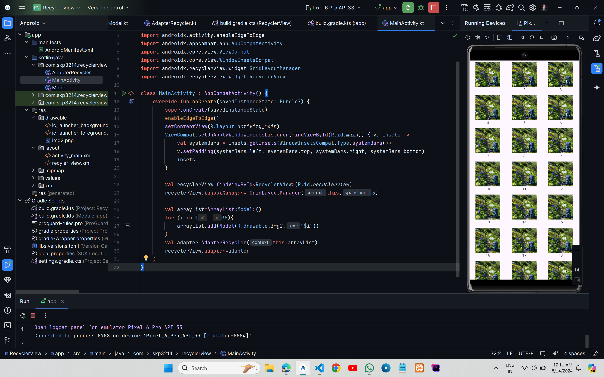

## Recycler View Using GridLayoutManager



## XML CODE

### `activity_main.xml`
```xml
<?xml version="1.0" encoding="utf-8"?>
<RelativeLayout xmlns:android="http://schemas.android.com/apk/res/android"
    xmlns:tools="http://schemas.android.com/tools"
    android:id="@+id/main"
    android:layout_width="match_parent"
    android:layout_height="match_parent"
    tools:context=".MainActivity">

    <androidx.recyclerview.widget.RecyclerView
        android:layout_width="match_parent"
        android:layout_height="match_parent"
        android:id="@+id/recyclerview"/>

</RelativeLayout>
```

### `recycler_view.xml`
```xml
<?xml version="1.0" encoding="utf-8"?>
<LinearLayout xmlns:android="http://schemas.android.com/apk/res/android"
    android:layout_width="match_parent"
    android:layout_height="wrap_content"
    android:orientation="vertical"
    android:padding="6dp">


    <ImageView
        android:id="@+id/imageView"
        android:layout_width="96dp"
        android:layout_height="94dp"
        android:layout_gravity="center"
        android:contentDescription="TODO" />

    <TextView
        android:id="@+id/textView"
        android:layout_width="wrap_content"
        android:layout_height="wrap_content"
        android:layout_gravity="center" />


</LinearLayout>
```

## Kotlin Code

### `MainActivity.kt`
```kt
import android.os.Bundle
import androidx.activity.enableEdgeToEdge
import androidx.appcompat.app.AppCompatActivity
import androidx.core.view.ViewCompat
import androidx.core.view.WindowInsetsCompat
import androidx.recyclerview.widget.GridLayoutManager
import androidx.recyclerview.widget.RecyclerView

class MainActivity : AppCompatActivity() {
    override fun onCreate(savedInstanceState: Bundle?) {
        super.onCreate(savedInstanceState)
        enableEdgeToEdge()
        setContentView(R.layout.activity_main)
        ViewCompat.setOnApplyWindowInsetsListener(findViewById(R.id.main)) { v, insets ->
            val systemBars = insets.getInsets(WindowInsetsCompat.Type.systemBars())
            v.setPadding(systemBars.left, systemBars.top, systemBars.right, systemBars.bottom)
            insets
        }

        val recyclerView=findViewById<RecyclerView>(R.id.recyclerview)
        recyclerView.layoutManager= GridLayoutManager(this,3)

        val arrayList=ArrayList<Model>()
        for (i in 1..35){
            arrayList.add(Model(R.drawable.img2,"$i"))
        }
        val adapter=AdapterRecycler(this,arrayList)
        recyclerView.adapter=adapter
    }
}
```
### `AdapterRecycler.kt`

```kt
import android.content.Context
import android.view.LayoutInflater
import android.view.View
import android.view.ViewGroup
import android.widget.ImageView
import android.widget.TextView
import android.widget.Toast
import androidx.recyclerview.widget.RecyclerView

class AdapterRecycler(private val context:Context, private val arrayList:ArrayList<Model>):RecyclerView.Adapter<AdapterRecycler.MyHolder>(){

    override fun onCreateViewHolder(parent: ViewGroup, viewType: Int): MyHolder {
        val view=LayoutInflater.from(context).inflate(R.layout.recyler_view,parent,false)
        return MyHolder(view)
    }

    override fun onBindViewHolder(holder:MyHolder, position: Int) {
        val item=arrayList[position]
        holder.image.setImageResource(item.image)
        holder.textView.text=item.text
        holder.itemView.setOnClickListener {
            Toast.makeText(context,arrayList[position].text,Toast.LENGTH_SHORT).show()
        }
    }

    override fun getItemCount(): Int {
        return arrayList.size
    }

    class MyHolder(view: View):RecyclerView.ViewHolder(view){
        val image: ImageView = view.findViewById(R.id.imageView)
        val textView: TextView = view.findViewById(R.id.textView)

    }

}
```
### `Model.kt`
```kt
class Model (val image:Int,val text:String)
```

