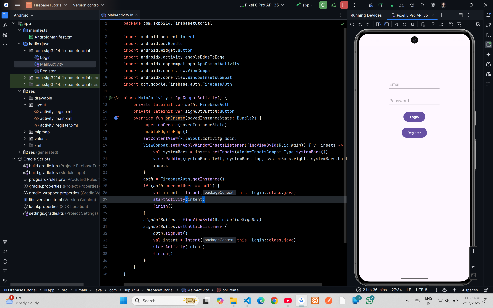
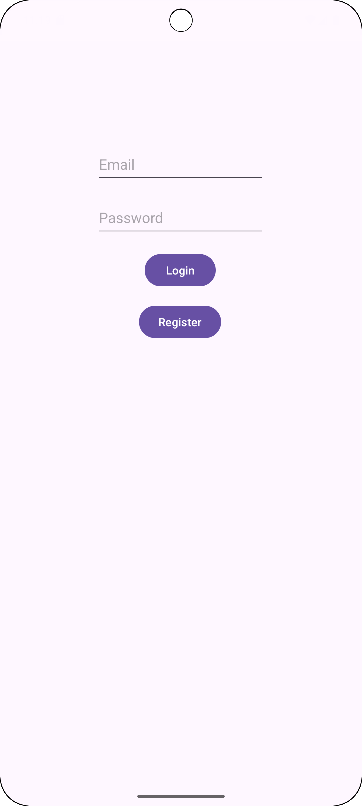
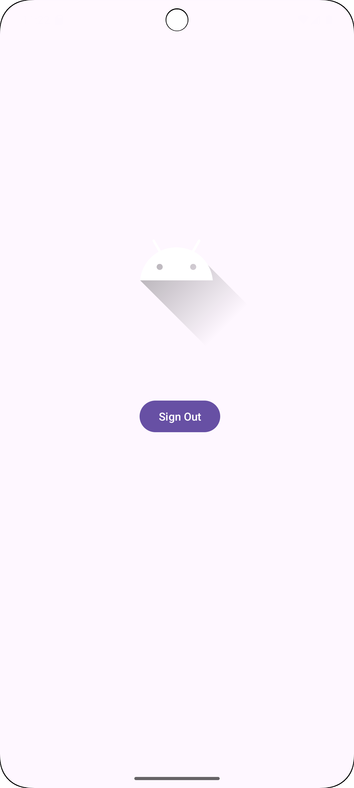

# Firebase Authentication (Email and Password)

## XML Code

### `actvity_main.xml`

```xml
<?xml version="1.0" encoding="utf-8"?>
<androidx.constraintlayout.widget.ConstraintLayout xmlns:android="http://schemas.android.com/apk/res/android"
    xmlns:app="http://schemas.android.com/apk/res-auto"
    xmlns:tools="http://schemas.android.com/tools"
    android:id="@+id/main"
    android:layout_width="match_parent"
    android:layout_height="match_parent"
    tools:context=".MainActivity">

    <ImageView
        android:id="@+id/myImageView"
        android:layout_width="254dp"
        android:layout_height="216dp"
        android:src="@drawable/ic_launcher_foreground"
        app:layout_constraintBottom_toBottomOf="parent"
        app:layout_constraintEnd_toEndOf="parent"
        app:layout_constraintHorizontal_bias="0.496"
        app:layout_constraintStart_toStartOf="parent"
        app:layout_constraintTop_toTopOf="parent"
        app:layout_constraintVertical_bias="0.25" />

    <Button
        android:id="@+id/buttonSignOut"
        android:layout_width="wrap_content"
        android:layout_height="wrap_content"
        android:layout_marginTop="60dp"
        android:text="Sign Out"
        app:layout_constraintEnd_toEndOf="parent"
        app:layout_constraintHorizontal_bias="0.511"
        app:layout_constraintStart_toStartOf="parent"
        app:layout_constraintTop_toBottomOf="@id/myImageView" />


</androidx.constraintlayout.widget.ConstraintLayout>
```
### `activity_login.xml`

```xml
<?xml version="1.0" encoding="utf-8"?>
<androidx.constraintlayout.widget.ConstraintLayout xmlns:android="http://schemas.android.com/apk/res/android"
    xmlns:app="http://schemas.android.com/apk/res-auto"
    xmlns:tools="http://schemas.android.com/tools"
    android:id="@+id/main"
    android:layout_width="match_parent"
    android:layout_height="match_parent"
    tools:context=".Login">

    <EditText
        android:id="@+id/editTextEmail"
        android:layout_width="wrap_content"
        android:layout_height="50dp"
        android:layout_marginTop="128dp"
        android:ems="10"
        android:hint="Email"
        android:inputType="textEmailAddress"
        app:layout_constraintEnd_toEndOf="parent"
        app:layout_constraintHorizontal_bias="0.497"
        app:layout_constraintStart_toStartOf="parent"
        app:layout_constraintTop_toTopOf="parent" />

    <EditText
        android:id="@+id/editTextPassword"
        android:layout_width="wrap_content"
        android:layout_height="50dp"
        android:layout_marginTop="16dp"
        android:ems="10"
        android:hint="Password"
        android:inputType="textPassword"
        app:layout_constraintEnd_toEndOf="parent"
        app:layout_constraintHorizontal_bias="0.497"
        app:layout_constraintStart_toStartOf="parent"
        app:layout_constraintTop_toBottomOf="@+id/editTextEmail" />

    <Button
        android:id="@+id/buttonLogin"
        android:layout_width="wrap_content"
        android:layout_height="wrap_content"
        android:layout_marginTop="16dp"
        android:text="Login"
        app:layout_constraintEnd_toEndOf="parent"
        app:layout_constraintHorizontal_bias="0.497"
        app:layout_constraintStart_toStartOf="parent"
        app:layout_constraintTop_toBottomOf="@+id/editTextPassword" />

    <Button
        android:id="@+id/buttonRegisterLogin"
        android:layout_width="wrap_content"
        android:layout_height="wrap_content"
        android:layout_marginTop="16dp"
        android:text="Register"
        app:layout_constraintEnd_toEndOf="parent"
        app:layout_constraintHorizontal_bias="0.497"
        app:layout_constraintStart_toStartOf="parent"
        app:layout_constraintTop_toBottomOf="@+id/buttonLogin" />

</androidx.constraintlayout.widget.ConstraintLayout>
```
### `activity_register.xml`

```xml
<?xml version="1.0" encoding="utf-8"?>
<androidx.constraintlayout.widget.ConstraintLayout xmlns:android="http://schemas.android.com/apk/res/android"
    xmlns:app="http://schemas.android.com/apk/res-auto"
    xmlns:tools="http://schemas.android.com/tools"
    android:id="@+id/main"
    android:layout_width="match_parent"
    android:layout_height="match_parent"
    tools:context=".Login">

    <EditText
        android:id="@+id/editTextEmailRegister"
        android:layout_width="wrap_content"
        android:layout_height="50dp"
        android:layout_marginTop="128dp"
        android:ems="10"
        android:hint="Email"
        android:inputType="textEmailAddress"
        app:layout_constraintEnd_toEndOf="parent"
        app:layout_constraintHorizontal_bias="0.497"
        app:layout_constraintStart_toStartOf="parent"
        app:layout_constraintTop_toTopOf="parent" />

    <EditText
        android:id="@+id/editTextPasswordRegister"
        android:layout_width="wrap_content"
        android:layout_height="50dp"
        android:layout_marginTop="16dp"
        android:ems="10"
        android:hint="Password"
        android:inputType="textPassword"
        app:layout_constraintEnd_toEndOf="parent"
        app:layout_constraintHorizontal_bias="0.497"
        app:layout_constraintStart_toStartOf="parent"
        app:layout_constraintTop_toBottomOf="@+id/editTextEmailRegister" />


    <Button
        android:id="@+id/buttonRegister"
        android:layout_width="wrap_content"
        android:layout_height="wrap_content"
        android:layout_marginTop="16dp"
        android:text="Register"
        app:layout_constraintEnd_toEndOf="parent"
        app:layout_constraintHorizontal_bias="0.497"
        app:layout_constraintStart_toStartOf="parent"
        app:layout_constraintTop_toBottomOf="@+id/editTextPasswordRegister" />

</androidx.constraintlayout.widget.ConstraintLayout>
```

## Kotlin Code

### `MainActivity.kt`

```kt
package com.skp3214.firebasetutorial

import android.content.Intent
import android.os.Bundle
import android.widget.Button
import androidx.activity.enableEdgeToEdge
import androidx.appcompat.app.AppCompatActivity
import androidx.core.view.ViewCompat
import androidx.core.view.WindowInsetsCompat
import com.google.firebase.auth.FirebaseAuth

class MainActivity : AppCompatActivity() {
    private lateinit var auth: FirebaseAuth
    private lateinit var signOutButton:Button
    override fun onCreate(savedInstanceState: Bundle?) {
        super.onCreate(savedInstanceState)
        enableEdgeToEdge()
        setContentView(R.layout.activity_main)
        ViewCompat.setOnApplyWindowInsetsListener(findViewById(R.id.main)) { v, insets ->
            val systemBars = insets.getInsets(WindowInsetsCompat.Type.systemBars())
            v.setPadding(systemBars.left, systemBars.top, systemBars.right, systemBars.bottom)
            insets
        }
        auth = FirebaseAuth.getInstance()
        if (auth.currentUser == null) {
            val intent = Intent(this, Login::class.java)
            startActivity(intent)
            finish()
        }
        signOutButton = findViewById(R.id.buttonSignOut)
        signOutButton.setOnClickListener {
            auth.signOut()
            val intent = Intent(this, Login::class.java)
            startActivity(intent)
            finish()
        }
    }
}
```

### `Login.kt`

```kt
package com.skp3214.firebasetutorial

import android.content.Intent
import android.os.Bundle
import android.widget.Button
import android.widget.EditText
import android.widget.Toast
import androidx.activity.enableEdgeToEdge
import androidx.appcompat.app.AppCompatActivity
import androidx.core.view.ViewCompat
import androidx.core.view.WindowInsetsCompat
import com.google.firebase.auth.FirebaseAuth

class Login : AppCompatActivity() {
    private lateinit var auth: FirebaseAuth
    private lateinit var emailEditText: EditText
    private lateinit var passwordEditText: EditText
    private lateinit var loginButton: Button
    private lateinit var registerButton: Button

    override fun onCreate(savedInstanceState: Bundle?) {
        super.onCreate(savedInstanceState)
        enableEdgeToEdge()
        setContentView(R.layout.activity_login)
        ViewCompat.setOnApplyWindowInsetsListener(findViewById(R.id.main)) { v, insets ->
            val systemBars = insets.getInsets(WindowInsetsCompat.Type.systemBars())
            v.setPadding(systemBars.left, systemBars.top, systemBars.right, systemBars.bottom)
            insets
        }
        auth = FirebaseAuth.getInstance()
        emailEditText = findViewById(R.id.editTextEmail)
        passwordEditText = findViewById(R.id.editTextPassword)
        loginButton = findViewById(R.id.buttonLogin)
        loginButton.setOnClickListener {
            val email = emailEditText.text.toString()
            val password = passwordEditText.text.toString()
            auth.signInWithEmailAndPassword(email, password)
                .addOnCompleteListener(this) { task ->
                    if (task.isSuccessful) {
                        val intent = Intent(this, MainActivity::class.java)
                        startActivity(intent)

                    } else {
                        Toast.makeText(baseContext, "Authentication failed.", Toast.LENGTH_SHORT).show()
                    }
                }
        }
        registerButton = findViewById(R.id.buttonRegisterLogin)
        registerButton.setOnClickListener {
            val intent = Intent(this, Register::class.java)
            startActivity(intent)
        }
    }
}
```

### `Register.kt`

```kt
package com.skp3214.firebasetutorial

import android.content.Intent
import android.os.Bundle
import android.widget.Button
import android.widget.EditText
import android.widget.Toast
import androidx.activity.enableEdgeToEdge
import androidx.appcompat.app.AppCompatActivity
import androidx.core.view.ViewCompat
import androidx.core.view.WindowInsetsCompat
import com.google.firebase.auth.FirebaseAuth

class Register : AppCompatActivity() {
    private lateinit var auth: FirebaseAuth
    private lateinit var emailEditText: EditText
    private lateinit var passwordEditText: EditText
    private lateinit var registerButton: Button

    override fun onCreate(savedInstanceState: Bundle?) {
        super.onCreate(savedInstanceState)
        enableEdgeToEdge()
        setContentView(R.layout.activity_register)
        ViewCompat.setOnApplyWindowInsetsListener(findViewById(R.id.main)) { v, insets ->
            val systemBars = insets.getInsets(WindowInsetsCompat.Type.systemBars())
            v.setPadding(systemBars.left, systemBars.top, systemBars.right, systemBars.bottom)
            insets
        }
        auth = FirebaseAuth.getInstance()
        emailEditText = findViewById(R.id.editTextEmailRegister)
        passwordEditText = findViewById(R.id.editTextPasswordRegister)
        registerButton = findViewById(R.id.buttonRegister)
        registerButton.setOnClickListener {
            val email = emailEditText.text.toString()
            val password = passwordEditText.text.toString()
            if(email.isEmpty() || password.isEmpty()){
                Toast.makeText(baseContext, "Email or Password is empty", Toast.LENGTH_SHORT).show()
                return@setOnClickListener
            }
            auth.createUserWithEmailAndPassword(email, password)
                .addOnCompleteListener(this) { task ->
                    if (task.isSuccessful) {
                        val intent = Intent(this, MainActivity::class.java)
                        startActivity(intent)
                    } else {
                        Toast.makeText(baseContext, "Authentication failed.", Toast.LENGTH_SHORT).show()
                    }
                }
        }

    }
}
```




