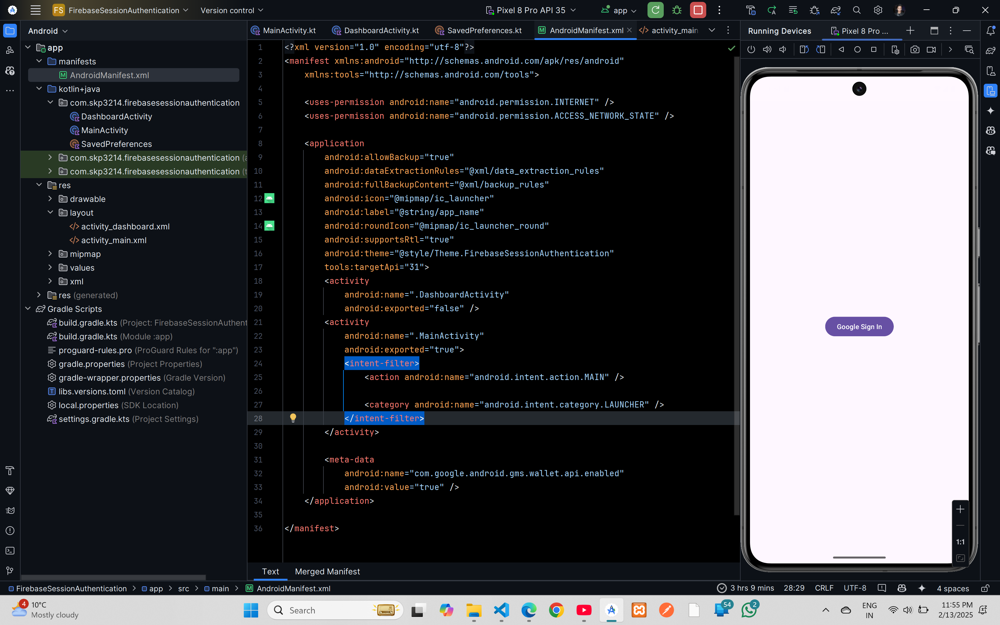

# Firebase Google Authentication



## XML Code

### `AndroidManifest.xml`

```xml
<?xml version="1.0" encoding="utf-8"?>
<manifest xmlns:android="http://schemas.android.com/apk/res/android"
    xmlns:tools="http://schemas.android.com/tools">

    <uses-permission android:name="android.permission.INTERNET" />
    <uses-permission android:name="android.permission.ACCESS_NETWORK_STATE" />

    <application
        android:allowBackup="true"
        android:dataExtractionRules="@xml/data_extraction_rules"
        android:fullBackupContent="@xml/backup_rules"
        android:icon="@mipmap/ic_launcher"
        android:label="@string/app_name"
        android:roundIcon="@mipmap/ic_launcher_round"
        android:supportsRtl="true"
        android:theme="@style/Theme.FirebaseSessionAuthentication"
        tools:targetApi="31">
        <activity
            android:name=".DashboardActivity"
            android:exported="false" />
        <activity
            android:name=".MainActivity"
            android:exported="true">
            <intent-filter>
                <action android:name="android.intent.action.MAIN" />

                <category android:name="android.intent.category.LAUNCHER" />
            </intent-filter>
        </activity>

        <meta-data
            android:name="com.google.android.gms.wallet.api.enabled"
            android:value="true" />
    </application>

</manifest>
```

### `activity_main.xml`

```xml
<?xml version="1.0" encoding="utf-8"?>
<androidx.constraintlayout.widget.ConstraintLayout xmlns:android="http://schemas.android.com/apk/res/android"
    xmlns:app="http://schemas.android.com/apk/res-auto"
    xmlns:tools="http://schemas.android.com/tools"
    android:id="@+id/main"
    android:layout_width="match_parent"
    android:layout_height="match_parent"
    tools:context=".MainActivity">


    <Button
        android:id="@+id/googleSignInButton"
        android:layout_width="wrap_content"
        android:layout_height="wrap_content"
        android:text="Google Sign In"
        app:layout_constraintBottom_toBottomOf="parent"
        app:layout_constraintEnd_toEndOf="parent"
        app:layout_constraintStart_toStartOf="parent"
        app:layout_constraintTop_toTopOf="parent" />
</androidx.constraintlayout.widget.ConstraintLayout>
```
### `activity_dashboard.xml`

```xml
<?xml version="1.0" encoding="utf-8"?>
<androidx.constraintlayout.widget.ConstraintLayout xmlns:android="http://schemas.android.com/apk/res/android"
    xmlns:app="http://schemas.android.com/apk/res-auto"
    xmlns:tools="http://schemas.android.com/tools"
    android:id="@+id/main"
    android:layout_width="match_parent"
    android:layout_height="match_parent"
    tools:context=".DashboardActivity">

    <ImageView
        android:id="@+id/imageView"
        android:layout_width="wrap_content"
        android:layout_height="wrap_content"
        app:layout_constraintStart_toStartOf="parent"
        app:layout_constraintTop_toTopOf="parent"
        app:layout_constraintEnd_toEndOf="parent"
        app:layout_constraintBottom_toTopOf="@+id/textView"
        tools:srcCompat="@tools:sample/avatars" />

    <TextView
        android:id="@+id/textView"
        android:layout_width="200dp"
        android:layout_height="50dp"
        android:text="Username"
        app:layout_constraintStart_toStartOf="parent"
        app:layout_constraintTop_toBottomOf="@+id/imageView"
        app:layout_constraintEnd_toEndOf="parent"
        app:layout_constraintBottom_toTopOf="@+id/textView2" />

    <TextView
        android:id="@+id/textView2"
        android:layout_width="200dp"
        android:layout_height="50dp"
        android:text="Email"
        app:layout_constraintStart_toStartOf="parent"
        app:layout_constraintTop_toBottomOf="@+id/textView"
        app:layout_constraintEnd_toEndOf="parent"
        app:layout_constraintBottom_toTopOf="@+id/logout" />

    <Button
        android:id="@+id/logout"
        android:layout_width="wrap_content"
        android:layout_height="wrap_content"
        android:text="Logout"
        app:layout_constraintStart_toStartOf="parent"
        app:layout_constraintTop_toBottomOf="@+id/textView2"
        app:layout_constraintEnd_toEndOf="parent"
        app:layout_constraintBottom_toBottomOf="parent" />
</androidx.constraintlayout.widget.ConstraintLayout>
```

## Kotlin Code

### `MainActivity.kt`

```kt
package com.skp3214.firebasesessionauthentication

import android.content.Intent
import android.os.Bundle
import android.widget.Button
import android.widget.Toast
import androidx.activity.enableEdgeToEdge
import androidx.activity.result.contract.ActivityResultContracts
import androidx.appcompat.app.AppCompatActivity
import androidx.core.view.ViewCompat
import androidx.core.view.WindowInsetsCompat
import com.google.android.gms.auth.api.signin.GoogleSignIn
import com.google.android.gms.auth.api.signin.GoogleSignInAccount
import com.google.android.gms.auth.api.signin.GoogleSignInClient
import com.google.android.gms.auth.api.signin.GoogleSignInOptions
import com.google.android.gms.tasks.Task
import com.google.firebase.FirebaseApp
import com.google.firebase.auth.FirebaseAuth
import com.google.android.gms.common.api.ApiException
import com.google.firebase.auth.GoogleAuthProvider


class MainActivity : AppCompatActivity() {
    private lateinit var mGoogleSignInClient: GoogleSignInClient
    private lateinit var firebaseAuth: FirebaseAuth
    override fun onCreate(savedInstanceState: Bundle?) {
        super.onCreate(savedInstanceState)
        enableEdgeToEdge()
        setContentView(R.layout.activity_main)
        ViewCompat.setOnApplyWindowInsetsListener(findViewById(R.id.main)) { v, insets ->
            val systemBars = insets.getInsets(WindowInsetsCompat.Type.systemBars())
            v.setPadding(systemBars.left, systemBars.top, systemBars.right, systemBars.bottom)
            insets
        }
        FirebaseApp.initializeApp(this)
        val gso= GoogleSignInOptions.Builder(GoogleSignInOptions.DEFAULT_SIGN_IN)
            .requestIdToken("put client_id")
            .requestEmail()
            .build()

        mGoogleSignInClient=GoogleSignIn.getClient(this,gso)
        firebaseAuth= FirebaseAuth.getInstance()
        val signInButton=findViewById<Button>(R.id.googleSignInButton)
        signInButton.setOnClickListener {
            Toast.makeText(this,"Logging In", Toast.LENGTH_SHORT).show()
            googleSignIn()
        }
    }

    private fun googleSignIn(){
        val signInIntent=mGoogleSignInClient.signInIntent
        signInLauncher.launch(signInIntent)
    }

    private val signInLauncher = registerForActivityResult(ActivityResultContracts
        .StartActivityForResult()) { result ->
        val data = result.data
        if (result.resultCode == RESULT_OK && data != null) {
            val task: Task<GoogleSignInAccount> =
                GoogleSignIn.getSignedInAccountFromIntent(data)
            handleResult(task)
        } else {
            Toast.makeText(this, "Google Sign-In failed",
                Toast.LENGTH_SHORT).show()
        }
    }
    private fun handleResult(completedTask: Task<GoogleSignInAccount>) {
        try {
            completedTask.getResult(ApiException::class.java)?.let { account ->
                updateUI(account)
            }
        } catch (e: ApiException) {
            Toast.makeText(this, "Sign-in failed: ${e.localizedMessage}",
                Toast.LENGTH_SHORT).show()
        }
    }
    // this is where we update the UI after Google signin takes place
    private fun updateUI(account: GoogleSignInAccount) {
        val credential = GoogleAuthProvider.getCredential(account.idToken, null)
        firebaseAuth.signInWithCredential(credential).addOnCompleteListener { task ->
            if (task.isSuccessful) {
                SavedPreferences.setEmail(this, account.email.toString())
                SavedPreferences.setName(this, account.displayName.toString())
                SavedPreferences.setProfile(this, account.photoUrl.toString())
                val intent = Intent(this, DashboardActivity::class.java)
                startActivity(intent)
                finish()
            }
        }
    }
    override fun onStart() {
        super.onStart()
        if (GoogleSignIn.getLastSignedInAccount(this) != null) {
            startActivity(
                Intent(
                    this, DashboardActivity::class.java
                )
            )
            finish()
        }
    }

}
```
### `DashboardActivity.kt`

```kt
package com.skp3214.firebasesessionauthentication
import android.content.Intent
import android.os.Bundle
import android.widget.Button
import android.widget.ImageView
import android.widget.TextView
import android.widget.Toast
import androidx.appcompat.app.AppCompatActivity
import com.bumptech.glide.Glide
import com.google.android.gms.auth.api.signin.GoogleSignIn
import com.google.android.gms.auth.api.signin.GoogleSignInClient
import com.google.android.gms.auth.api.signin.GoogleSignInOptions

class DashboardActivity : AppCompatActivity() {
    // declare the GoogleSignInClient
    lateinit var mGoogleSignInClient: GoogleSignInClient
    override fun onCreate(savedInstanceState: Bundle?) {
        super.onCreate(savedInstanceState)
        setContentView(R.layout.activity_dashboard)
        // Set retrieved data to TextViews
        val tvUsername = findViewById<TextView>(R.id.textView)
        val tvEmail = findViewById<TextView>(R.id.textView2)
        tvUsername.text = "Username: ${SavedPreferences.getName(this)}"
        tvEmail.text = "Email: ${SavedPreferences.getEmail(this)}"
        val profilePicUrl = SavedPreferences.getProfile(this)
        val profileImageView = findViewById<ImageView>(R.id.imageView)
        Glide.with(this)
            .load(profilePicUrl)
            .placeholder(R.drawable.ic_launcher_background) // Show default image if null
            .into(profileImageView)
        // call requestIdToken as follows
        val gso = GoogleSignInOptions.Builder(GoogleSignInOptions.DEFAULT_SIGN_IN)
            .requestIdToken("put client_id")
            .requestEmail()
            .build()
        mGoogleSignInClient = GoogleSignIn.getClient(this, gso)
        val logout = findViewById<Button>(R.id.logout)
        logout.setOnClickListener {
            mGoogleSignInClient.signOut().addOnCompleteListener {
                val intent = Intent(this, MainActivity::class.java)
                Toast.makeText(this, "Logging Out", Toast.LENGTH_SHORT).show()
                startActivity(intent)
                finish()
            }
        }
    }
}
```

### `SavedPreferences.kt`

```kt
package com.skp3214.firebasesessionauthentication

import android.content.Context
import android.content.SharedPreferences

object SavedPreferences {
    const val PREF_NAME = "user_pref"
    const val PREF_EMAIL = "email"
    const val PREF_NAME_USER = "username"
    const val PREF_PROFILE = "profile_pic"

    private fun getSharedPreference(context: Context): SharedPreferences {
        return context.getSharedPreferences(PREF_NAME, Context.MODE_PRIVATE)
    }
    fun setEmail(context: Context, email: String) {
        getSharedPreference(context).edit().putString(PREF_EMAIL, email).apply()
    }
    fun getEmail(context: Context): String? {
        return getSharedPreference(context).getString(PREF_EMAIL, "")
    }
    fun setName(context: Context, name: String) {
        getSharedPreference(context).edit().putString(PREF_NAME_USER, name).apply()
    }
    fun getName(context: Context): String? {
        return getSharedPreference(context).getString(PREF_NAME_USER, "")
    }
    fun setProfile(context: Context, profile: String) {
        getSharedPreference(context).edit().putString(PREF_PROFILE, profile).apply()
    }
    fun getProfile(context: Context): String? {
        return getSharedPreference(context).getString(PREF_PROFILE, "")
    }
    fun clear(context: Context) {
        getSharedPreference(context).edit().clear().apply()
    }

}
```