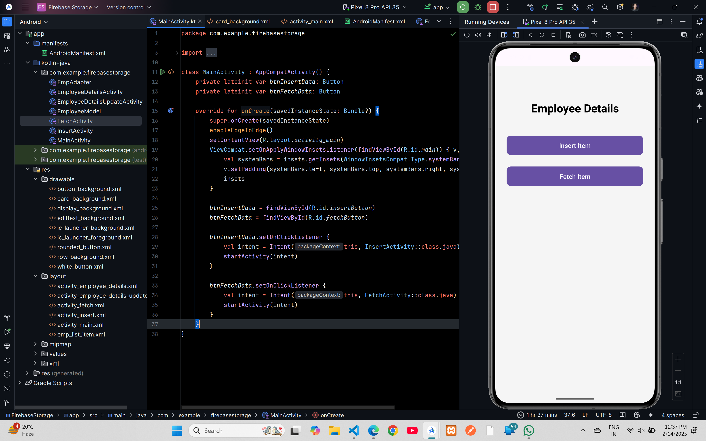

# Firebase Storage (Realtime Database)


## XML Code

### `activity_main.xml`
```xml
<?xml version="1.0" encoding="utf-8"?>
<androidx.constraintlayout.widget.ConstraintLayout
    xmlns:android="http://schemas.android.com/apk/res/android"
    xmlns:app="http://schemas.android.com/apk/res-auto"
    xmlns:tools="http://schemas.android.com/tools"
    android:id="@+id/main"
    android:layout_width="match_parent"
    android:layout_height="match_parent"
    android:background="@color/background_color"
    tools:context=".MainActivity">

    <TextView
        android:id="@+id/employeeDetails"
        android:layout_width="wrap_content"
        android:layout_height="wrap_content"
        android:layout_marginTop="96dp"
        android:text="Employee Details"
        android:textColor="@color/black"
        android:textSize="32sp"
        android:textStyle="bold"
        app:layout_constraintEnd_toEndOf="parent"
        app:layout_constraintStart_toStartOf="parent"
        app:layout_constraintTop_toTopOf="parent" />

    <Button
        android:id="@+id/insertButton"
        android:layout_width="0dp"
        android:layout_height="55dp"
        android:layout_marginStart="32dp"
        android:layout_marginTop="56dp"
        android:layout_marginEnd="32dp"
        android:background="@drawable/rounded_button"
        android:elevation="4dp"
        android:text="Insert Item"
        android:textColor="@android:color/white"
        android:textSize="18sp"
        app:layout_constraintEnd_toEndOf="parent"
        app:layout_constraintHorizontal_bias="1.0"
        app:layout_constraintStart_toStartOf="parent"
        app:layout_constraintTop_toBottomOf="@id/employeeDetails" />

    <Button
        android:id="@+id/fetchButton"
        android:layout_width="0dp"
        android:layout_height="55dp"
        android:layout_marginStart="32dp"
        android:layout_marginTop="32dp"
        android:layout_marginEnd="32dp"
        android:background="@drawable/rounded_button"
        android:elevation="4dp"
        android:text="Fetch Item"
        android:textColor="@android:color/white"
        android:textSize="18sp"
        app:layout_constraintEnd_toEndOf="parent"
        app:layout_constraintStart_toStartOf="parent"
        app:layout_constraintTop_toBottomOf="@id/insertButton" />

</androidx.constraintlayout.widget.ConstraintLayout>
```
### `activity_fetch.xml`
```xml
<?xml version="1.0" encoding="utf-8"?>
<androidx.constraintlayout.widget.ConstraintLayout xmlns:android="http://schemas.android.com/apk/res/android"
    xmlns:app="http://schemas.android.com/apk/res-auto"
    xmlns:tools="http://schemas.android.com/tools"
    android:id="@+id/main"
    android:layout_width="match_parent"
    android:layout_height="match_parent"
    tools:context=".FetchActivity">

    <androidx.recyclerview.widget.RecyclerView
        android:id="@+id/rvEmp"
        android:layout_width="match_parent"
        android:layout_height="match_parent"
        android:layout_marginStart="1dp"
        android:layout_marginTop="1dp"
        android:layout_marginEnd="1dp"
        android:layout_marginBottom="1dp"
        app:layout_constraintBottom_toBottomOf="parent"
        app:layout_constraintEnd_toEndOf="parent"
        app:layout_constraintStart_toStartOf="parent"
        app:layout_constraintTop_toTopOf="parent"
        tools:listitem="@layout/emp_list_item" />

    <TextView
        android:id="@+id/tvLoadingData"
        android:layout_width="wrap_content"
        android:layout_height="wrap_content"
        android:text="Loading Data....."
        android:textColor="@color/black"
        android:textSize="28sp"
        android:textStyle="bold"
        android:visibility="gone"
        app:layout_constraintBottom_toBottomOf="parent"
        app:layout_constraintEnd_toEndOf="parent"
        app:layout_constraintStart_toStartOf="parent"
        app:layout_constraintTop_toTopOf="parent" />

</androidx.constraintlayout.widget.ConstraintLayout>
```

### `activity_employee_details.xml`

```xml
<?xml version="1.0" encoding="utf-8"?>
<androidx.constraintlayout.widget.ConstraintLayout
    xmlns:android="http://schemas.android.com/apk/res/android"
    xmlns:app="http://schemas.android.com/apk/res-auto"
    xmlns:tools="http://schemas.android.com/tools"
    android:id="@+id/main"
    android:layout_width="match_parent"
    android:layout_height="match_parent"
    android:padding="16dp"
    tools:context=".EmployeeDetailsActivity">

    <!-- Employee Details Container -->
    <LinearLayout
        android:id="@+id/linearLayout"
        android:layout_width="0dp"
        android:layout_height="wrap_content"
        android:layout_marginTop="12dp"
        android:background="@drawable/card_background"
        android:orientation="vertical"
        android:padding="16dp"
        app:layout_constraintEnd_toEndOf="parent"
        app:layout_constraintStart_toStartOf="parent"
        app:layout_constraintTop_toTopOf="parent">

        <!-- Employee ID -->
        <LinearLayout
            android:layout_width="match_parent"
            android:layout_height="wrap_content"
            android:orientation="horizontal"
            android:padding="8dp">

            <TextView
                android:layout_width="0dp"
                android:layout_height="wrap_content"
                android:layout_weight="1"
                android:gravity="center"
                android:padding="8dp"
                android:text="Emp ID"
                android:textColor="@android:color/white"
                android:textSize="16sp" />

            <TextView
                android:id="@+id/tvEmpId"
                android:layout_width="0dp"
                android:layout_height="wrap_content"
                android:layout_weight="1"
                android:gravity="center"
                android:padding="8dp"
                android:text=""
                android:textColor="@color/black"
                android:textSize="16sp" />
        </LinearLayout>

        <!-- Employee Name -->
        <LinearLayout
            android:layout_width="match_parent"
            android:layout_height="wrap_content"
            android:orientation="horizontal"
            android:padding="8dp">

            <TextView
                android:layout_width="0dp"
                android:layout_height="wrap_content"
                android:layout_weight="1"
                android:gravity="center"
                android:padding="8dp"
                android:text="Emp Name"
                android:textColor="@android:color/white"
                android:textSize="16sp" />

            <TextView
                android:id="@+id/tvEmpName"
                android:layout_width="0dp"
                android:layout_height="wrap_content"
                android:layout_weight="1"
                android:gravity="center"
                android:padding="8dp"
                android:text=""
                android:textColor="@color/black"
                android:textSize="16sp" />
        </LinearLayout>

        <!-- Employee Age -->
        <LinearLayout
            android:layout_width="match_parent"
            android:layout_height="wrap_content"
            android:orientation="horizontal"
            android:padding="8dp">

            <TextView
                android:layout_width="0dp"
                android:layout_height="wrap_content"
                android:layout_weight="1"
                android:gravity="center"
                android:padding="8dp"
                android:text="Emp Age"
                android:textColor="@android:color/white"
                android:textSize="16sp" />

            <TextView
                android:id="@+id/tvEmpAge"
                android:layout_width="0dp"
                android:layout_height="wrap_content"
                android:layout_weight="1"
                android:gravity="center"
                android:padding="8dp"
                android:text=""
                android:textColor="@color/black"
                android:textSize="16sp" />
        </LinearLayout>

        <!-- Employee Salary -->
        <LinearLayout
            android:layout_width="match_parent"
            android:layout_height="wrap_content"
            android:orientation="horizontal"
            android:padding="8dp">

            <TextView
                android:layout_width="0dp"
                android:layout_height="wrap_content"
                android:layout_weight="1"
                android:gravity="center"
                android:padding="8dp"
                android:text="Emp Salary"
                android:textColor="@android:color/white"
                android:textSize="16sp" />

            <TextView
                android:id="@+id/tvEmpSalary"
                android:layout_width="0dp"
                android:layout_height="wrap_content"
                android:layout_weight="1"
                android:gravity="center"
                android:padding="8dp"
                android:text=""
                android:textColor="@color/black"
                android:textSize="16sp" />
        </LinearLayout>
    </LinearLayout>

    <!-- Buttons Section -->
    <LinearLayout
        android:layout_width="0dp"
        android:layout_height="wrap_content"
        android:layout_marginStart="16dp"
        android:layout_marginTop="24dp"
        android:layout_marginEnd="16dp"
        android:gravity="center"
        android:orientation="horizontal"
        app:layout_constraintEnd_toEndOf="parent"
        app:layout_constraintStart_toStartOf="parent"
        app:layout_constraintTop_toBottomOf="@id/linearLayout">

        <Button
            android:id="@+id/btnUpdate"
            android:layout_width="0dp"
            android:layout_height="50dp"
            android:layout_marginEnd="8dp"
            android:layout_weight="1"
            android:background="@drawable/button_background"
            android:elevation="4dp"
            android:text="Update"
            android:textColor="@android:color/white"
            android:textSize="16sp" />

        <Button
            android:id="@+id/btnDelete"
            android:layout_width="0dp"
            android:layout_height="50dp"
            android:layout_marginStart="8dp"
            android:layout_weight="1"
            android:background="@drawable/button_background"
            android:elevation="4dp"
            android:text="Delete"
            android:textColor="@android:color/white"
            android:textSize="16sp" />
    </LinearLayout>

</androidx.constraintlayout.widget.ConstraintLayout>
```

### `activity_employee_details_update.xml`

```xml
<?xml version="1.0" encoding="utf-8"?>
<androidx.constraintlayout.widget.ConstraintLayout xmlns:android="http://schemas.android.com/apk/res/android"
    xmlns:app="http://schemas.android.com/apk/res-auto"
    xmlns:tools="http://schemas.android.com/tools"
    android:id="@+id/main"
    android:layout_width="match_parent"
    android:layout_height="match_parent"
    android:padding="20dp"
    android:background="@color/background_color"
    tools:context=".EmployeeDetailsUpdateActivity">

    <LinearLayout
        android:id="@+id/linearLayout"
        android:layout_width="match_parent"
        android:layout_height="wrap_content"
        android:layout_marginTop="12dp"
        android:orientation="vertical"
        android:padding="10dp"
        app:layout_constraintEnd_toEndOf="parent"
        app:layout_constraintStart_toStartOf="parent"
        app:layout_constraintTop_toTopOf="parent">

        <!-- Employee ID -->
        <LinearLayout
            android:layout_width="match_parent"
            android:layout_height="wrap_content"
            android:layout_marginBottom="10dp"
            android:background="@color/border_color"
            android:orientation="horizontal"
            android:padding="8dp">

            <TextView
                android:layout_width="0dp"
                android:layout_height="wrap_content"
                android:layout_weight="1"
                android:gravity="center_vertical"
                android:text="Emp ID:"
                android:textColor="@color/text_color"
                android:textSize="16sp" />

            <TextView
                android:id="@+id/tvEmpId"
                android:layout_width="0dp"
                android:layout_height="wrap_content"
                android:layout_weight="1"
                android:gravity="center_vertical"
                android:textColor="@color/text_color"
                android:textSize="16sp" />
        </LinearLayout>

        <!-- Employee Name -->
        <LinearLayout
            android:layout_width="match_parent"
            android:layout_height="wrap_content"
            android:layout_marginBottom="10dp"
            android:background="@color/border_color"
            android:orientation="horizontal"
            android:padding="8dp">

            <TextView
                android:layout_width="0dp"
                android:layout_height="wrap_content"
                android:layout_weight="1"
                android:gravity="center_vertical"
                android:text="Emp Name:"
                android:textColor="@color/text_color"
                android:textSize="16sp" />

            <EditText
                android:id="@+id/tvEmpName"
                android:layout_width="0dp"
                android:layout_height="wrap_content"
                android:layout_weight="1"
                android:background="@null"
                android:gravity="center_vertical"
                android:hint="Enter Name"
                android:padding="5dp"
                android:textColor="@color/text_color"
                android:textSize="16sp" />
        </LinearLayout>

        <!-- Employee Age -->
        <LinearLayout
            android:layout_width="match_parent"
            android:layout_height="wrap_content"
            android:layout_marginBottom="10dp"
            android:background="@color/border_color"
            android:orientation="horizontal"
            android:padding="8dp">

            <TextView
                android:layout_width="0dp"
                android:layout_height="wrap_content"
                android:layout_weight="1"
                android:gravity="center_vertical"
                android:text="Emp Age:"
                android:textColor="@color/text_color"
                android:textSize="16sp" />

            <EditText
                android:id="@+id/tvEmpAge"
                android:layout_width="0dp"
                android:layout_height="wrap_content"
                android:layout_weight="1"
                android:background="@null"
                android:gravity="center_vertical"
                android:hint="Enter Age"
                android:inputType="number"
                android:padding="5dp"
                android:textColor="@color/text_color"
                android:textSize="16sp" />
        </LinearLayout>

        <!-- Employee Salary -->
        <LinearLayout
            android:layout_width="match_parent"
            android:layout_height="wrap_content"
            android:layout_marginBottom="10dp"
            android:background="@color/border_color"
            android:orientation="horizontal"
            android:padding="8dp">

            <TextView
                android:layout_width="0dp"
                android:layout_height="wrap_content"
                android:layout_weight="1"
                android:gravity="center_vertical"
                android:text="Emp Salary:"
                android:textColor="@color/text_color"
                android:textSize="16sp" />

            <EditText
                android:id="@+id/tvEmpSalary"
                android:layout_width="0dp"
                android:layout_height="wrap_content"
                android:layout_weight="1"
                android:background="@null"
                android:gravity="center_vertical"
                android:hint="Enter Salary"
                android:inputType="numberDecimal"
                android:padding="5dp"
                android:textColor="@color/text_color"
                android:textSize="16sp" />
        </LinearLayout>

    </LinearLayout>

    <!-- Update Button -->
    <Button
        android:id="@+id/btnUpdate"
        android:layout_width="match_parent"
        android:layout_height="50dp"
        android:layout_marginStart="16dp"
        android:layout_marginTop="20dp"
        android:layout_marginEnd="16dp"
        android:background="@drawable/button_background"
        android:backgroundTint="@color/primary_color"
        android:stateListAnimator="@null"
        android:text="Update"
        android:textColor="@color/white"
        app:layout_constraintEnd_toEndOf="parent"
        app:layout_constraintStart_toStartOf="parent"
        app:layout_constraintTop_toBottomOf="@id/linearLayout" />

</androidx.constraintlayout.widget.ConstraintLayout>
```

### `actvity_insert.xml`

```xml
<?xml version="1.0" encoding="utf-8"?>
<androidx.constraintlayout.widget.ConstraintLayout
    xmlns:android="http://schemas.android.com/apk/res/android"
    xmlns:app="http://schemas.android.com/apk/res-auto"
    xmlns:tools="http://schemas.android.com/tools"
    android:id="@+id/main"
    android:layout_width="match_parent"
    android:layout_height="match_parent"
    android:background="@color/background_color"
    tools:context=".InsertActivity">

    <EditText
        android:id="@+id/editTextName"
        android:layout_width="match_parent"
        android:layout_height="50dp"
        android:layout_marginStart="32dp"
        android:layout_marginTop="100dp"
        android:layout_marginEnd="32dp"
        android:background="@drawable/edittext_background"
        android:hint="Enter Name"
        android:padding="12dp"
        android:textColor="@color/black"
        android:textColorHint="@color/hint_color"
        android:textSize="16sp"
        app:layout_constraintEnd_toEndOf="parent"
        app:layout_constraintStart_toStartOf="parent"
        app:layout_constraintTop_toTopOf="parent" />

    <EditText
        android:id="@+id/editTextAge"
        android:layout_width="match_parent"
        android:layout_height="50dp"
        android:layout_marginStart="32dp"
        android:layout_marginTop="16dp"
        android:layout_marginEnd="32dp"
        android:background="@drawable/edittext_background"
        android:hint="Enter Age"
        android:inputType="number"
        android:padding="12dp"
        android:textColor="@color/black"
        android:textColorHint="@color/hint_color"
        android:textSize="16sp"
        app:layout_constraintEnd_toEndOf="parent"
        app:layout_constraintStart_toStartOf="parent"
        app:layout_constraintTop_toBottomOf="@id/editTextName" />

    <EditText
        android:id="@+id/editTextSalary"
        android:layout_width="match_parent"
        android:layout_height="50dp"
        android:layout_marginStart="32dp"
        android:layout_marginTop="16dp"
        android:layout_marginEnd="32dp"
        android:background="@drawable/edittext_background"
        android:hint="Enter Salary"
        android:inputType="numberDecimal"
        android:padding="12dp"
        android:textColor="@color/black"
        android:textColorHint="@color/hint_color"
        android:textSize="16sp"
        app:layout_constraintEnd_toEndOf="parent"
        app:layout_constraintStart_toStartOf="parent"
        app:layout_constraintTop_toBottomOf="@id/editTextAge" />

    <Button
        android:id="@+id/buttonSave"
        android:layout_width="match_parent"
        android:layout_height="55dp"
        android:layout_marginStart="32dp"
        android:layout_marginTop="24dp"
        android:layout_marginEnd="32dp"
        android:background="@drawable/rounded_button"
        android:elevation="6dp"
        android:text="Save Employee"
        android:textColor="@android:color/white"
        android:textSize="18sp"
        app:layout_constraintEnd_toEndOf="parent"
        app:layout_constraintStart_toStartOf="parent"
        app:layout_constraintTop_toBottomOf="@id/editTextSalary" />

</androidx.constraintlayout.widget.ConstraintLayout>
```
### `emp_list_item.xml`

```xml
<?xml version="1.0" encoding="utf-8"?>
<androidx.cardview.widget.CardView
    xmlns:android="http://schemas.android.com/apk/res/android"
    xmlns:app="http://schemas.android.com/apk/res-auto"
    android:layout_width="match_parent"
    android:layout_height="wrap_content"
    android:layout_margin="12dp"
    app:cardElevation="6dp"
    app:cardCornerRadius="12dp"
    app:cardBackgroundColor="@color/white">

    <LinearLayout
        android:layout_width="match_parent"
        android:layout_height="wrap_content"
        android:orientation="vertical"
        android:padding="16dp"
        android:gravity="center_horizontal">

        <!-- Employee Name -->
        <TextView
            android:id="@+id/tvEmpName"
            android:layout_width="wrap_content"
            android:layout_height="wrap_content"
            android:text="Emp Name"
            android:textColor="@color/text_color"
            android:textSize="22sp"
            android:textStyle="bold"
            android:gravity="center"/>

    </LinearLayout>

</androidx.cardview.widget.CardView>
```

## Kotlin Code

### `EmpAdapter.kt`

```kotlin
package com.example.firebasestorage

import android.view.LayoutInflater
import android.view.View
import android.view.ViewGroup
import android.widget.TextView
import androidx.recyclerview.widget.RecyclerView

class EmpAdapter(private val empList: ArrayList<EmployeeModel>) :
    RecyclerView.Adapter<EmpAdapter.ViewHolder>() {

    private lateinit var mListener: OnItemClickListener

    interface OnItemClickListener {
        fun onItemClick(position: Int)
    }

    fun setOnItemClickListener(clickListener: OnItemClickListener) {
        mListener = clickListener
    }

    override fun onCreateViewHolder(parent: ViewGroup, viewType: Int): ViewHolder {
        val itemView = LayoutInflater.from(parent.context)
            .inflate(R.layout.emp_list_item, parent, false)
        return ViewHolder(itemView, mListener)
    }

    override fun onBindViewHolder(holder: ViewHolder, position: Int) {
        val currentEmp = empList[position]
        holder.tvEmpName.text = currentEmp.empName
    }

    override fun getItemCount(): Int {
        return empList.size
    }

    class ViewHolder(itemView: View, clickListener: OnItemClickListener) :
        RecyclerView.ViewHolder(itemView) {

        val tvEmpName: TextView = itemView.findViewById(R.id.tvEmpName)

        init {
            itemView.setOnClickListener {
                clickListener.onItemClick(adapterPosition)
            }
        }

    }

}
```

### `EmployeeModel.kt`

```kotlin
package com.example.firebasestorage

data class EmployeeModel(
    var empId: String? = null,
    var empName: String? = null,
    var empAge: String? = null,
    var empSalary: String? = null,
)
```

### `MainActivity.kt`

```kotlin
package com.example.firebasestorage

import android.content.Intent
import android.os.Bundle
import android.widget.Button
import androidx.activity.enableEdgeToEdge
import androidx.appcompat.app.AppCompatActivity
import androidx.core.view.ViewCompat
import androidx.core.view.WindowInsetsCompat

class MainActivity : AppCompatActivity() {
    private lateinit var btnInsertData: Button
    private lateinit var btnFetchData: Button

    override fun onCreate(savedInstanceState: Bundle?) {
        super.onCreate(savedInstanceState)
        enableEdgeToEdge()
        setContentView(R.layout.activity_main)
        ViewCompat.setOnApplyWindowInsetsListener(findViewById(R.id.main)) { v, insets ->
            val systemBars = insets.getInsets(WindowInsetsCompat.Type.systemBars())
            v.setPadding(systemBars.left, systemBars.top, systemBars.right, systemBars.bottom)
            insets
        }

        btnInsertData = findViewById(R.id.insertButton)
        btnFetchData = findViewById(R.id.fetchButton)

        btnInsertData.setOnClickListener {
            val intent = Intent(this, InsertActivity::class.java)
            startActivity(intent)
        }

        btnFetchData.setOnClickListener {
            val intent = Intent(this, FetchActivity::class.java)
            startActivity(intent)
        }
    }
}
```

### `FetchActivity.kt`

```kotlin
package com.example.firebasestorage

import android.os.Bundle
import androidx.activity.enableEdgeToEdge
import androidx.appcompat.app.AppCompatActivity
import androidx.core.view.ViewCompat
import androidx.core.view.WindowInsetsCompat

import android.content.Intent
import android.view.View
import android.widget.TextView
import androidx.recyclerview.widget.LinearLayoutManager
import androidx.recyclerview.widget.RecyclerView
import com.google.firebase.database.DataSnapshot
import com.google.firebase.database.DatabaseError
import com.google.firebase.database.DatabaseReference
import com.google.firebase.database.FirebaseDatabase
import com.google.firebase.database.ValueEventListener

class FetchActivity : AppCompatActivity() {

    private lateinit var empRecyclerView: RecyclerView
    private lateinit var tvLoadingData: TextView
    private lateinit var empList: ArrayList<EmployeeModel>
    private lateinit var dbRef: DatabaseReference

    override fun onCreate(savedInstanceState: Bundle?) {
        super.onCreate(savedInstanceState)
        enableEdgeToEdge()
        setContentView(R.layout.activity_fetch)
        ViewCompat.setOnApplyWindowInsetsListener(findViewById(R.id.main)) { v, insets ->
            val systemBars = insets.getInsets(WindowInsetsCompat.Type.systemBars())
            v.setPadding(systemBars.left, systemBars.top, systemBars.right, systemBars.bottom)
            insets
        }

        empRecyclerView = findViewById(R.id.rvEmp)
        empRecyclerView.layoutManager = LinearLayoutManager(this)
        empRecyclerView.setHasFixedSize(true)
        tvLoadingData = findViewById(R.id.tvLoadingData)

        empList = arrayListOf<EmployeeModel>()
        getEmployeesData()
    }
    private fun getEmployeesData() {
        empRecyclerView.visibility = View.GONE
        tvLoadingData.visibility = View.VISIBLE

        dbRef = FirebaseDatabase.getInstance().getReference("Employees")

        dbRef.addValueEventListener(object : ValueEventListener {
            override fun onDataChange(snapshot: DataSnapshot) {
                empList.clear()
                if (snapshot.exists()){
                    for (empSnap in snapshot.children){
                        val empData = empSnap
                            .getValue(EmployeeModel::class.java)
                        empList.add(empData!!)
                    }
                    val mAdapter = EmpAdapter(empList)
                    empRecyclerView.adapter = mAdapter

                    mAdapter.setOnItemClickListener(object : EmpAdapter. onItemClickListener{
                        override fun onItemClick(position: Int) {

                            val intent = Intent(this@FetchActivity,
                                EmployeeDetailsActivity::class.java)

                            //put extras
                            intent.putExtra("empId", empList[position].empId)
                            intent.putExtra("empName", empList[position].empName)
                            intent.putExtra("empAge", empList[position].empAge)
                            intent.putExtra("empSalary", empList[position].empSalary)
                            startActivity(intent)
                        }

                    })

                    empRecyclerView.visibility = View.VISIBLE
                    tvLoadingData.visibility = View.GONE
                }
            }

            override fun onCancelled(error: DatabaseError) {
                TODO("Not yet implemented")
            }

        })
    }
}
```

### `EmployeeDetailsActivity.kt`

```kotlin
package com.example.firebasestorage

import android.os.Bundle
import androidx.activity.enableEdgeToEdge
import androidx.appcompat.app.AppCompatActivity
import androidx.core.view.ViewCompat
import androidx.core.view.WindowInsetsCompat
import android.content.Intent
import android.widget.Button
import android.widget.TextView
import android.widget.Toast
import com.google.firebase.database.FirebaseDatabase

class EmployeeDetailsActivity : AppCompatActivity() {
    private lateinit var tvEmpId: TextView
    private lateinit var tvEmpName: TextView
    private lateinit var tvEmpAge: TextView
    private lateinit var tvEmpSalary: TextView
    private lateinit var btnUpdate: Button
    private lateinit var btnDelete: Button
    override fun onCreate(savedInstanceState: Bundle?) {
        super.onCreate(savedInstanceState)
        enableEdgeToEdge()
        setContentView(R.layout.activity_employee_details)
        ViewCompat.setOnApplyWindowInsetsListener(findViewById(R.id.main)) { v, insets ->
            val systemBars = insets.getInsets(WindowInsetsCompat.Type.systemBars())
            v.setPadding(systemBars.left, systemBars.top, systemBars.right, systemBars.bottom)
            insets
        }

        tvEmpId = findViewById(R.id.tvEmpId)
        tvEmpName = findViewById(R.id.tvEmpName)
        tvEmpAge = findViewById(R.id.tvEmpAge)
        tvEmpSalary = findViewById(R.id.tvEmpSalary)

        btnUpdate = findViewById(R.id.btnUpdate)
        btnDelete = findViewById(R.id.btnDelete)

        setValuesToViews()

        btnDelete.setOnClickListener {
            deleteRecord(intent.getStringExtra("empId").toString())
        }

        btnUpdate.setOnClickListener {
            val intent = Intent(
                this@EmployeeDetailsActivity,
                EmployeeDetailsUpdateActivity::class.java
            )

            //put extras
            intent.putExtra("empId", tvEmpId.text.toString())
            intent.putExtra("empName", tvEmpName.text.toString())
            intent.putExtra("empAge", tvEmpAge.text.toString())
            intent.putExtra("empSalary", tvEmpSalary.text.toString())
            startActivity(intent)
        }

    }

    private fun setValuesToViews() {
        tvEmpId.text = intent.getStringExtra("empId")
        tvEmpName.text = intent.getStringExtra("empName")
        tvEmpAge.text = intent.getStringExtra("empAge")
        tvEmpSalary.text = intent.getStringExtra("empSalary")

    }

    private fun deleteRecord(id: String) {
        val dbRef = FirebaseDatabase.getInstance()
            .getReference("Employees").child(id)
        val mTask = dbRef.removeValue()

        mTask.addOnSuccessListener {
            Toast.makeText(this, "Employee data deleted", Toast.LENGTH_LONG).show()

            val intent = Intent(this, FetchActivity::class.java)
            finish()
            startActivity(intent)
        }.addOnFailureListener { error ->
            Toast.makeText(this, "Deleting Err ${error.message}", Toast.LENGTH_LONG).show()
        }

    }
}
```

### `EmployeeDetailsUpdateActivity.kt`

```kotlin
package com.example.firebasestorage

import android.os.Bundle
import androidx.activity.enableEdgeToEdge
import androidx.appcompat.app.AppCompatActivity
import androidx.core.view.ViewCompat
import androidx.core.view.WindowInsetsCompat

import android.content.Intent
import android.widget.Button
import android.widget.EditText
import android.widget.TextView
import android.widget.Toast
import com.google.firebase.database.DatabaseReference
import com.google.firebase.database.FirebaseDatabase

class EmployeeDetailsUpdateActivity : AppCompatActivity() {
    private lateinit var tvEmpId: TextView
    private lateinit var etEmpName: EditText
    private lateinit var etEmpAge: EditText
    private lateinit var etEmpSalary: EditText
    private lateinit var btnUpdate: Button

    private lateinit var dbRef: DatabaseReference

    override fun onCreate(savedInstanceState: Bundle?) {
        super.onCreate(savedInstanceState)
        enableEdgeToEdge()
        setContentView(R.layout.activity_employee_details_update)
        ViewCompat.setOnApplyWindowInsetsListener(findViewById(R.id.main)) { v, insets ->
            val systemBars = insets.getInsets(WindowInsetsCompat.Type.systemBars())
            v.setPadding(systemBars.left, systemBars.top, systemBars.right, systemBars.bottom)
            insets
        }

        tvEmpId = findViewById(R.id.tvEmpId)
        etEmpName = findViewById(R.id.tvEmpName)
        etEmpAge = findViewById(R.id.tvEmpAge)
        etEmpSalary = findViewById(R.id.tvEmpSalary)

        btnUpdate = findViewById(R.id.btnUpdate)

        setValuesToViews()
        btnUpdate.setOnClickListener {
            //   Toast.makeText(this, tvEmpId.text.toString(), Toast.LENGTH_LONG).show()
            updateEmpData(tvEmpId.text.toString(), etEmpName.text.toString(),
                etEmpAge.text.toString(), etEmpSalary.text.toString())
        }
    }

    private fun updateEmpData(tvEmpId: String, name: String, age: String, salary: String) {
        dbRef = FirebaseDatabase.getInstance().getReference("Employees").child(tvEmpId)
        val empInfo = EmployeeModel(tvEmpId, name, age, salary)
        val mTask =  dbRef.setValue(empInfo)

        mTask.addOnSuccessListener {
            Toast.makeText(
                this@EmployeeDetailsUpdateActivity,
                "Updated Successfully",
                Toast.LENGTH_SHORT
            ).show()
            val intent = Intent(
                this@EmployeeDetailsUpdateActivity,
                FetchActivity::class.java
            )
            startActivity(intent)
        }.addOnFailureListener{ error ->
            Toast.makeText(this, "Deleting Err ${error.message}", Toast.LENGTH_LONG).show()
        }
    }

    private fun setValuesToViews() {
        tvEmpId.text = intent.getStringExtra("empId")
        etEmpName.setText(intent.getStringExtra("empName"))
        etEmpAge.setText(intent.getStringExtra("empAge"))
        etEmpSalary.setText(intent.getStringExtra("empSalary"))

    }
}
```

### `InsertActivity.kt`

```kotlin
package com.example.firebasestorage

import android.os.Bundle
import android.widget.Button
import android.widget.EditText
import android.widget.Toast
import androidx.activity.enableEdgeToEdge
import androidx.appcompat.app.AppCompatActivity
import androidx.core.view.ViewCompat
import androidx.core.view.WindowInsetsCompat
import com.google.firebase.database.DatabaseReference
import com.google.firebase.database.FirebaseDatabase

class InsertActivity : AppCompatActivity() {
    private lateinit var empName: EditText
    private lateinit var empAge: EditText
    private lateinit var empSalary: EditText
    private lateinit var empSaveBtn: Button
    private lateinit var dbRef: DatabaseReference

    override fun onCreate(savedInstanceState: Bundle?) {
        super.onCreate(savedInstanceState)
        enableEdgeToEdge()
        setContentView(R.layout.activity_insert)

        ViewCompat.setOnApplyWindowInsetsListener(findViewById(R.id.main)) { v, insets ->
            val systemBars = insets.getInsets(WindowInsetsCompat.Type.systemBars())
            v.setPadding(systemBars.left, systemBars.top, systemBars.right, systemBars.bottom)
            insets
        }

        empName = findViewById(R.id.editTextName)
        empAge = findViewById(R.id.editTextAge)
        empSalary = findViewById(R.id.editTextSalary)
        empSaveBtn = findViewById(R.id.buttonSave)

        dbRef = FirebaseDatabase.getInstance().getReference("Employees")

        empSaveBtn.setOnClickListener {
            saveEmployeeData()
        }
    }

    private fun saveEmployeeData() {
        val name = empName.text.toString().trim()
        val age = empAge.text.toString().trim()
        val salary = empSalary.text.toString().trim()

        // Validate Inputs
        if (name.isEmpty()) {
            empName.error = "Please enter employee name"
            return
        }
        if (age.isEmpty()) {
            empAge.error = "Please enter employee age"
            return
        }
        if (salary.isEmpty()) {
            empSalary.error = "Please enter employee salary"
            return
        }

        // Generate a unique ID for the employee
        val empId = dbRef.push().key!!

        val employee = EmployeeModel(empId, name, age.toInt().toString(),
            salary.toDouble().toString()
        )

        dbRef.child(empId).setValue(employee)
            .addOnCompleteListener {
                Toast.makeText(this, "Employee added successfully!", Toast.LENGTH_LONG).show()
                empName.text.clear()
                empAge.text.clear()
                empSalary.text.clear()
            }
            .addOnFailureListener { err ->
                Toast.makeText(this, "Error: ${err.message}", Toast.LENGTH_LONG).show()
            }
    }
}
```
