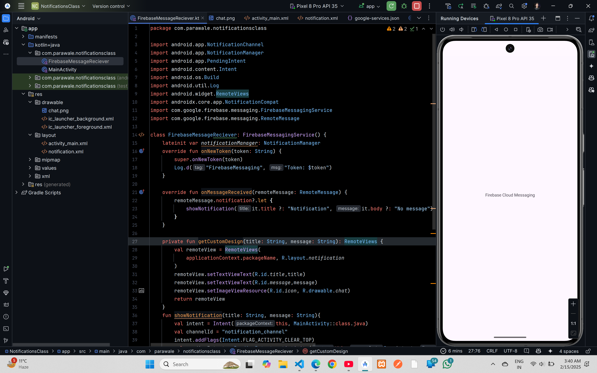

# Firebase Cloud Messaging (Notification)


## XML Code

### `AndroidManifest.xml`
```xml
<?xml version="1.0" encoding="utf-8"?>
<manifest xmlns:android="http://schemas.android.com/apk/res/android"
    xmlns:tools="http://schemas.android.com/tools">
<uses-permission android:name="android.permission.INTERNET"/>
    <application
        android:allowBackup="true"
        android:dataExtractionRules="@xml/data_extraction_rules"
        android:fullBackupContent="@xml/backup_rules"
        android:icon="@mipmap/ic_launcher"
        android:label="@string/app_name"
        android:roundIcon="@mipmap/ic_launcher_round"
        android:supportsRtl="true"
        android:theme="@style/Theme.NotificationsClass"
        tools:targetApi="31">
        <activity
            android:name=".MainActivity"
            android:exported="true">
            <intent-filter>
                <action android:name="android.intent.action.MAIN" />

                <category android:name="android.intent.category.LAUNCHER" />
            </intent-filter>
        </activity>
        <service android:name=".FirebaseMessageReciever" android:exported="true">
            <intent-filter>
                <action android:name="com.google.firebase.MESSAGING_EVENT" />
            </intent-filter>
        </service>
    </application>

</manifest>
```
### `activity_main.xml`
```xml
<?xml version="1.0" encoding="utf-8"?>
<androidx.constraintlayout.widget.ConstraintLayout xmlns:android="http://schemas.android.com/apk/res/android"
    xmlns:app="http://schemas.android.com/apk/res-auto"
    xmlns:tools="http://schemas.android.com/tools"
    android:id="@+id/main"
    android:layout_width="match_parent"
    android:layout_height="match_parent"
    tools:context=".MainActivity">

    <TextView
        android:layout_width="wrap_content"
        android:layout_height="wrap_content"
        android:text="Firebase Cloud Messaging"
        app:layout_constraintBottom_toBottomOf="parent"
        app:layout_constraintEnd_toEndOf="parent"
        app:layout_constraintStart_toStartOf="parent"
        app:layout_constraintTop_toTopOf="parent" />

</androidx.constraintlayout.widget.ConstraintLayout>
```

### `notification.xml`
```xml
<?xml version="1.0" encoding="utf-8"?>
<LinearLayout
    xmlns:android="http://schemas.android.com/apk/res/android"
    android:id="@+id/linear_layout"
    android:layout_width="match_parent"
    android:layout_height="wrap_content"
    android:orientation="horizontal"
    android:padding="20dp">

    <!-- Parent Layout of ImageView -->
    <LinearLayout
        android:layout_width="wrap_content"
        android:layout_height="wrap_content">

        <!--Image to be displayed beside the notification text-->
        <ImageView
            android:id="@+id/icon"
            android:layout_width="50dp"
            android:layout_height="50dp"
            android:padding="5dp"
            android:src="@drawable/chat" />
    </LinearLayout>

    <!-- Parent layout for holding the Title and the Body-->
    <LinearLayout
        android:layout_width="0dp"
        android:layout_height="wrap_content"
        android:layout_weight="1"
        android:orientation="vertical"
        android:padding="5dp">

        <!-- TextView for Title -->
        <TextView
            android:id="@+id/title"
            android:layout_width="match_parent"
            android:layout_height="wrap_content"
            android:text="Firebase Cloud Messaging"
            android:textColor="#000"
            android:textStyle="bold" />

        <!-- TextView for Body -->
        <TextView
            android:id="@+id/message"
            android:layout_width="match_parent"
            android:layout_height="wrap_content"
            android:text="Welcome!"
            android:textSize="15sp" />

    </LinearLayout>

</LinearLayout>
```

## Kotlin Code

### `MainActivity.kt`
```kotlin
package com.parawale.notificationsclass

import android.os.Bundle
import androidx.activity.enableEdgeToEdge
import androidx.appcompat.app.AppCompatActivity
import androidx.core.view.ViewCompat
import androidx.core.view.WindowInsetsCompat

class MainActivity : AppCompatActivity() {
    override fun onCreate(savedInstanceState: Bundle?) {
        super.onCreate(savedInstanceState)
        enableEdgeToEdge()
        setContentView(R.layout.activity_main)
        ViewCompat.setOnApplyWindowInsetsListener(findViewById(R.id.main)) { v, insets ->
            val systemBars = insets.getInsets(WindowInsetsCompat.Type.systemBars())
            v.setPadding(systemBars.left, systemBars.top, systemBars.right, systemBars.bottom)
            insets
        }
    }
}
```

### `FirebaseMessageReceiver.kt`
```kotlin
package com.parawale.notificationsclass

import android.app.NotificationChannel
import android.app.NotificationManager
import android.app.PendingIntent
import android.content.Intent
import android.os.Build
import android.util.Log
import android.widget.RemoteViews
import androidx.core.app.NotificationCompat
import com.google.firebase.messaging.FirebaseMessagingService
import com.google.firebase.messaging.RemoteMessage

class FirebaseMessageReciever: FirebaseMessagingService() {
    lateinit var notificationManager: NotificationManager
    override fun onNewToken(token: String) {
        super.onNewToken(token)
        Log.d("FirebaseMessaging", "Token: $token")
    }

    override fun onMessageReceived(remoteMessage: RemoteMessage) {
        remoteMessage.notification?.let {
            showNotification(it.title ?: "Notification", it.body ?: "No message")
        }
    }

    private fun getCustomDesign(title: String, message: String): RemoteViews {
        val remoteView = RemoteViews(
            applicationContext.packageName, R.layout.notification
        )
        remoteView.setTextViewText(R.id.title,title)
        remoteView.setTextViewText(R.id.message,message)
        remoteView.setImageViewResource(R.id.icon, R.drawable.chat)
        return remoteView
    }
    fun showNotification(title: String, message: String){
        val intent = Intent(this, MainActivity::class.java)
        val channelId = "notification_channel"
        intent.addFlags(Intent.FLAG_ACTIVITY_CLEAR_TOP)
        val pendingIntent = PendingIntent.getActivity(this,0 , intent, PendingIntent.FLAG_ONE_SHOT or PendingIntent.FLAG_IMMUTABLE)
        val builder: NotificationCompat.Builder =
            NotificationCompat.Builder(this, channelId)
                .setSmallIcon(R.drawable.chat)
                .setAutoCancel(true)
                .setVibrate(longArrayOf(1000,1000,1000,1000,1000))
                .setOnlyAlertOnce(true)
                .setContentIntent(pendingIntent)
                .setContent(getCustomDesign(title, message))
        notificationManager = getSystemService(NOTIFICATION_SERVICE) as NotificationManager

        if (Build.VERSION.SDK_INT >= Build.VERSION_CODES.O){
            val notificationChannel = NotificationChannel(channelId, "notification", NotificationManager.IMPORTANCE_HIGH)
            notificationChannel.enableVibration(true)
            notificationManager.createNotificationChannel(notificationChannel)
        }
    }
}
```