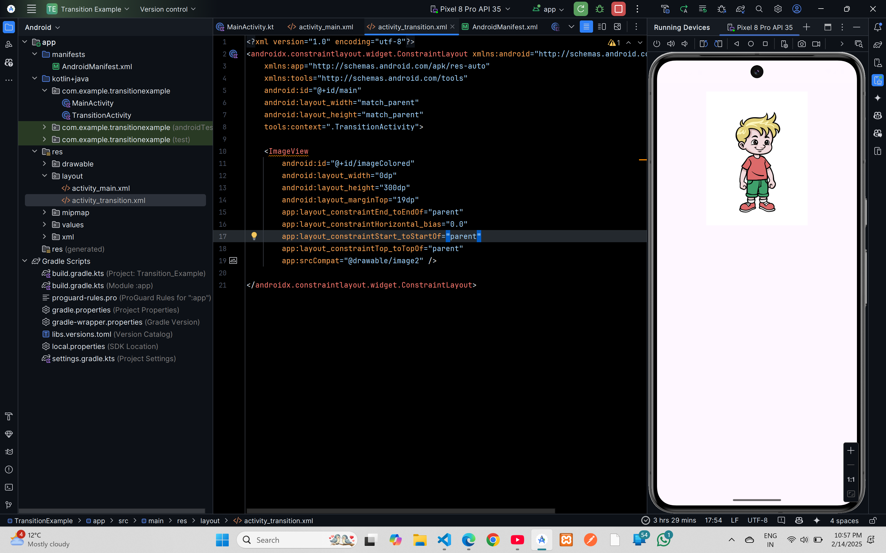

# Transition

## XML Code

### `activity_main.xml`
```xml
<?xml version="1.0" encoding="utf-8"?>
<androidx.constraintlayout.widget.ConstraintLayout xmlns:android="http://schemas.android.com/apk/res/android"
    xmlns:app="http://schemas.android.com/apk/res-auto"
    xmlns:tools="http://schemas.android.com/tools"
    android:id="@+id/main"
    android:layout_width="match_parent"
    android:layout_height="match_parent"
    tools:context=".MainActivity">

    <TextView
        android:layout_width="wrap_content"
        android:layout_height="wrap_content"
        android:text="Shared Element Transition Example"
        android:textSize="24sp"
        app:layout_constraintBottom_toTopOf="@+id/imageBlank"
        app:layout_constraintEnd_toEndOf="parent"
        app:layout_constraintStart_toStartOf="parent"
        app:layout_constraintTop_toTopOf="parent"
        app:layout_constraintVertical_bias="0.177" />

    <ImageView
        android:id="@+id/imageBlank"
        android:layout_width="0dp"
        android:layout_height="300dp"
        android:layout_marginBottom="32dp"
        app:layout_constraintBottom_toBottomOf="parent"
        app:layout_constraintEnd_toEndOf="parent"
        app:layout_constraintStart_toStartOf="parent"
        app:srcCompat="@drawable/image1" />


</androidx.constraintlayout.widget.ConstraintLayout>
```
### `activity_transition.xml`
```xml
<?xml version="1.0" encoding="utf-8"?>
<androidx.constraintlayout.widget.ConstraintLayout xmlns:android="http://schemas.android.com/apk/res/android"
    xmlns:app="http://schemas.android.com/apk/res-auto"
    xmlns:tools="http://schemas.android.com/tools"
    android:id="@+id/main"
    android:layout_width="match_parent"
    android:layout_height="match_parent"
    tools:context=".TransitionActivity">

    <ImageView
        android:id="@+id/imageColored"
        android:layout_width="0dp"
        android:layout_height="300dp"
        android:layout_marginTop="19dp"
        app:layout_constraintEnd_toEndOf="parent"
        app:layout_constraintHorizontal_bias="0.0"
        app:layout_constraintStart_toStartOf="parent"
        app:layout_constraintTop_toTopOf="parent"
        app:srcCompat="@drawable/image2" />

</androidx.constraintlayout.widget.ConstraintLayout>
```

## Kotlin Code

### `MainActivity.kt`
```kotlin
package com.example.transitionexample

import android.content.Intent
import android.os.Bundle
import android.widget.ImageView
import androidx.activity.enableEdgeToEdge
import androidx.appcompat.app.AppCompatActivity
import androidx.core.app.ActivityOptionsCompat
import androidx.core.view.ViewCompat
import androidx.core.view.WindowInsetsCompat
import android.transition.Fade

class MainActivity : AppCompatActivity() {

    override fun onCreate(savedInstanceState: Bundle?) {
        super.onCreate(savedInstanceState)
        enableEdgeToEdge()
        setContentView(R.layout.activity_main)

        ViewCompat.setOnApplyWindowInsetsListener(findViewById(R.id.main)) { v, insets ->
            val systemBars = insets.getInsets(WindowInsetsCompat.Type.systemBars())
            v.setPadding(systemBars.left, systemBars.top, systemBars.right, systemBars.bottom)
            insets
        }

        val imageView = findViewById<ImageView>(R.id.imageBlank)

        // Set Fade Transition
        val fade = Fade()
        fade.excludeTarget(android.R.id.statusBarBackground, true)
        fade.excludeTarget(android.R.id.navigationBarBackground, true)

        window.enterTransition = fade
        window.exitTransition = fade

        imageView.setOnClickListener {
            val intent = Intent(this@MainActivity, TransitionActivity::class.java)

            // FIX: Correct usage of ActivityOptionsCompat
            val options = ActivityOptionsCompat.makeSceneTransitionAnimation(
                this@MainActivity,
                imageView,
                ViewCompat.getTransitionName(imageView) ?: ""
            )

            startActivity(intent, options.toBundle())
        }
    }
}
```

### `TransitionActivity.kt`
```kotlin
package com.example.transitionexample

import android.os.Bundle
import androidx.activity.enableEdgeToEdge
import androidx.appcompat.app.AppCompatActivity
import androidx.core.view.ViewCompat
import androidx.core.view.WindowInsetsCompat
import android.transition.Fade

class TransitionActivity : AppCompatActivity() {

    override fun onCreate(savedInstanceState: Bundle?) {
        super.onCreate(savedInstanceState)
        enableEdgeToEdge()
        setContentView(R.layout.activity_transition)

        ViewCompat.setOnApplyWindowInsetsListener(findViewById(R.id.main)) { v, insets ->
            val systemBars = insets.getInsets(WindowInsetsCompat.Type.systemBars())
            v.setPadding(systemBars.left, systemBars.top, systemBars.right, systemBars.bottom)
            insets
        }

        // Set Fade Transition
        val fade = Fade()
        fade.excludeTarget(android.R.id.statusBarBackground, true)
        fade.excludeTarget(android.R.id.navigationBarBackground, true)

        window.enterTransition = fade
        window.exitTransition = fade
    }
}
```

