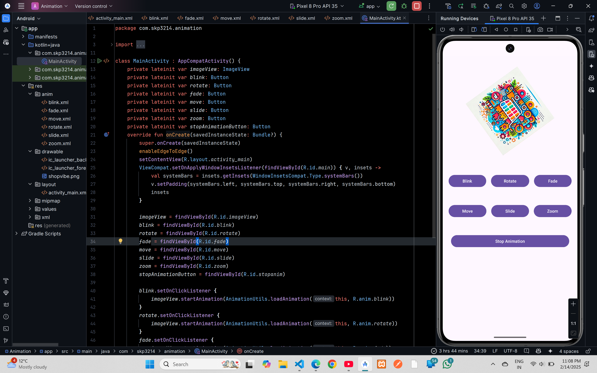

# Animation

## XML Code

### `activity_main.xml`
```xml
<?xml version="1.0" encoding="utf-8"?>
<androidx.constraintlayout.widget.ConstraintLayout xmlns:android="http://schemas.android.com/apk/res/android"
    xmlns:app="http://schemas.android.com/apk/res-auto"
    xmlns:tools="http://schemas.android.com/tools"
    android:id="@+id/main"
    android:layout_width="match_parent"
    android:layout_height="match_parent"
    tools:context=".MainActivity">

    <ImageView
        android:id="@+id/imageView"
        android:layout_width="239dp"
        android:layout_height="212dp"
        app:layout_constraintBottom_toTopOf="@+id/linearLayout"
        app:layout_constraintEnd_toEndOf="parent"
        android:src="@drawable/shopvibe"
        app:layout_constraintStart_toStartOf="parent"
        app:layout_constraintTop_toTopOf="parent"
         />

    <LinearLayout
        android:id="@+id/linearLayout"
        android:layout_width="409dp"
        android:layout_height="481dp"
        android:orientation="vertical"
        app:layout_constraintTop_toBottomOf="@+id/imageView"
        app:layout_constraintStart_toStartOf="parent"
        app:layout_constraintEnd_toEndOf="parent"
        app:layout_constraintBottom_toBottomOf="parent">

        <LinearLayout
            android:layout_width="match_parent"
            android:layout_height="100dp"
            android:gravity="center"
            android:orientation="horizontal">

            <Button
                android:id="@+id/blink"
                android:layout_width="wrap_content"
                android:layout_height="wrap_content"
                android:layout_marginEnd="8dp"
                android:layout_weight="1"
                android:text="Blink" />

            <Button
                android:id="@+id/rotate"
                android:layout_width="wrap_content"
                android:layout_height="wrap_content"
                android:layout_marginStart="8dp"
                android:layout_marginEnd="8dp"
                android:layout_weight="1"
                android:text="Rotate" />

            <Button
                android:id="@+id/fade"
                android:layout_width="wrap_content"
                android:layout_height="wrap_content"
                android:layout_marginStart="8dp"
                android:layout_weight="1"
                android:text="Fade" />
        </LinearLayout>

        <LinearLayout
            android:layout_width="match_parent"
            android:layout_height="100dp"
            android:gravity="center"
            android:orientation="horizontal">

            <Button
                android:id="@+id/move"
                android:layout_width="wrap_content"
                android:layout_height="wrap_content"
                android:layout_marginEnd="8dp"
                android:layout_weight="1"
                android:text="Move" />

            <Button
                android:id="@+id/slide"
                android:layout_width="wrap_content"
                android:layout_height="wrap_content"
                android:layout_marginStart="8dp"
                android:layout_marginEnd="8dp"
                android:layout_weight="1"
                android:text="Slide" />

            <Button
                android:id="@+id/zoom"
                android:layout_width="wrap_content"
                android:layout_height="wrap_content"
                android:layout_marginStart="8dp"
                android:layout_weight="1"
                android:text="Zoom" />
        </LinearLayout>

        <LinearLayout
            android:layout_width="match_parent"
            android:layout_height="100dp"
            android:gravity="center"
            android:orientation="horizontal">

            <Button
                android:id="@+id/stopanim"
                android:layout_width="wrap_content"
                android:layout_height="wrap_content"
                android:layout_margin="8dp"
                android:layout_weight="1"
                android:text="Stop Animation" />
        </LinearLayout>
    </LinearLayout>
</androidx.constraintlayout.widget.ConstraintLayout>
```
- #### Made a anim folder and paste all below code into it as shown in the screenshot at the top

### `blink.xml`
```xml
<?xml version="1.0" encoding="utf-8"?>
<set xmlns:android="http://schemas.android.com/apk/res/android">
    <alpha
        android:fromAlpha="0.0"
        android:toAlpha="1.0"
        android:interpolator="@android:anim/accelerate_interpolator"
        android:duration="500"
        android:repeatMode="reverse"
        android:repeatCount="infinite" />
</set>
```

### `fade.xml`
```xml
<?xml version="1.0" encoding="utf-8"?>
<set xmlns:android="http://schemas.android.com/apk/res/android">
    <alpha
        android:fromAlpha="0.0"
        android:toAlpha="1.0"
        android:duration="1000" />

    <alpha
        android:fromAlpha="1.0"
        android:toAlpha="0.0"
        android:duration="1000"
        android:startOffset="2000" />

</set>
```

### `move.xml`
```xml
<?xml version="1.0" encoding="utf-8"?>
<set xmlns:android="http://schemas.android.com/apk/res/android"
    android:interpolator="@android:anim/linear_interpolator"
    android:fillAfter="true">

    <translate
        android:fromXDelta="0"
        android:toXDelta="200"
        android:fromYDelta="0"
        android:toYDelta="200"
        android:duration="1000" />

</set>
```

### `rotate.xml`
```xml
<?xml version="1.0" encoding="utf-8"?>
<set xmlns:android="http://schemas.android.com/apk/res/android">
    <rotate
        android:fromDegrees="0"
        android:toDegrees="360"
        android:pivotX="50%"
        android:pivotY="50%"
        android:duration="6000" />

    <rotate
        android:fromDegrees="360"
        android:toDegrees="0"
        android:pivotX="50%"
        android:pivotY="50%"
        android:duration="6000"
        android:startOffset="5000" />
</set>
```

### `slide.xml`
```xml
<?xml version="1.0" encoding="utf-8"?>
<set xmlns:android="http://schemas.android.com/apk/res/android">

    <scale
        android:duration="500"
        android:fromXScale="1.0"
        android:fromYScale="1.0"
        android:interpolator="@android:anim/linear_interpolator"
        android:toXScale="1.0"
        android:toYScale="0.0"
        />
</set>
```

### `zoom.xml`
```xml
<?xml version="1.0" encoding="utf-8"?>
<set xmlns:android="http://schemas.android.com/apk/res/android"
    android:fillAfter="true"
    >

    <scale
        android:duration="500"
        android:fromXScale="1.0"
        android:fromYScale="1.0"
        android:interpolator="@android:anim/linear_interpolator"
        android:toXScale="2.0"
        android:toYScale="2.0"
        android:pivotX="50%"
        android:pivotY="50%"
    />

    <scale
        android:duration="500"
        android:fromXScale="2.0"
        android:fromYScale="2.0"
        android:interpolator="@android:anim/linear_interpolator"
        android:toXScale="1.0"
        android:toYScale="1.0"
        android:pivotX="50%"
        android:pivotY="50%"
        android:startOffset="500"
    />


</set>
```

## Kotlin Code

### `MainActivity.kt`
```kotlin
package com.skp3214.animation

import android.os.Bundle
import android.view.animation.AnimationUtils
import android.widget.Button
import android.widget.ImageView
import androidx.activity.enableEdgeToEdge
import androidx.appcompat.app.AppCompatActivity
import androidx.core.view.ViewCompat
import androidx.core.view.WindowInsetsCompat

class MainActivity : AppCompatActivity() {
    private lateinit var imageView: ImageView
    private lateinit var blink: Button
    private lateinit var rotate: Button
    private lateinit var fade: Button
    private lateinit var move: Button
    private lateinit var slide: Button
    private lateinit var zoom: Button
    private lateinit var stopAnimationButton: Button
    override fun onCreate(savedInstanceState: Bundle?) {
        super.onCreate(savedInstanceState)
        enableEdgeToEdge()
        setContentView(R.layout.activity_main)
        ViewCompat.setOnApplyWindowInsetsListener(findViewById(R.id.main)) { v, insets ->
            val systemBars = insets.getInsets(WindowInsetsCompat.Type.systemBars())
            v.setPadding(systemBars.left, systemBars.top, systemBars.right, systemBars.bottom)
            insets
        }

        imageView = findViewById(R.id.imageView)
        blink = findViewById(R.id.blink)
        rotate = findViewById(R.id.rotate)
        fade = findViewById(R.id.fade)
        move = findViewById(R.id.move)
        slide = findViewById(R.id.slide)
        zoom = findViewById(R.id.zoom)
        stopAnimationButton = findViewById(R.id.stopanim)

        blink.setOnClickListener {
            imageView.startAnimation(AnimationUtils.loadAnimation(this, R.anim.blink))
        }
        rotate.setOnClickListener {
            imageView.startAnimation(AnimationUtils.loadAnimation(this, R.anim.rotate))
        }
        fade.setOnClickListener {
            imageView.startAnimation(AnimationUtils.loadAnimation(this, R.anim.fade))
        }
        move.setOnClickListener {
            imageView.startAnimation(AnimationUtils.loadAnimation(this, R.anim.move))
        }
        slide.setOnClickListener {
            imageView.startAnimation(AnimationUtils.loadAnimation(this, R.anim.slide))
        }
        zoom.setOnClickListener {
            imageView.startAnimation(AnimationUtils.loadAnimation(this, R.anim.zoom))
        }
        stopAnimationButton.setOnClickListener {
            imageView.clearAnimation()
        }
    }
}
```