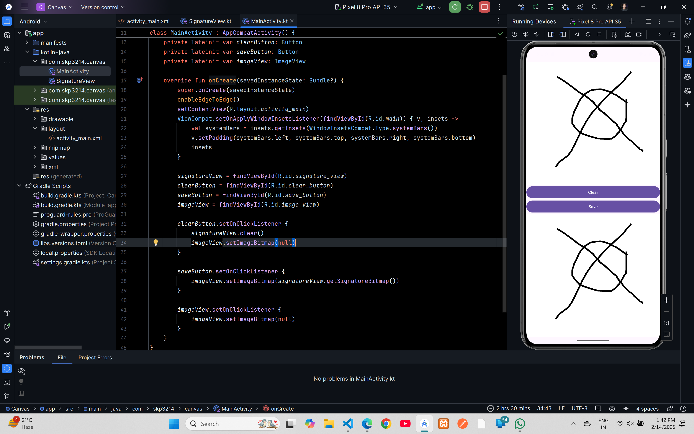

# Canvas (Digital Signature)


## XML Code

### `activity_main.xml`
```xml
<?xml version="1.0" encoding="utf-8"?>
<LinearLayout xmlns:android="http://schemas.android.com/apk/res/android"
    xmlns:tools="http://schemas.android.com/tools"
    android:id="@+id/main"
    android:layout_width="match_parent"
    android:layout_height="match_parent"
    android:orientation="vertical"
    tools:context=".MainActivity">

    <com.skp3214.canvas.SignatureView          // your package name
        android:id="@+id/signature_view"
        android:layout_width="match_parent"
        android:layout_height="0dp"
        android:layout_weight="1"
        android:background="#E4CCCC" />

    <Button
        android:id="@+id/clear_button"
        android:layout_width="match_parent"
        android:layout_height="wrap_content"
        android:text="Clear" />

    <Button
        android:id="@+id/save_button"
        android:layout_width="match_parent"
        android:layout_height="wrap_content"
        android:text="Save" />

    <ImageView
        android:id="@+id/image_view"
        android:layout_width="match_parent"
        android:layout_height="0dp"
        android:layout_weight="1"
        android:scaleType="fitCenter" />
</LinearLayout>
```
## Kotlin Code

### `MainActivity.kt`
```kotlin
package com.skp3214.canvas

import android.os.Bundle
import android.widget.Button
import android.widget.ImageView
import androidx.activity.enableEdgeToEdge
import androidx.appcompat.app.AppCompatActivity
import androidx.core.view.ViewCompat
import androidx.core.view.WindowInsetsCompat

class MainActivity : AppCompatActivity() {
    private lateinit var signatureView: SignatureView
    private lateinit var clearButton: Button
    private lateinit var saveButton: Button
    private lateinit var imageView: ImageView

    override fun onCreate(savedInstanceState: Bundle?) {
        super.onCreate(savedInstanceState)
        enableEdgeToEdge()
        setContentView(R.layout.activity_main)
        ViewCompat.setOnApplyWindowInsetsListener(findViewById(R.id.main)) { v, insets ->
            val systemBars = insets.getInsets(WindowInsetsCompat.Type.systemBars())
            v.setPadding(systemBars.left, systemBars.top, systemBars.right, systemBars.bottom)
            insets
        }

        signatureView = findViewById(R.id.signature_view)
        clearButton = findViewById(R.id.clear_button)
        saveButton = findViewById(R.id.save_button)
        imageView = findViewById(R.id.image_view)

        clearButton.setOnClickListener {
            signatureView.clear()
            imageView.setImageBitmap(null)
        }

        saveButton.setOnClickListener {
            imageView.setImageBitmap(signatureView.getSignatureBitmap())
        }

        imageView.setOnClickListener {
            imageView.setImageBitmap(null)
        }
    }
}
```

### `SignatureView.kt`
```kotlin
package com.skp3214.canvas

import android.content.Context
import android.graphics.Bitmap
import android.graphics.Canvas
import android.graphics.Color
import android.graphics.Paint
import android.graphics.Path
import android.util.AttributeSet
import android.view.MotionEvent
import android.view.View

class SignatureView(context: Context, attrs: AttributeSet?) : View(context, attrs) {
    private var path = Path()
    private var paint = Paint().apply {
        color = 0xFF000000.toInt()
        style = Paint.Style.STROKE
        strokeWidth = 15f
    }
    private var bitmap: Bitmap? = null
    private var canvas: Canvas? = null

    override fun onDraw(canvas: Canvas) {
        super.onDraw(canvas)
        if (bitmap == null) {
            bitmap = Bitmap.createBitmap(width, height, Bitmap.Config.ARGB_8888)
            this.canvas = Canvas(bitmap!!)
            this.canvas?.drawColor(Color.WHITE)
        }
        canvas.drawBitmap(bitmap!!, 0f, 0f, null)
        canvas.drawPath(path, paint)
    }

    override fun onTouchEvent(event: MotionEvent): Boolean {
        val x = event.x
        val y = event.y
        when (event.action) {
            MotionEvent.ACTION_DOWN -> {
                path.moveTo(x, y)
                return true
            }
            MotionEvent.ACTION_MOVE -> {
                path.lineTo(x, y)
                canvas?.drawPath(path, paint)
                invalidate()
            }
            MotionEvent.ACTION_UP -> {

            }
        }
        return super.onTouchEvent(event)
    }

    fun clear() {
        path.reset()
        bitmap?.eraseColor(Color.WHITE)
        invalidate()
    }

    fun getSignatureBitmap(): Bitmap {
        return bitmap!!
    }
}
```