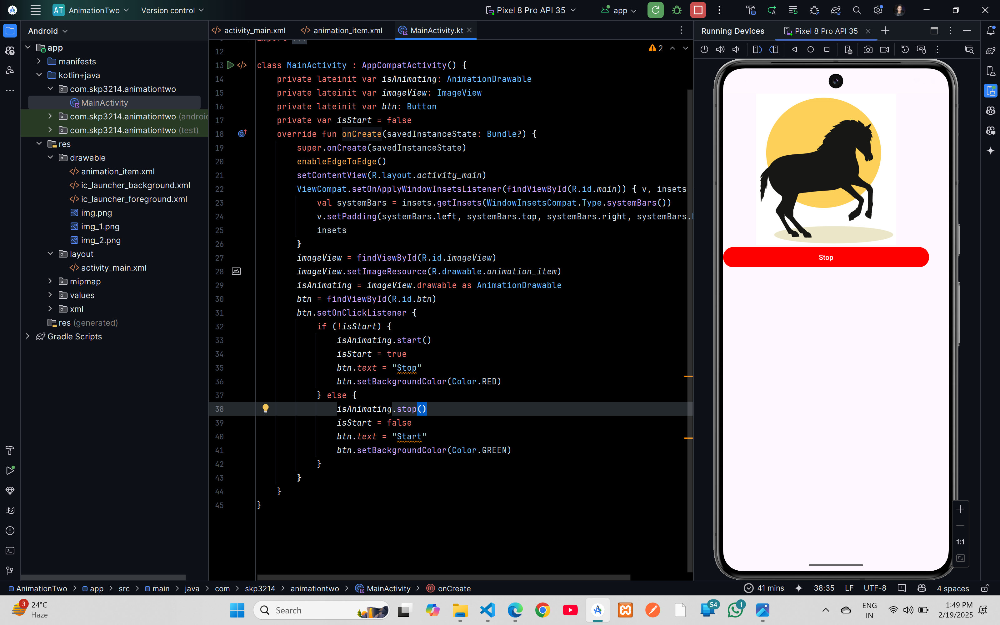

# Horse Animation


## XML Code

### `activity_main.xml`
```xml
<?xml version="1.0" encoding="utf-8"?>
<LinearLayout xmlns:android="http://schemas.android.com/apk/res/android"
    xmlns:app="http://schemas.android.com/apk/res-auto"
    xmlns:tools="http://schemas.android.com/tools"
    android:layout_width="match_parent"
    android:layout_height="match_parent"
    android:id="@+id/main"
    android:orientation="vertical">

    <LinearLayout
        android:layout_width="409dp"
        android:layout_height="729dp"
        android:orientation="vertical"
        tools:layout_editor_absoluteX="1dp"
        tools:layout_editor_absoluteY="1dp">

        <ImageView
            android:id="@+id/imageView"
            android:layout_width="match_parent"
            android:layout_height="300dp"
            app:srcCompat="@drawable/animation_item" />

        <Button
            android:id="@+id/btn"
            android:layout_width="match_parent"
            android:layout_height="wrap_content"
            android:text="Start" />
    </LinearLayout>
</LinearLayout>
```
### `animation_item.xml`
```xml
<?xml version="1.0" encoding="utf-8"?>
<animation-list  xmlns:android="http://schemas.android.com/apk/res/android">
    <item
        android:drawable="@drawable/img"
        android:duration="100"/>
    <item
        android:drawable="@drawable/img_1"
        android:duration="100"/>
    <item
        android:drawable="@drawable/img_2"
        android:duration="100"/>
</animation-list>
```

## Kotlin Code

### `MainActivity.kt`
```kt
package com.skp3214.animationtwo

import android.graphics.Color
import android.graphics.drawable.AnimationDrawable
import android.os.Bundle
import android.widget.Button
import android.widget.ImageView
import androidx.activity.enableEdgeToEdge
import androidx.appcompat.app.AppCompatActivity
import androidx.core.view.ViewCompat
import androidx.core.view.WindowInsetsCompat

class MainActivity : AppCompatActivity() {
    private lateinit var isAnimating: AnimationDrawable
    private lateinit var imageView: ImageView
    private lateinit var btn: Button
    private var isStart = false
    override fun onCreate(savedInstanceState: Bundle?) {
        super.onCreate(savedInstanceState)
        enableEdgeToEdge()
        setContentView(R.layout.activity_main)
        ViewCompat.setOnApplyWindowInsetsListener(findViewById(R.id.main)) { v, insets ->
            val systemBars = insets.getInsets(WindowInsetsCompat.Type.systemBars())
            v.setPadding(systemBars.left, systemBars.top, systemBars.right, systemBars.bottom)
            insets
        }
        imageView = findViewById(R.id.imageView)
        imageView.setImageResource(R.drawable.animation_item)
        isAnimating = imageView.drawable as AnimationDrawable
        btn = findViewById(R.id.btn)
        btn.setOnClickListener {
            if (!isStart) {
                isAnimating.start()
                isStart = true
                btn.text = "Stop"
                btn.setBackgroundColor(Color.RED)
            } else {
                isAnimating.stop()
                isStart = false
                btn.text = "Start"
                btn.setBackgroundColor(Color.GREEN)
            }
        }
    }
}
```