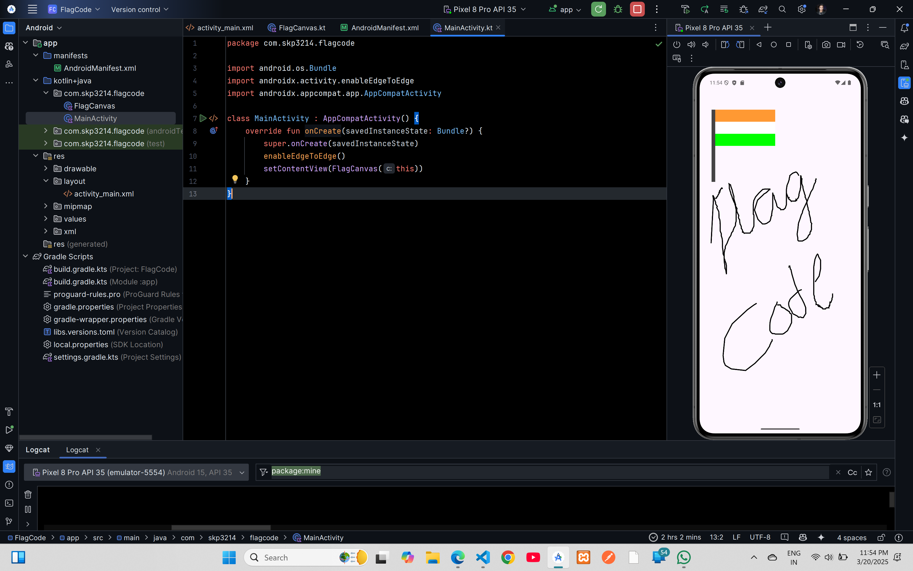

# Indian Flag Code



## XML Code

### `activity_main.xml`
```xml
<?xml version="1.0" encoding="utf-8"?>
<LinearLayout xmlns:android="http://schemas.android.com/apk/res/android"
    android:layout_width="match_parent"
    android:layout_height="match_parent"
    android:orientation="vertical"
    android:gravity="center"
    android:id="@+id/main"
    android:background="#F5F5F5">

    <com.skp3214.flagcode.FlagCanvas
        android:layout_width="match_parent"
        android:layout_height="match_parent" />
</LinearLayout>
```

## Kotlin Code

### `FlagCanvas.kt`
```kt
package com.skp3214.flagcode

import android.content.Context
import android.graphics.Canvas
import android.graphics.Color
import android.graphics.Paint
import android.graphics.Path
import android.util.AttributeSet
import android.view.MotionEvent
import android.view.View
import androidx.core.graphics.toColorInt

class FlagCanvas(c: Context, a: AttributeSet? = null) : View(c, a) {
    private val p = Paint()
    private val path = Path()

    init {
        p.apply {
            color = Color.BLACK
            style = Paint.Style.STROKE
            strokeWidth = 9f
        }
    }

    override fun onDraw(canvas: Canvas) {
        super.onDraw(canvas)

        // Draw the pole
        p.color = Color.DKGRAY
        p.style = Paint.Style.FILL
        canvas.drawRect(100f, 300f, 130f, 900f, p)

        // Draw the flag sections
        p.color = "#FF9933".toColorInt()
        canvas.drawRect(130f, 300f, 630f, 400f, p)

        p.color = Color.WHITE
        canvas.drawRect(130f, 400f, 630f, 500f, p)

        p.color = Color.GREEN
        canvas.drawRect(130f, 500f, 630f, 600f, p)

        // Draw the user path
        p.color = Color.BLACK
        p.style = Paint.Style.STROKE
        canvas.drawPath(path, p)
    }

    override fun onTouchEvent(event: MotionEvent?): Boolean {
        if (event == null) return false

        val x = event.x
        val y = event.y

        when (event.action) {
            MotionEvent.ACTION_DOWN -> {
                path.moveTo(x, y)
                return true
            }
            MotionEvent.ACTION_MOVE -> {
                path.lineTo(x, y)
                invalidate()
            }
        }
        return super.onTouchEvent(event)
    }
}
```

### `MainActivity.kt`
```kt
package com.skp3214.flagcode

import android.os.Bundle
import androidx.activity.enableEdgeToEdge
import androidx.appcompat.app.AppCompatActivity

class MainActivity : AppCompatActivity() {
    override fun onCreate(savedInstanceState: Bundle?) {
        super.onCreate(savedInstanceState)
        enableEdgeToEdge()
        setContentView(FlagCanvas(this))
    }
}
```