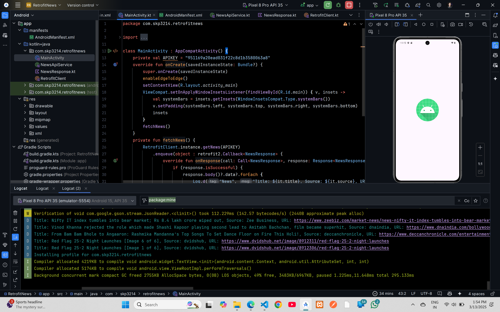

# Retrofit News Api Demo Code

## Kotlin Code

### `MainActivity.kt`
```kt
package com.skp3214.retrofitnews

import android.os.Bundle
import android.util.Log
import androidx.activity.enableEdgeToEdge
import androidx.appcompat.app.AppCompatActivity
import androidx.core.view.ViewCompat
import androidx.core.view.WindowInsetsCompat
import retrofit2.Call
import retrofit2.Response

class MainActivity : AppCompatActivity() {
    private val APIKEY = "951169a20ead031f22c8d1b3580063a8"
    override fun onCreate(savedInstanceState: Bundle?) {
        super.onCreate(savedInstanceState)
        enableEdgeToEdge()
        setContentView(R.layout.activity_main)
        ViewCompat.setOnApplyWindowInsetsListener(findViewById(R.id.main)) { v, insets ->
            val systemBars = insets.getInsets(WindowInsetsCompat.Type.systemBars())
            v.setPadding(systemBars.left, systemBars.top, systemBars.right, systemBars.bottom)
            insets
        }
        fetchNews()
    }
    private fun fetchNews() {
        RetrofitClient.instance.getNews(APIKEY)
            .enqueue(object : retrofit2.Callback<NewsResponse> {
                override fun onResponse(call: Call<NewsResponse>, response: Response<NewsResponse>) {
                    if (response.isSuccessful) {
                        response.body()?.data?.forEach {
                            Log.d("News", "Title: ${it.title}, Source: ${it.source}, URL: ${it.url}")
                        }
                    } else {
                        Log.e("API Error", "Response not successful: ${response.code()}")
                    }
                }

                override fun onFailure(call: Call<NewsResponse>, t: Throwable) {
                    Log.e("API Error", "Request failed: ${t.message}")
                }
            })
    }
}
```
### `NewsApiService.kt`
```kt
package com.skp3214.retrofitnews

import retrofit2.Call
import retrofit2.http.GET
import retrofit2.http.Query

interface NewsApiService {
    @GET("v1/news")
    fun getNews(
        @Query("access_key") apiKey: String,
        @Query("countries") countries: String = "us",
        @Query("limit") limit: Int = 5
    ): Call<NewsResponse>
}
```
### `NewsResponse.kt`
```kt
package com.skp3214.retrofitnews

data class NewsResponse(
    val data: List<NewsItem>,
)

data class NewsItem(
    val author: String?,
    val title: String,
    val description: String?,
    val published_at: String,
    val source: String,
    val url: String,
)
```
### `RetrofitClient.kt`
```kt
package com.skp3214.retrofitnews

import retrofit2.Retrofit
import retrofit2.converter.gson.GsonConverterFactory

object RetrofitClient {
    private const val BASE_URI = "http://api.mediastack.com/"
    val instance:NewsApiService by lazy{
        Retrofit.Builder()
            .baseUrl(BASE_URI)
            .addConverterFactory(GsonConverterFactory.create())
            .build()
            .create(NewsApiService::class.java)
    }
}
```