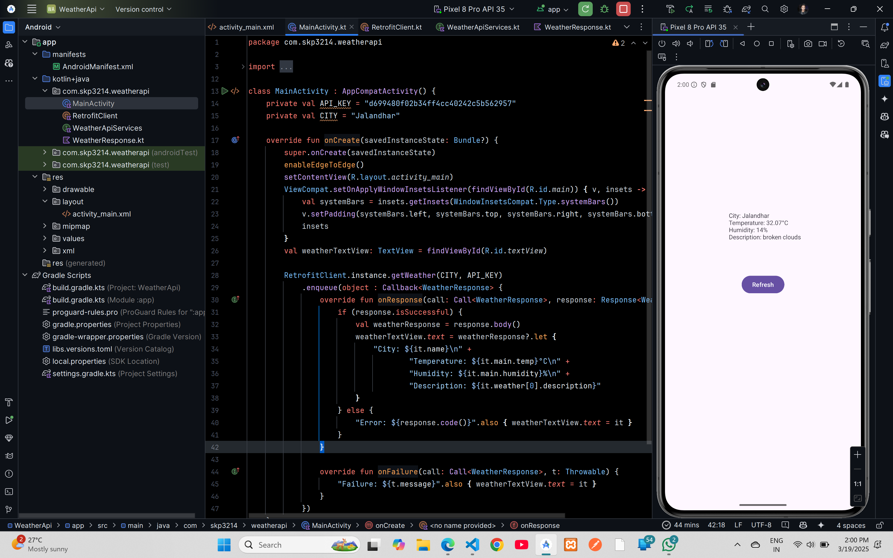

# Retrofit WeatherApi Demo Code


## XML Code

### `activity_main.xml`
```xml
<?xml version="1.0" encoding="utf-8"?>
<androidx.constraintlayout.widget.ConstraintLayout xmlns:android="http://schemas.android.com/apk/res/android"
    xmlns:app="http://schemas.android.com/apk/res-auto"
    xmlns:tools="http://schemas.android.com/tools"
    android:id="@+id/main"
    android:layout_width="match_parent"
    android:layout_height="match_parent"
    tools:context=".MainActivity">

    <TextView
        android:id="@+id/textView"
        android:layout_width="wrap_content"
        android:layout_height="wrap_content"
        android:layout_marginTop="264dp"
        android:text="Fetching Weather Data"
        app:layout_constraintEnd_toEndOf="parent"
        app:layout_constraintHorizontal_bias="0.517"
        app:layout_constraintStart_toStartOf="parent"
        app:layout_constraintTop_toTopOf="parent" />

    <Button
        android:id="@+id/button"
        android:layout_width="wrap_content"
        android:layout_height="wrap_content"
        android:text="Refresh"
        app:layout_constraintBottom_toBottomOf="parent"
        app:layout_constraintEnd_toEndOf="parent"
        app:layout_constraintStart_toStartOf="parent"
        app:layout_constraintTop_toBottomOf="@+id/textView"
        app:layout_constraintVertical_bias="0.139" />

</androidx.constraintlayout.widget.ConstraintLayout>
```

## Kotlin Code

### `MainActivity.kt`
```kt
package com.skp3214.weatherapi

import android.os.Bundle
import android.widget.TextView
import androidx.activity.enableEdgeToEdge
import androidx.appcompat.app.AppCompatActivity
import androidx.core.view.ViewCompat
import androidx.core.view.WindowInsetsCompat
import retrofit2.Call
import retrofit2.Callback
import retrofit2.Response

class MainActivity : AppCompatActivity() {
    private val API_KEY = "d699480f02b34ff4cc40242c5b562957"
    private val CITY = "Jalandhar"

    override fun onCreate(savedInstanceState: Bundle?) {
        super.onCreate(savedInstanceState)
        enableEdgeToEdge()
        setContentView(R.layout.activity_main)
        ViewCompat.setOnApplyWindowInsetsListener(findViewById(R.id.main)) { v, insets ->
            val systemBars = insets.getInsets(WindowInsetsCompat.Type.systemBars())
            v.setPadding(systemBars.left, systemBars.top, systemBars.right, systemBars.bottom)
            insets
        }
        val weatherTextView: TextView = findViewById(R.id.textView)

        RetrofitClient.instance.getWeather(CITY, API_KEY)
            .enqueue(object : Callback<WeatherResponse> {
                override fun onResponse(call: Call<WeatherResponse>, response: Response<WeatherResponse>) {
                    if (response.isSuccessful) {
                        val weatherResponse = response.body()
                        weatherTextView.text = weatherResponse?.let {
                            "City: ${it.name}\n" +
                                    "Temperature: ${it.main.temp}°C\n" +
                                    "Humidity: ${it.main.humidity}%\n" +
                                    "Description: ${it.weather[0].description}"
                        }
                    } else {
                        "Error: ${response.code()}".also { weatherTextView.text = it }
                    }
                }

                override fun onFailure(call: Call<WeatherResponse>, t: Throwable) {
                    "Failure: ${t.message}".also { weatherTextView.text = it }
                }
            })
    }
}
```
### `WeatherApiServices.kt`
```kt
package com.skp3214.weatherapi

import retrofit2.Call
import retrofit2.http.GET
import retrofit2.http.Query

interface WeatherApiServices {
    @GET("weather")
    fun getWeather(
        @Query("q") city: String,
        @Query("appid") apiKey: String,
        @Query("units") units: String = "metric"
    ): Call<WeatherResponse>
}
```
### `WeatherResponse.kt`
```kt
package com.skp3214.weatherapi

data class WeatherResponse(
    val name:String,
    val main:Main,
    val weather: List<Weather>
)

data class Main (
    val temp:Double,
    val humidity:Int
)

data class Weather(
    val description:String
)
```
### `RetrofitClient.kt`
```kt
package com.skp3214.weatherapi

import retrofit2.Retrofit
import retrofit2.converter.gson.GsonConverterFactory

object RetrofitClient {
    private const val BASE_URL="https://api.openweathermap.org/data/2.5/"

    val instance:WeatherApiServices by lazy{
        Retrofit.Builder()
            .baseUrl(BASE_URL)
            .addConverterFactory(GsonConverterFactory.create())
            .build().create(WeatherApiServices::class.java)
    }
}
```