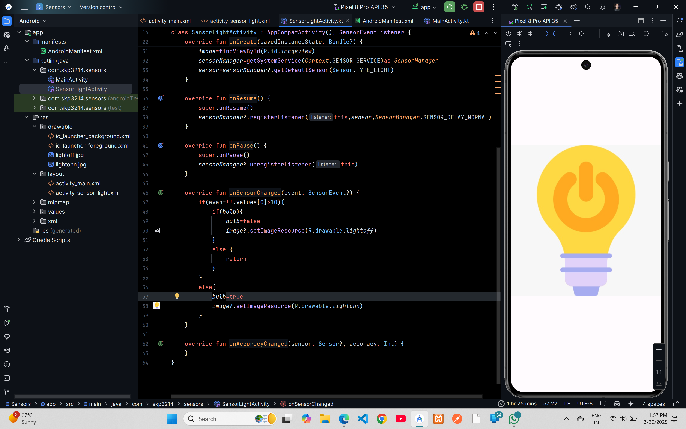

# Light Sensors



## XML Code

### `AndroidManifest.xml`
```xml
<?xml version="1.0" encoding="utf-8"?>
<manifest xmlns:android="http://schemas.android.com/apk/res/android"
    xmlns:tools="http://schemas.android.com/tools">

    <application
        android:allowBackup="true"
        android:dataExtractionRules="@xml/data_extraction_rules"
        android:fullBackupContent="@xml/backup_rules"
        android:icon="@mipmap/ic_launcher"
        android:label="@string/app_name"
        android:roundIcon="@mipmap/ic_launcher_round"
        android:supportsRtl="true"
        android:theme="@style/Theme.Sensors"
        tools:targetApi="31">
        <activity
            android:name=".MainActivity"
            android:exported="false" />
        <activity
            android:name=".SensorLightActivity"
            android:exported="true">
            <intent-filter>
                <action android:name="android.intent.action.MAIN" />

                <category android:name="android.intent.category.LAUNCHER" />
            </intent-filter>
        </activity>
    </application>

</manifest>
```

### `activity_main.xml`
```xml
<?xml version="1.0" encoding="utf-8"?>
<androidx.constraintlayout.widget.ConstraintLayout xmlns:android="http://schemas.android.com/apk/res/android"
    xmlns:app="http://schemas.android.com/apk/res-auto"
    xmlns:tools="http://schemas.android.com/tools"
    android:id="@+id/main"
    android:layout_width="match_parent"
    android:layout_height="match_parent"
    tools:context=".MainActivity">

    <TextView
        android:layout_width="wrap_content"
        android:layout_height="wrap_content"
        android:text="Hello World!"
        app:layout_constraintBottom_toBottomOf="parent"
        app:layout_constraintEnd_toEndOf="parent"
        app:layout_constraintStart_toStartOf="parent"
        app:layout_constraintTop_toTopOf="parent" />

</androidx.constraintlayout.widget.ConstraintLayout>
```

### `activity_sensor_light.xml`
```xml
<?xml version="1.0" encoding="utf-8"?>
<androidx.constraintlayout.widget.ConstraintLayout xmlns:android="http://schemas.android.com/apk/res/android"
    xmlns:app="http://schemas.android.com/apk/res-auto"
    xmlns:tools="http://schemas.android.com/tools"
    android:id="@+id/main"
    android:layout_width="match_parent"
    android:layout_height="match_parent"
    tools:context=".SensorLightActivity">

    <ImageView
        android:id="@+id/imageView"
        android:layout_width="0dp"
        android:layout_height="0dp"
        android:src="@drawable/lightoff"
        app:layout_constraintBottom_toBottomOf="parent"
        app:layout_constraintEnd_toEndOf="parent"
        app:layout_constraintStart_toStartOf="parent"
        app:layout_constraintTop_toTopOf="parent" />

</androidx.constraintlayout.widget.ConstraintLayout>
```

## Kotlin Code

### `MainActivity.kt`
```kt
package com.skp3214.sensors

import android.os.Bundle
import androidx.activity.enableEdgeToEdge
import androidx.appcompat.app.AppCompatActivity
import androidx.core.view.ViewCompat
import androidx.core.view.WindowInsetsCompat

class MainActivity : AppCompatActivity() {
    override fun onCreate(savedInstanceState: Bundle?) {
        super.onCreate(savedInstanceState)
        enableEdgeToEdge()
        setContentView(R.layout.activity_main)
        ViewCompat.setOnApplyWindowInsetsListener(findViewById(R.id.main)) { v, insets ->
            val systemBars = insets.getInsets(WindowInsetsCompat.Type.systemBars())
            v.setPadding(systemBars.left, systemBars.top, systemBars.right, systemBars.bottom)
            insets
        }
    }
}
```

### `SensorLightActivity.kt`
```kt

package com.skp3214.sensors

import android.content.Context
import android.hardware.Sensor
import android.hardware.SensorEvent
import android.hardware.SensorEventListener
import android.hardware.SensorManager
import android.os.Bundle
import android.widget.ImageView
import androidx.activity.enableEdgeToEdge
import androidx.appcompat.app.AppCompatActivity
import androidx.core.view.ViewCompat
import androidx.core.view.WindowInsetsCompat

class SensorLightActivity : AppCompatActivity(), SensorEventListener {
    var sensorManager: SensorManager?=null
    var sensor: Sensor?=null
    var image: ImageView?=null
    var bulb:Boolean=true

    override fun onCreate(savedInstanceState: Bundle?) {
        super.onCreate(savedInstanceState)
        enableEdgeToEdge()
        setContentView(R.layout.activity_sensor_light)
        ViewCompat.setOnApplyWindowInsetsListener(findViewById(R.id.main)) { v, insets ->
            val systemBars = insets.getInsets(WindowInsetsCompat.Type.systemBars())
            v.setPadding(systemBars.left, systemBars.top, systemBars.right, systemBars.bottom)
            insets
        }
        image=findViewById(R.id.imageView)
        sensorManager=getSystemService(Context.SENSOR_SERVICE)as SensorManager
        sensor=sensorManager?.getDefaultSensor(Sensor.TYPE_LIGHT)
    }

    override fun onResume() {
        super.onResume()
        sensorManager?.registerListener(this,sensor,SensorManager.SENSOR_DELAY_NORMAL)
    }

    override fun onPause() {
        super.onPause()
        sensorManager?.unregisterListener(this)
    }

    override fun onSensorChanged(event: SensorEvent?) {
        if(event!!.values[0]>10){
            if(bulb){
                bulb=false
                image?.setImageResource(R.drawable.lightoff)
            }
            else {
                return
            }
        }
        else{
            bulb=true
            image?.setImageResource(R.drawable.lightonn)
        }
    }

    override fun onAccuracyChanged(sensor: Sensor?, accuracy: Int) {
    }
}
```
