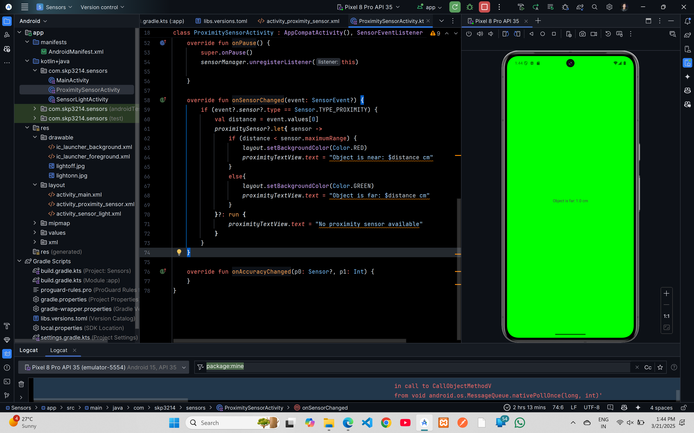

# Proximity Sensor Demo Code


## XML Code

### `AndroidManifest.xml`
```xml
<?xml version="1.0" encoding="utf-8"?>
<manifest xmlns:android="http://schemas.android.com/apk/res/android"
    xmlns:tools="http://schemas.android.com/tools">

    <application
        android:allowBackup="true"
        android:dataExtractionRules="@xml/data_extraction_rules"
        android:fullBackupContent="@xml/backup_rules"
        android:icon="@mipmap/ic_launcher"
        android:label="@string/app_name"
        android:roundIcon="@mipmap/ic_launcher_round"
        android:supportsRtl="true"
        android:theme="@style/Theme.Sensors"
        tools:targetApi="31">
    
        <activity
            android:name=".MainActivity"
            android:exported="false" />
        <activity
            android:name=".ProximitySensorActivity"
            android:exported="true">
            <intent-filter>
                <action android:name="android.intent.action.MAIN" />

                <category android:name="android.intent.category.LAUNCHER" />
            </intent-filter>
        </activity>
    </application>

</manifest>
```

### `activity_main.xml`
```xml
<?xml version="1.0" encoding="utf-8"?>
<androidx.constraintlayout.widget.ConstraintLayout xmlns:android="http://schemas.android.com/apk/res/android"
    xmlns:app="http://schemas.android.com/apk/res-auto"
    xmlns:tools="http://schemas.android.com/tools"
    android:id="@+id/main"
    android:layout_width="match_parent"
    android:layout_height="match_parent"
    tools:context=".MainActivity">

    <TextView
        android:layout_width="wrap_content"
        android:layout_height="wrap_content"
        android:text="Hello World!"
        app:layout_constraintBottom_toBottomOf="parent"
        app:layout_constraintEnd_toEndOf="parent"
        app:layout_constraintStart_toStartOf="parent"
        app:layout_constraintTop_toTopOf="parent" />

</androidx.constraintlayout.widget.ConstraintLayout>
```

### `activity_proximity_sensor.xml`
```xml
<?xml version="1.0" encoding="utf-8"?>
<androidx.constraintlayout.widget.ConstraintLayout xmlns:android="http://schemas.android.com/apk/res/android"
    xmlns:app="http://schemas.android.com/apk/res-auto"
    xmlns:tools="http://schemas.android.com/tools"
    android:id="@+id/main"
    android:layout_width="match_parent"
    android:layout_height="match_parent"
    tools:context=".MainActivity">

    <TextView
        android:layout_width="wrap_content"
        android:layout_height="wrap_content"
        android:text="Hello World!"
        app:layout_constraintBottom_toBottomOf="parent"
        app:layout_constraintEnd_toEndOf="parent"
        app:layout_constraintStart_toStartOf="parent"
        app:layout_constraintTop_toTopOf="parent" />

</androidx.constraintlayout.widget.ConstraintLayout>
```

## Kotlin Code

### `MainActivity.kt`
```kt
package com.skp3214.sensors

import android.os.Bundle
import androidx.activity.enableEdgeToEdge
import androidx.appcompat.app.AppCompatActivity
import androidx.core.view.ViewCompat
import androidx.core.view.WindowInsetsCompat

class MainActivity : AppCompatActivity() {
    override fun onCreate(savedInstanceState: Bundle?) {
        super.onCreate(savedInstanceState)
        enableEdgeToEdge()
        setContentView(R.layout.activity_main)
        ViewCompat.setOnApplyWindowInsetsListener(findViewById(R.id.main)) { v, insets ->
            val systemBars = insets.getInsets(WindowInsetsCompat.Type.systemBars())
            v.setPadding(systemBars.left, systemBars.top, systemBars.right, systemBars.bottom)
            insets
        }
    }
}
```

### `ProximitySensorActivity.kt`
```kt
package com.skp3214.sensors

import android.content.Context
import android.graphics.Color
import android.hardware.Sensor
import android.hardware.SensorEvent
import android.hardware.SensorEventListener
import android.hardware.SensorManager
import android.os.Bundle
import android.provider.CalendarContract.Colors
import android.widget.TextView
import androidx.activity.enableEdgeToEdge
import androidx.appcompat.app.AppCompatActivity
import androidx.constraintlayout.widget.ConstraintLayout
import androidx.core.view.ViewCompat
import androidx.core.view.WindowInsetsCompat

class ProximitySensorActivity : AppCompatActivity(), SensorEventListener {
    private lateinit var sensorManager: SensorManager
    private var proximitySensor: Sensor?=null
    private lateinit var layout: ConstraintLayout
    private lateinit var proximityTextView:TextView

    override fun onCreate(savedInstanceState: Bundle?) {
        super.onCreate(savedInstanceState)
        enableEdgeToEdge()
        setContentView(R.layout.activity_proximity_sensor)
        ViewCompat.setOnApplyWindowInsetsListener(findViewById(R.id.layout)) { v, insets ->
            val systemBars = insets.getInsets(WindowInsetsCompat.Type.systemBars())
            v.setPadding(systemBars.left, systemBars.top, systemBars.right, systemBars.bottom)
            insets
        }

        layout = findViewById(R.id.layout)
        proximityTextView=findViewById(R.id.textView)

        sensorManager = getSystemService(Context.SENSOR_SERVICE) as SensorManager
        proximitySensor = sensorManager.getDefaultSensor(Sensor.TYPE_PROXIMITY)

        if (proximitySensor == null) {
            proximityTextView.text = "No proximity sensor available"
        }
    }

    override fun onResume() {
        super.onResume()
        proximitySensor?.let {
            sensorManager.registerListener(this, it, SensorManager.SENSOR_DELAY_NORMAL)
        }
    }

    override fun onPause() {
        super.onPause()
        sensorManager.unregisterListener(this)

    }

    override fun onSensorChanged(event: SensorEvent?) {
        if (event?.sensor?.type == Sensor.TYPE_PROXIMITY) {
            val distance = event.values[0]
            proximitySensor?.let{ sensor ->
                if (distance < sensor.maximumRange) {
                    layout.setBackgroundColor(Color.RED)
                    proximityTextView.text = "Object is near: $distance cm"
                }
                else{
                    layout.setBackgroundColor(Color.GREEN)
                    proximityTextView.text = "Object is far: $distance cm"
                }
            }?: run {
                proximityTextView.text = "No proximity sensor available"
            }
        }
    }

    override fun onAccuracyChanged(p0: Sensor?, p1: Int) {
    }
}
```