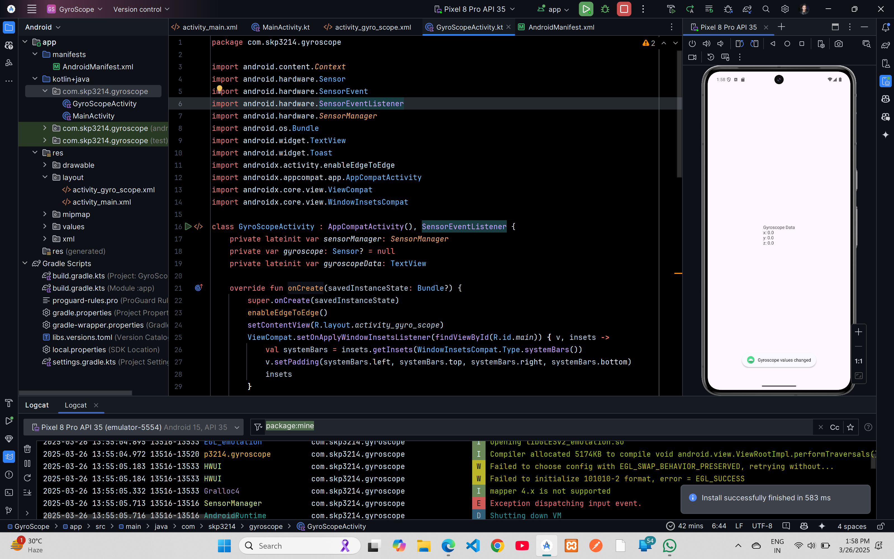

# GyroScope Demo Code


## XML Code

### `AndroidManifest.xml`
```xml
<?xml version="1.0" encoding="utf-8"?>
<manifest xmlns:android="http://schemas.android.com/apk/res/android"
    xmlns:tools="http://schemas.android.com/tools">

    <application
        android:allowBackup="true"
        android:dataExtractionRules="@xml/data_extraction_rules"
        android:fullBackupContent="@xml/backup_rules"
        android:icon="@mipmap/ic_launcher"
        android:label="@string/app_name"
        android:roundIcon="@mipmap/ic_launcher_round"
        android:supportsRtl="true"
        android:theme="@style/Theme.GyroScope"
        tools:targetApi="31">
        <activity
            android:name=".MainActivity"
            android:exported="false" />
        <activity
            android:name=".GyroScopeActivity"
            android:exported="true">
            <intent-filter>
                <action android:name="android.intent.action.MAIN" />

                <category android:name="android.intent.category.LAUNCHER" />
            </intent-filter>
        </activity>
    </application>

</manifest>
```

### `activity_main.xml`
```xml
<?xml version="1.0" encoding="utf-8"?>
<androidx.constraintlayout.widget.ConstraintLayout xmlns:android="http://schemas.android.com/apk/res/android"
    xmlns:app="http://schemas.android.com/apk/res-auto"
    xmlns:tools="http://schemas.android.com/tools"
    android:id="@+id/main"
    android:layout_width="match_parent"
    android:layout_height="match_parent"
    tools:context=".MainActivity">

    <TextView
        android:layout_width="wrap_content"
        android:layout_height="wrap_content"
        android:text="Hello World!"
        app:layout_constraintBottom_toBottomOf="parent"
        app:layout_constraintEnd_toEndOf="parent"
        app:layout_constraintStart_toStartOf="parent"
        app:layout_constraintTop_toTopOf="parent" />

</androidx.constraintlayout.widget.ConstraintLayout>
```
### `activity_gyro_scope.xml`
```xml
<?xml version="1.0" encoding="utf-8"?>
<androidx.constraintlayout.widget.ConstraintLayout xmlns:android="http://schemas.android.com/apk/res/android"
    xmlns:app="http://schemas.android.com/apk/res-auto"
    xmlns:tools="http://schemas.android.com/tools"
    android:id="@+id/main"
    android:layout_width="match_parent"
    android:layout_height="match_parent"
    tools:context=".GyroScopeActivity">


    <TextView
        android:id="@+id/textView"
        android:layout_width="wrap_content"
        android:layout_height="wrap_content"
        android:text="TextView"
        app:layout_constraintBottom_toBottomOf="parent"
        app:layout_constraintEnd_toEndOf="parent"
        app:layout_constraintStart_toStartOf="parent"
        app:layout_constraintTop_toTopOf="parent" />
</androidx.constraintlayout.widget.ConstraintLayout>
```

## Kotlin Code

### `MainActivity.kt`
```kotlin
package com.skp3214.gyroscope

import android.os.Bundle
import androidx.activity.enableEdgeToEdge
import androidx.appcompat.app.AppCompatActivity
import androidx.core.view.ViewCompat
import androidx.core.view.WindowInsetsCompat

class MainActivity : AppCompatActivity() {
    override fun onCreate(savedInstanceState: Bundle?) {
        super.onCreate(savedInstanceState)
        enableEdgeToEdge()
        setContentView(R.layout.activity_main)
        ViewCompat.setOnApplyWindowInsetsListener(findViewById(R.id.main)) { v, insets ->
            val systemBars = insets.getInsets(WindowInsetsCompat.Type.systemBars())
            v.setPadding(systemBars.left, systemBars.top, systemBars.right, systemBars.bottom)
            insets
        }
    }
}
```

### `GyroScopeActivity.kt`
```kotlin
package com.skp3214.gyroscope

import android.content.Context
import android.hardware.Sensor
import android.hardware.SensorEvent
import android.hardware.SensorEventListener
import android.hardware.SensorManager
import android.os.Bundle
import android.widget.TextView
import android.widget.Toast
import androidx.activity.enableEdgeToEdge
import androidx.appcompat.app.AppCompatActivity
import androidx.core.view.ViewCompat
import androidx.core.view.WindowInsetsCompat

class GyroScopeActivity : AppCompatActivity(), SensorEventListener {
    private lateinit var sensorManager: SensorManager
    private var gyroscope: Sensor? = null
    private lateinit var gyroscopeData: TextView

    override fun onCreate(savedInstanceState: Bundle?) {
        super.onCreate(savedInstanceState)
        enableEdgeToEdge()
        setContentView(R.layout.activity_gyro_scope)
        ViewCompat.setOnApplyWindowInsetsListener(findViewById(R.id.main)) { v, insets ->
            val systemBars = insets.getInsets(WindowInsetsCompat.Type.systemBars())
            v.setPadding(systemBars.left, systemBars.top, systemBars.right, systemBars.bottom)
            insets
        }

        gyroscopeData = findViewById(R.id.textView)

        sensorManager = getSystemService(Context.SENSOR_SERVICE) as SensorManager

        gyroscope = sensorManager.getDefaultSensor(Sensor.TYPE_GYROSCOPE)

        if(gyroscope != null) {
            sensorManager.registerListener(this, gyroscope, SensorManager.SENSOR_DELAY_NORMAL)
        }
        else {
            Toast.makeText(this, "Gyroscope not available", Toast.LENGTH_SHORT).show()
        }
    }

    override fun onSensorChanged(event: SensorEvent?) {
        if(event != null) {
            val xValue = event.values[0]
            val yValue = event.values[1]
            val zValue = event.values[2]

            // display gyroscope data on screen
            gyroscopeData.text = "Gyroscope Data\nx: $xValue\ny: $yValue\nz: $zValue"

            // show a toast if values change
            Toast.makeText(this, "Gyroscope values changed" , Toast.LENGTH_SHORT).show()

        }
    }

    override fun onAccuracyChanged(sensor: Sensor?, accuracy: Int) {
    }

    override fun onResume() {
        super.onResume()
        gyroscope?.also { gyro ->
            sensorManager.registerListener(this, gyro, SensorManager.SENSOR_DELAY_NORMAL)
        }
    }

    override fun onPause() {
        super.onPause()
        sensorManager.unregisterListener(this)
    }
}
```
