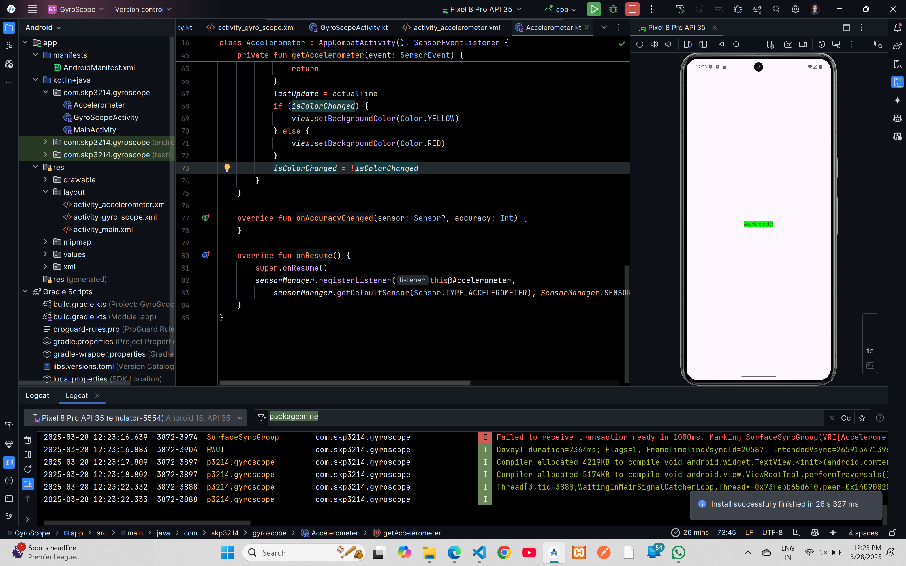

# AcceleroMeter Demo Code


## XML Code

### `AndroidManifest.xml`
```xml
<?xml version="1.0" encoding="utf-8"?>
<manifest xmlns:android="http://schemas.android.com/apk/res/android"
    xmlns:tools="http://schemas.android.com/tools">

    <application
        android:allowBackup="true"
        android:dataExtractionRules="@xml/data_extraction_rules"
        android:fullBackupContent="@xml/backup_rules"
        android:icon="@mipmap/ic_launcher"
        android:label="@string/app_name"
        android:roundIcon="@mipmap/ic_launcher_round"
        android:supportsRtl="true"
        android:theme="@style/Theme.GyroScope"
        tools:targetApi="31">
        <activity
            android:name=".MainActivity"
            android:exported="false" />
        <activity
            android:name=".AcceleroMeter"
            android:exported="true">
            <intent-filter>
                <action android:name="android.intent.action.MAIN" />

                <category android:name="android.intent.category.LAUNCHER" />
            </intent-filter>
        </activity>
    </application>

</manifest>
```

### `activity_main.xml`
```xml
<?xml version="1.0" encoding="utf-8"?>
<androidx.constraintlayout.widget.ConstraintLayout xmlns:android="http://schemas.android.com/apk/res/android"
    xmlns:app="http://schemas.android.com/apk/res-auto"
    xmlns:tools="http://schemas.android.com/tools"
    android:id="@+id/main"
    android:layout_width="match_parent"
    android:layout_height="match_parent"
    tools:context=".MainActivity">

    <TextView
        android:layout_width="wrap_content"
        android:layout_height="wrap_content"
        android:text="Hello World!"
        app:layout_constraintBottom_toBottomOf="parent"
        app:layout_constraintEnd_toEndOf="parent"
        app:layout_constraintStart_toStartOf="parent"
        app:layout_constraintTop_toTopOf="parent" />

</androidx.constraintlayout.widget.ConstraintLayout>
```
### `activity_accelerometer.xml`
```xml
<?xml version="1.0" encoding="utf-8"?>
<androidx.constraintlayout.widget.ConstraintLayout xmlns:android="http://schemas.android.com/apk/res/android"
    xmlns:app="http://schemas.android.com/apk/res-auto"
    xmlns:tools="http://schemas.android.com/tools"
    android:id="@+id/main"
    android:layout_width="match_parent"
    android:layout_height="match_parent"
    tools:context=".Accelerometer">

    <TextView
        android:id="@+id/textView2"
        android:layout_width="wrap_content"
        android:layout_height="wrap_content"
        android:text="Accelerometer"
        app:layout_constraintBottom_toBottomOf="parent"
        app:layout_constraintEnd_toEndOf="parent"
        app:layout_constraintStart_toStartOf="parent"
        app:layout_constraintTop_toTopOf="parent" />
</androidx.constraintlayout.widget.ConstraintLayout>
```

## Kotlin Code


## Kotlin Code

### `MainActivity.kt`
```kotlin
package com.skp3214.gyroscope

import android.os.Bundle
import androidx.activity.enableEdgeToEdge
import androidx.appcompat.app.AppCompatActivity
import androidx.core.view.ViewCompat
import androidx.core.view.WindowInsetsCompat

class MainActivity : AppCompatActivity() {
    override fun onCreate(savedInstanceState: Bundle?) {
        super.onCreate(savedInstanceState)
        enableEdgeToEdge()
        setContentView(R.layout.activity_main)
        ViewCompat.setOnApplyWindowInsetsListener(findViewById(R.id.main)) { v, insets ->
            val systemBars = insets.getInsets(WindowInsetsCompat.Type.systemBars())
            v.setPadding(systemBars.left, systemBars.top, systemBars.right, systemBars.bottom)
            insets
        }
    }
}
```

### `Accelerometer.kt`
```kotlin
package com.skp3214.gyroscope

import android.graphics.Color
import android.hardware.Sensor
import android.hardware.SensorEvent
import android.hardware.SensorEventListener
import android.hardware.SensorManager
import android.os.Bundle
import android.widget.TextView
import android.widget.Toast
import androidx.activity.enableEdgeToEdge
import androidx.appcompat.app.AppCompatActivity
import androidx.core.view.ViewCompat
import androidx.core.view.WindowInsetsCompat

class Accelerometer : AppCompatActivity(), SensorEventListener {
    private lateinit var sensorManager: SensorManager
    private var isColorChanged = false
    private lateinit var view: TextView
    private var lastUpdate: Long = 0

    override fun onCreate(savedInstanceState: Bundle?) {
        super.onCreate(savedInstanceState)
        enableEdgeToEdge()
        setContentView(R.layout.activity_accelerometer)
        ViewCompat.setOnApplyWindowInsetsListener(findViewById(R.id.main)) { v, insets ->
            val systemBars = insets.getInsets(WindowInsetsCompat.Type.systemBars())
            v.setPadding(systemBars.left, systemBars.top, systemBars.right, systemBars.bottom)
            insets
        }

        view = findViewById(R.id.textView2)
        view.setBackgroundColor(Color.GREEN)
        sensorManager = getSystemService(SENSOR_SERVICE) as SensorManager
        lastUpdate  = System.currentTimeMillis()
    }

    override fun onSensorChanged(event: SensorEvent?) {
        if(event?.sensor?.type == Sensor.TYPE_ACCELEROMETER){
            getAccelerometer(event)
        }
    }


    private var toast: Toast? = null

    private fun getAccelerometer(event: SensorEvent) {
        val values: FloatArray = event.values

        val x = values[0]
        val y = values[1]
        val z = values[2]

        val accelerationSquareRoot: Float = (x * x + y * y + z * z) / (SensorManager.GRAVITY_EARTH * SensorManager.GRAVITY_EARTH)
        val actualTime = System.currentTimeMillis()

        if (toast != null) {
            toast?.cancel()
        }
        toast = Toast.makeText(applicationContext, "$accelerationSquareRoot---${SensorManager.GRAVITY_EARTH}", Toast.LENGTH_SHORT)
        toast?.show()

        if (accelerationSquareRoot >= 2) {
            if (actualTime - lastUpdate < 200) {
                return
            }
            lastUpdate = actualTime
            if (isColorChanged) {
                view.setBackgroundColor(Color.YELLOW)
            } else {
                view.setBackgroundColor(Color.RED)
            }
            isColorChanged = !isColorChanged
        }
    }

    override fun onAccuracyChanged(p0: Sensor?, p1: Int) {
    }

    override fun onResume() {
        super.onResume()
        sensorManager.registerListener(this@Accelerometer,
            sensorManager.getDefaultSensor(Sensor.TYPE_ACCELEROMETER),SensorManager.SENSOR_DELAY_NORMAL)
    }
}
```