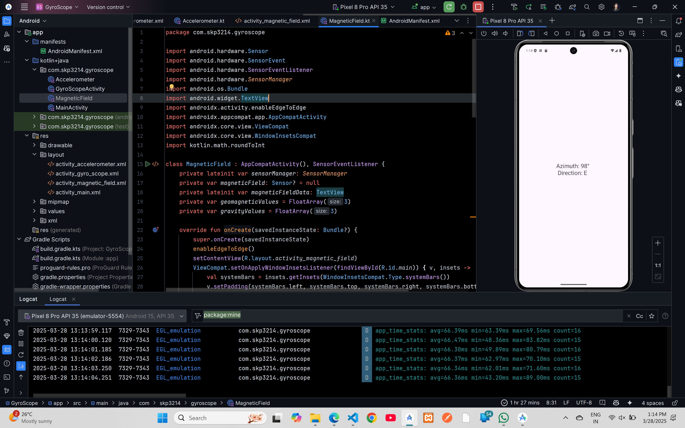

# Magnetic Field Direction Demo Code



## XML Code

### `AndroidManifest.xml`
```xml
<?xml version="1.0" encoding="utf-8"?>
<manifest xmlns:android="http://schemas.android.com/apk/res/android"
    xmlns:tools="http://schemas.android.com/tools">

    <application
        android:allowBackup="true"
        android:dataExtractionRules="@xml/data_extraction_rules"
        android:fullBackupContent="@xml/backup_rules"
        android:icon="@mipmap/ic_launcher"
        android:label="@string/app_name"
        android:roundIcon="@mipmap/ic_launcher_round"
        android:supportsRtl="true"
        android:theme="@style/Theme.GyroScope"
        tools:targetApi="31">
        <activity
            android:name=".MainActivity"
            android:exported="false" />
        <activity
            android:name=".AcceleroMeter"
            android:exported="true">
            <intent-filter>
                <action android:name="android.intent.action.MAIN" />

                <category android:name="android.intent.category.LAUNCHER" />
            </intent-filter>
        </activity>
    </application>

</manifest>
```

### `activity_main.xml`
```xml
<?xml version="1.0" encoding="utf-8"?>
<androidx.constraintlayout.widget.ConstraintLayout xmlns:android="http://schemas.android.com/apk/res/android"
    xmlns:app="http://schemas.android.com/apk/res-auto"
    xmlns:tools="http://schemas.android.com/tools"
    android:id="@+id/main"
    android:layout_width="match_parent"
    android:layout_height="match_parent"
    tools:context=".MainActivity">

    <TextView
        android:layout_width="wrap_content"
        android:layout_height="wrap_content"
        android:text="Hello World!"
        app:layout_constraintBottom_toBottomOf="parent"
        app:layout_constraintEnd_toEndOf="parent"
        app:layout_constraintStart_toStartOf="parent"
        app:layout_constraintTop_toTopOf="parent" />

</androidx.constraintlayout.widget.ConstraintLayout>
```

### `activity_magnetic_field.xml`
```xml
<?xml version="1.0" encoding="utf-8"?>
<androidx.constraintlayout.widget.ConstraintLayout xmlns:android="http://schemas.android.com/apk/res/android"
    xmlns:app="http://schemas.android.com/apk/res-auto"
    xmlns:tools="http://schemas.android.com/tools"
    android:id="@+id/main"
    android:layout_width="match_parent"
    android:layout_height="match_parent"
    tools:context=".MagneticField">

    <TextView
        android:id="@+id/textView3"
        android:layout_width="wrap_content"
        android:layout_height="wrap_content"
        android:text="TextView"
        android:textSize="24sp"
        app:layout_constraintBottom_toBottomOf="parent"
        app:layout_constraintEnd_toEndOf="parent"
        app:layout_constraintStart_toStartOf="parent"
        app:layout_constraintTop_toTopOf="parent" />
</androidx.constraintlayout.widget.ConstraintLayout>
```


## Kotlin Code

### `MainActivity.kt`
```kotlin
package com.skp3214.gyroscope

import android.os.Bundle
import androidx.activity.enableEdgeToEdge
import androidx.appcompat.app.AppCompatActivity
import androidx.core.view.ViewCompat
import androidx.core.view.WindowInsetsCompat

class MainActivity : AppCompatActivity() {
    override fun onCreate(savedInstanceState: Bundle?) {
        super.onCreate(savedInstanceState)
        enableEdgeToEdge()
        setContentView(R.layout.activity_main)
        ViewCompat.setOnApplyWindowInsetsListener(findViewById(R.id.main)) { v, insets ->
            val systemBars = insets.getInsets(WindowInsetsCompat.Type.systemBars())
            v.setPadding(systemBars.left, systemBars.top, systemBars.right, systemBars.bottom)
            insets
        }
    }
}
```
### `MagneticField.kt`

```kt
package com.skp3214.gyroscope

import android.hardware.Sensor
import android.hardware.SensorEvent
import android.hardware.SensorEventListener
import android.hardware.SensorManager
import android.os.Bundle
import android.widget.TextView
import androidx.activity.enableEdgeToEdge
import androidx.appcompat.app.AppCompatActivity
import androidx.core.view.ViewCompat
import androidx.core.view.WindowInsetsCompat
import kotlin.math.roundToInt

class MagneticField : AppCompatActivity(), SensorEventListener {
    private lateinit var sensorManager: SensorManager
    private var magneticField: Sensor? = null
    private lateinit var magneticFieldData: TextView
    private var geomagneticValues = FloatArray(3)
    private var gravityValues = FloatArray(3)

    override fun onCreate(savedInstanceState: Bundle?) {
        super.onCreate(savedInstanceState)
        enableEdgeToEdge()
        setContentView(R.layout.activity_magnetic_field)
        ViewCompat.setOnApplyWindowInsetsListener(findViewById(R.id.main)) { v, insets ->
            val systemBars = insets.getInsets(WindowInsetsCompat.Type.systemBars())
            v.setPadding(systemBars.left, systemBars.top, systemBars.right, systemBars.bottom)
            insets
        }
        magneticFieldData = findViewById(R.id.textView3)
        sensorManager = getSystemService(SENSOR_SERVICE) as SensorManager
        magneticField = sensorManager.getDefaultSensor(Sensor.TYPE_MAGNETIC_FIELD)
        val accelerometer = sensorManager.getDefaultSensor(Sensor.TYPE_ACCELEROMETER)
        sensorManager.registerListener(this,accelerometer,SensorManager.SENSOR_DELAY_NORMAL)
        magneticField?.let{
            sensorManager.registerListener(this,it,SensorManager.SENSOR_DELAY_NORMAL)
        }
        gravityValues = FloatArray(3)
    }

    override fun onSensorChanged(event: SensorEvent?) {
        event?.let{
            when(it.sensor.type){
                Sensor.TYPE_MAGNETIC_FIELD -> geomagneticValues = it.values.clone()
                Sensor.TYPE_ACCELEROMETER -> gravityValues = it.values.clone()
            }
            if(geomagneticValues.isNotEmpty() && gravityValues.isNotEmpty()){
                val rotationMatrix = FloatArray(9)
                val orientation = FloatArray(3)

                if(SensorManager.getRotationMatrix(rotationMatrix,null,gravityValues,geomagneticValues)){
                    SensorManager.getOrientation(rotationMatrix,orientation)

                    val azimuth = Math.toDegrees(orientation[0].toDouble()).roundToInt()

                    val direction = when(azimuth){
                        in 0..45->"N"
                        in 46..135->"E"
                        in 136..225->"S"
                        in 226..315->"W"
                        else -> "N"
                    }
                    magneticFieldData.text = "Azimuth: $azimuth\u00B0 \n Direction: $direction"
                }
            }
        }
    }

    override fun onAccuracyChanged(p0: Sensor?, p1: Int) {
    }

    override fun onPause() {
        super.onPause()
        sensorManager.unregisterListener(this)
    }

    override fun onResume() {
        super.onResume()
        magneticField?.let{
            sensorManager.registerListener(this,it,SensorManager.SENSOR_DELAY_NORMAL)
        }
    }
}
```