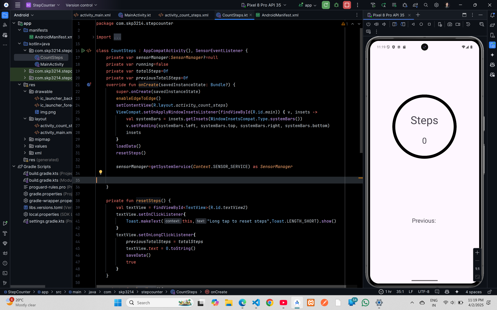

# Step Counter



## XML Code
### `AndroidManifest.xml`
```xml
<?xml version="1.0" encoding="utf-8"?>
<manifest xmlns:android="http://schemas.android.com/apk/res/android"
    xmlns:tools="http://schemas.android.com/tools">

    <application
        android:allowBackup="true"
        android:dataExtractionRules="@xml/data_extraction_rules"
        android:fullBackupContent="@xml/backup_rules"
        android:icon="@mipmap/ic_launcher"
        android:label="@string/app_name"
        android:roundIcon="@mipmap/ic_launcher_round"
        android:supportsRtl="true"
        android:theme="@style/Theme.StepCounter"
        tools:targetApi="31">
        <activity
            android:name=".MainActivity"
            android:exported="false" />
        <activity
            android:name=".CountSteps"
            android:exported="true">
            <intent-filter>
                <action android:name="android.intent.action.MAIN" />

                <category android:name="android.intent.category.LAUNCHER" />
            </intent-filter>
        </activity>
    </application>

</manifest>
```
### `activity_main.xml`
```xml
<?xml version="1.0" encoding="utf-8"?>
<androidx.constraintlayout.widget.ConstraintLayout xmlns:android="http://schemas.android.com/apk/res/android"
    xmlns:app="http://schemas.android.com/apk/res-auto"
    xmlns:tools="http://schemas.android.com/tools"
    android:id="@+id/main"
    android:layout_width="match_parent"
    android:layout_height="match_parent"
    tools:context=".MainActivity">

    <TextView
        android:layout_width="wrap_content"
        android:layout_height="wrap_content"
        android:text="Hello World!"
        app:layout_constraintBottom_toBottomOf="parent"
        app:layout_constraintEnd_toEndOf="parent"
        app:layout_constraintStart_toStartOf="parent"
        app:layout_constraintTop_toTopOf="parent" />

</androidx.constraintlayout.widget.ConstraintLayout>
```

### `activity_count_steps.xml`
```xml
<?xml version="1.0" encoding="utf-8"?>
<androidx.constraintlayout.widget.ConstraintLayout xmlns:android="http://schemas.android.com/apk/res/android"
    xmlns:app="http://schemas.android.com/apk/res-auto"
    xmlns:tools="http://schemas.android.com/tools"
    android:id="@+id/main"
    android:layout_width="match_parent"
    android:layout_height="match_parent"
    tools:context=".CountSteps">


    <ImageView
        android:id="@+id/imageView"
        android:layout_width="300dp"
        android:layout_height="300dp"
        android:layout_marginTop="152dp"
        android:scaleType="fitCenter"
        android:src="@drawable/img"
        app:layout_constraintEnd_toEndOf="parent"
        app:layout_constraintHorizontal_bias="0.495"
        app:layout_constraintStart_toStartOf="parent"
        app:layout_constraintTop_toTopOf="parent" />

    <TextView
        android:id="@+id/textView"
        android:layout_width="wrap_content"
        android:layout_height="wrap_content"
        android:layout_marginTop="92dp"
        android:text="Steps"
        android:textSize="45sp"
        app:layout_constraintEnd_toEndOf="parent"
        app:layout_constraintHorizontal_bias="0.498"
        app:layout_constraintStart_toStartOf="parent"
        app:layout_constraintTop_toTopOf="@+id/imageView" />

    <TextView
        android:id="@+id/textView2"
        android:layout_width="wrap_content"
        android:layout_height="wrap_content"
        android:text="0"
        android:textSize="34sp"
        app:layout_constraintBottom_toBottomOf="@+id/imageView"
        app:layout_constraintEnd_toEndOf="parent"
        app:layout_constraintHorizontal_bias="0.498"
        app:layout_constraintStart_toStartOf="parent"
        app:layout_constraintTop_toBottomOf="@+id/textView"
        app:layout_constraintVertical_bias="0.311" />

    <TextView
        android:id="@+id/textView3"
        android:layout_width="wrap_content"
        android:layout_height="wrap_content"
        android:text="Previous: "
        android:textSize="24sp"
        app:layout_constraintBottom_toBottomOf="parent"
        app:layout_constraintEnd_toEndOf="parent"
        app:layout_constraintStart_toStartOf="parent"
        app:layout_constraintTop_toBottomOf="@+id/imageView" />
</androidx.constraintlayout.widget.ConstraintLayout>
```

## Kotlin Code

### `MainActivity.kt`
```kotlin
package com.skp3214.stepcounter

import android.os.Bundle
import androidx.activity.enableEdgeToEdge
import androidx.appcompat.app.AppCompatActivity
import androidx.core.view.ViewCompat
import androidx.core.view.WindowInsetsCompat

class MainActivity : AppCompatActivity() {
    override fun onCreate(savedInstanceState: Bundle?) {
        super.onCreate(savedInstanceState)
        enableEdgeToEdge()
        setContentView(R.layout.activity_main)
        ViewCompat.setOnApplyWindowInsetsListener(findViewById(R.id.main)) { v, insets ->
            val systemBars = insets.getInsets(WindowInsetsCompat.Type.systemBars())
            v.setPadding(systemBars.left, systemBars.top, systemBars.right, systemBars.bottom)
            insets
        }
    }
}
```
### `CountSteps.kt`
```kotlin
package com.skp3214.stepcounter

import android.content.Context
import android.hardware.Sensor
import android.hardware.SensorEvent
import android.hardware.SensorEventListener
import android.hardware.SensorManager
import android.os.Bundle
import android.widget.TextView
import android.widget.Toast
import androidx.activity.enableEdgeToEdge
import androidx.appcompat.app.AppCompatActivity
import androidx.core.view.ViewCompat
import androidx.core.view.WindowInsetsCompat

class CountSteps : AppCompatActivity(), SensorEventListener {
    private var sensorManager:SensorManager?=null
    private var running=false
    private var totalSteps=0f
    private var previousTotalSteps=0f
    override fun onCreate(savedInstanceState: Bundle?) {
        super.onCreate(savedInstanceState)
        enableEdgeToEdge()
        setContentView(R.layout.activity_count_steps)
        ViewCompat.setOnApplyWindowInsetsListener(findViewById(R.id.main)) { v, insets ->
            val systemBars = insets.getInsets(WindowInsetsCompat.Type.systemBars())
            v.setPadding(systemBars.left, systemBars.top, systemBars.right, systemBars.bottom)
            insets
        }
        loadData()
        resetSteps()

        sensorManager=getSystemService(Context.SENSOR_SERVICE) as SensorManager


    }

    private fun resetSteps() {
        val textView = findViewById<TextView>(R.id.textView2)
        textView.setOnClickListener{
            Toast.makeText(this,"Long tap to reset steps",Toast.LENGTH_SHORT).show()
        }
        textView.setOnLongClickListener{
            previousTotalSteps = totalSteps
            textView.text = 0.toString()
            saveData()
            true
        }
    }

    private fun loadData(){
        val sharedPreferences = getSharedPreferences("myPrefs",Context.MODE_PRIVATE)
        val savedNumber = sharedPreferences.getFloat("key1",0f)
        previousTotalSteps = savedNumber
    }

    private fun saveData(){
        val sharedPreferences = getSharedPreferences("myPrefs",Context.MODE_PRIVATE)
        val editor = sharedPreferences.edit()
        editor.putFloat("key1",previousTotalSteps)
        editor.apply()
    }

    override fun onSensorChanged(event: SensorEvent?) {
        val stepsTaken = findViewById<TextView>(R.id.textView2)
        if(running){
            totalSteps = event!!.values[0]
            val currentSteps = totalSteps.toInt() - previousTotalSteps.toInt()
            stepsTaken.text = ("$currentSteps")
        }
    }

    override fun onAccuracyChanged(p0: Sensor?, p1: Int) {
    }

    override fun onResume() {
        super.onResume()
        running = true
        val stepSensor = sensorManager?.getDefaultSensor(Sensor.TYPE_STEP_COUNTER)
        if(stepSensor == null){
            Toast.makeText(this,"No sensor detected on this device",Toast.LENGTH_SHORT).show()
        }
        else{
            sensorManager?.registerListener(this,stepSensor,SensorManager.SENSOR_DELAY_UI)
        }
    }

    override fun onPause() {
        super.onPause()
        running = false
        sensorManager?.unregisterListener(this)
    }
}

```