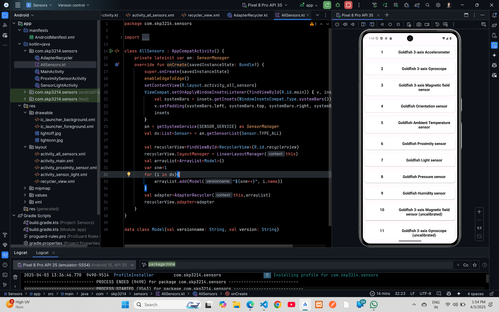

# All Sensors



## XML Code
### `AndroidManifest.xml`
```xml
<?xml version="1.0" encoding="utf-8"?>
<manifest xmlns:android="http://schemas.android.com/apk/res/android"
    xmlns:tools="http://schemas.android.com/tools">

    <application
        android:allowBackup="true"
        android:dataExtractionRules="@xml/data_extraction_rules"
        android:fullBackupContent="@xml/backup_rules"
        android:icon="@mipmap/ic_launcher"
        android:label="@string/app_name"
        android:roundIcon="@mipmap/ic_launcher_round"
        android:supportsRtl="true"
        android:theme="@style/Theme.StepCounter"
        tools:targetApi="31">
        <activity
            android:name=".MainActivity"
            android:exported="false" />
        <activity
            android:name=".AllSensors"
            android:exported="true">
            <intent-filter>
                <action android:name="android.intent.action.MAIN" />

                <category android:name="android.intent.category.LAUNCHER" />
            </intent-filter>
        </activity>
    </application>

</manifest>
```
### `activity_main.xml`
```xml
<?xml version="1.0" encoding="utf-8"?>
<androidx.constraintlayout.widget.ConstraintLayout xmlns:android="http://schemas.android.com/apk/res/android"
    xmlns:app="http://schemas.android.com/apk/res-auto"
    xmlns:tools="http://schemas.android.com/tools"
    android:id="@+id/main"
    android:layout_width="match_parent"
    android:layout_height="match_parent"
    tools:context=".MainActivity">

    <TextView
        android:layout_width="wrap_content"
        android:layout_height="wrap_content"
        android:text="Hello World!"
        app:layout_constraintBottom_toBottomOf="parent"
        app:layout_constraintEnd_toEndOf="parent"
        app:layout_constraintStart_toStartOf="parent"
        app:layout_constraintTop_toTopOf="parent" />

</androidx.constraintlayout.widget.ConstraintLayout>
```
### `activity_all_sensors.xml`
```xml
<?xml version="1.0" encoding="utf-8"?>
<RelativeLayout xmlns:android="http://schemas.android.com/apk/res/android"
    xmlns:tools="http://schemas.android.com/tools"
    android:id="@+id/main"
    android:layout_width="match_parent"
    android:layout_height="match_parent"
    tools:context=".AllSensors">

    <androidx.recyclerview.widget.RecyclerView
        android:layout_width="match_parent"
        android:layout_height="match_parent"
        android:id="@+id/recyclerview"/>

</RelativeLayout>
```

### `recycler_view_item.xml`
```xml
<?xml version="1.0" encoding="utf-8"?>
<LinearLayout xmlns:android="http://schemas.android.com/apk/res/android"
    android:layout_width="match_parent"
    android:layout_height="wrap_content"
    xmlns:app="http://schemas.android.com/apk/res-auto"
    android:padding="6dp"
    android:orientation="horizontal">

    <androidx.cardview.widget.CardView
        android:layout_width="match_parent"
        android:layout_height="wrap_content"
        app:cardCornerRadius="10dp"
        app:contentPadding="6dp"
        android:layout_margin="4dp"
        android:scrollbars="vertical"
        android:focusable="true">

        <LinearLayout
            android:layout_width="match_parent"
            android:layout_height="match_parent"
            android:padding="8dp"
            android:orientation="horizontal">

            <TextView
                android:id="@+id/version_name"
                android:layout_width="0dp"
                android:layout_height="wrap_content"
                android:layout_weight="1"
                android:gravity="center"
                android:padding="3dp"
                android:text="Version Name"
                android:textColor="@color/black"
                android:textSize="18sp"
                android:textStyle="bold" />

            <TextView
                android:id="@+id/version"
                android:layout_width="132dp"
                android:layout_height="wrap_content"
                android:layout_weight="1"
                android:gravity="center"
                android:padding="3dp"
                android:text="Version"
                android:textColor="@color/black"
                android:textSize="18sp"
                android:textStyle="bold" />

        </LinearLayout>
    </androidx.cardview.widget.CardView>

</LinearLayout>
```

## Kotlin Code

### `MainActivity.kt`
```kotlin
package com.skp3214.stepcounter

import android.os.Bundle
import androidx.activity.enableEdgeToEdge
import androidx.appcompat.app.AppCompatActivity
import androidx.core.view.ViewCompat
import androidx.core.view.WindowInsetsCompat

class MainActivity : AppCompatActivity() {
    override fun onCreate(savedInstanceState: Bundle?) {
        super.onCreate(savedInstanceState)
        enableEdgeToEdge()
        setContentView(R.layout.activity_main)
        ViewCompat.setOnApplyWindowInsetsListener(findViewById(R.id.main)) { v, insets ->
            val systemBars = insets.getInsets(WindowInsetsCompat.Type.systemBars())
            v.setPadding(systemBars.left, systemBars.top, systemBars.right, systemBars.bottom)
            insets
        }
    }
}
```
### `AllSensors.kt`
```kotlin
package com.skp3214.sensors

import android.hardware.Sensor
import android.hardware.SensorManager
import android.os.Bundle
import android.util.Log
import androidx.activity.enableEdgeToEdge
import androidx.appcompat.app.AppCompatActivity
import androidx.core.view.ViewCompat
import androidx.core.view.WindowInsetsCompat
import androidx.recyclerview.widget.LinearLayoutManager
import androidx.recyclerview.widget.RecyclerView

class AllSensors : AppCompatActivity() {
    private lateinit var sn: SensorManager
    override fun onCreate(savedInstanceState: Bundle?) {
        super.onCreate(savedInstanceState)
        enableEdgeToEdge()
        setContentView(R.layout.activity_all_sensors)
        ViewCompat.setOnApplyWindowInsetsListener(findViewById(R.id.main)) { v, insets ->
            val systemBars = insets.getInsets(WindowInsetsCompat.Type.systemBars())
            v.setPadding(systemBars.left, systemBars.top, systemBars.right, systemBars.bottom)
            insets
        }
        sn = getSystemService(SENSOR_SERVICE) as SensorManager
        val dv:List<Sensor> = sn.getSensorList(Sensor.TYPE_ALL)

        val recyclerView=findViewById<RecyclerView>(R.id.recyclerview)
        recyclerView.layoutManager = LinearLayoutManager(this)
        val arrayList=ArrayList<Model>()
        var snm=1
        for (i in dv){
            arrayList.add(Model("${snm++}", i.name))
        }
        val adapter=AdapterRecycler(this,arrayList)
        recyclerView.adapter=adapter
    }
}

data class Model(val versionname: String, val version: String)
```

### `AdapterRecycler.kt`
```kotlin
package com.skp3214.sensors

import android.content.Context
import android.view.LayoutInflater
import android.view.View
import android.view.ViewGroup
import android.widget.TextView
import androidx.recyclerview.widget.RecyclerView

class AdapterRecycler(private val context:Context, private val arrayList:ArrayList<Model>):RecyclerView.Adapter<AdapterRecycler.MyHolder>(){

    override fun onCreateViewHolder(parent: ViewGroup, viewType: Int): MyHolder {
        val view=LayoutInflater.from(context).inflate(R.layout.recycler_view,parent,false)
        return MyHolder(view)
    }

    override fun onBindViewHolder(holder:MyHolder, position: Int) {
        val item=arrayList[position]
        holder.versionname.text=item.versionname
        holder.version.text=item.version
    }

    override fun getItemCount(): Int {
        return arrayList.size
    }

    class MyHolder(view: View):RecyclerView.ViewHolder(view){
        val versionname: TextView = view.findViewById(R.id.version_name)
        val version: TextView = view.findViewById(R.id.version)

    }
}
```
