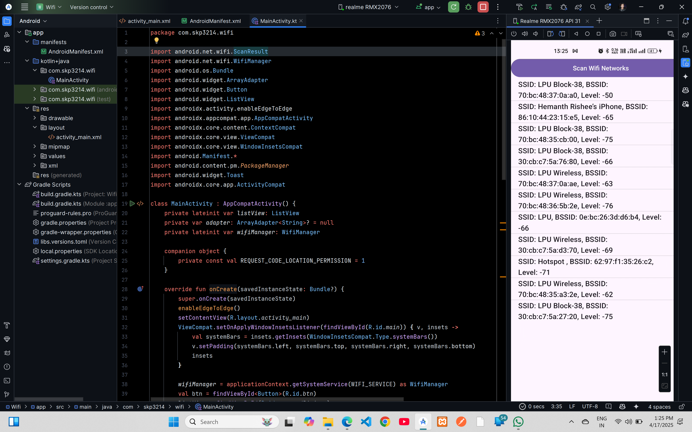

# Wifi (Available Devices)


## XML Code

### `AndroidManifest.xml`

```xml
<?xml version="1.0" encoding="utf-8"?>
<manifest xmlns:android="http://schemas.android.com/apk/res/android"
    xmlns:tools="http://schemas.android.com/tools">

    <uses-permission android:name="android.permission.ACTIVITY_RECOGNITION"/>
    <uses-permission android:name="android.permission.INTERNET"/>
    <uses-permission android:name="android.permission.BLUETOOTH_ADMIN"/>
    <uses-permission android:name="android.permission.BLUETOOTH_CONNECT"/>
    <uses-permission android:name="android.permission.BLUETOOTH"/>
    <uses-permission android:name="android.hardware.bluetooth"/>
    <uses-permission android:name="android.permission.BLUETOOTH_SCAN"
        android:usesPermissionFlags="neverForLocation"/>
    <uses-permission android:name="android.permission.ACCESS_FINE_LOCATION"/>
    <uses-permission android:name="android.permission.ACCESS_WIFI_STATE"/>
    <uses-permission android:name="android.permission.CHANGE_WIFI_STATE"/>
    <uses-permission android:name="android.permission.ACCESS_COARSE_LOCATION"/>

    <application
        android:allowBackup="true"
        android:dataExtractionRules="@xml/data_extraction_rules"
        android:fullBackupContent="@xml/backup_rules"
        android:icon="@mipmap/ic_launcher"
        android:label="@string/app_name"
        android:roundIcon="@mipmap/ic_launcher_round"
        android:supportsRtl="true"
        android:theme="@style/Theme.Wifi"
        tools:targetApi="31">
        <activity
            android:name=".MainActivity"
            android:exported="true">
            <intent-filter>
                <action android:name="android.intent.action.MAIN" />

                <category android:name="android.intent.category.LAUNCHER" />
            </intent-filter>
        </activity>
    </application>

</manifest>
```

### `activity_main.xml`

```xml
<?xml version="1.0" encoding="utf-8"?>
<LinearLayout xmlns:android="http://schemas.android.com/apk/res/android"
    xmlns:app="http://schemas.android.com/apk/res-auto"
    xmlns:tools="http://schemas.android.com/tools"
    android:id="@+id/main"
    android:layout_width="match_parent"
    android:layout_height="match_parent"
    android:orientation="vertical"
    tools:context=".MainActivity">

    <Button
        android:id="@+id/btn"
        android:layout_width="398dp"
        android:layout_height="wrap_content"
        android:text="Scan Wifi Networks"
        app:layout_constraintBottom_toBottomOf="parent"
        app:layout_constraintEnd_toEndOf="parent"
        app:layout_constraintStart_toStartOf="parent"
        app:layout_constraintTop_toTopOf="parent" />

    <ListView
        android:id="@+id/scannedDivices"
        android:layout_width="match_parent"
        android:layout_height="wrap_content"/>

</LinearLayout>
```

## Kotlin Code

### `MainActivity.kt`

```kt
package com.skp3214.wifi

import android.net.wifi.ScanResult
import android.net.wifi.WifiManager
import android.os.Bundle
import android.widget.ArrayAdapter
import android.widget.Button
import android.widget.ListView
import androidx.activity.enableEdgeToEdge
import androidx.appcompat.app.AppCompatActivity
import androidx.core.content.ContextCompat
import androidx.core.view.ViewCompat
import androidx.core.view.WindowInsetsCompat
import android.Manifest.*
import android.content.pm.PackageManager
import android.widget.Toast
import androidx.core.app.ActivityCompat

class MainActivity : AppCompatActivity() {
    private lateinit var listView: ListView
    private var adapter: ArrayAdapter<String>? = null
    private lateinit var wifiManager: WifiManager

    companion object {
        private const val REQUEST_CODE_LOCATION_PERMISSION = 1
    }

    override fun onCreate(savedInstanceState: Bundle?) {
        super.onCreate(savedInstanceState)
        enableEdgeToEdge()
        setContentView(R.layout.activity_main)
        ViewCompat.setOnApplyWindowInsetsListener(findViewById(R.id.main)) { v, insets ->
            val systemBars = insets.getInsets(WindowInsetsCompat.Type.systemBars())
            v.setPadding(systemBars.left, systemBars.top, systemBars.right, systemBars.bottom)
            insets
        }

        wifiManager = applicationContext.getSystemService(WIFI_SERVICE) as WifiManager
        val btn = findViewById<Button>(R.id.btn)
        listView = findViewById(R.id.scannedDivices)
        if (ContextCompat.checkSelfPermission(this, permission.ACCESS_FINE_LOCATION) != PackageManager.PERMISSION_GRANTED) {
            ActivityCompat.requestPermissions(
                this,
                arrayOf(permission.ACCESS_FINE_LOCATION),
                REQUEST_CODE_LOCATION_PERMISSION
            )
        }
        btn.setOnClickListener {
            if (ContextCompat.checkSelfPermission(this, permission.ACCESS_FINE_LOCATION) == PackageManager.PERMISSION_GRANTED) {
                if (!wifiManager.isWifiEnabled) {
                    Toast.makeText(this, "Wifi is not enabled", Toast.LENGTH_SHORT).show()
                    wifiManager.isWifiEnabled = true
                }
                wifiManager.startScan()
                val scanResult = wifiManager.scanResults
                displayWifiNetworks(scanResult)
            } else {
                Toast.makeText(this, "Location Permission is required", Toast.LENGTH_SHORT).show()
            }
        }
    }

    private fun displayWifiNetworks(scanResults: List<ScanResult>) {
        val list = ArrayList<String>()
        if (scanResults.isNotEmpty()) {
            for (scanResult in scanResults) {
                val ssid = scanResult.SSID
                val bssid = scanResult.BSSID
                val level = scanResult.level
                list.add("SSID: $ssid, BSSID: $bssid, Level: $level")
            }
            adapter = ArrayAdapter(this, android.R.layout.simple_list_item_1, list)
            listView.adapter = adapter
        }
        else{
            Toast.makeText(this, "No Wifi Networks Found", Toast.LENGTH_SHORT).show()
        }
    }

    override fun onRequestPermissionsResult(
        requestCode: Int,
        permissions: Array<out String>,
        grantResults: IntArray
    ) {
        super.onRequestPermissionsResult(requestCode, permissions, grantResults)
        if(requestCode == REQUEST_CODE_LOCATION_PERMISSION){
            if(grantResults.isNotEmpty() && grantResults[0] == PackageManager.PERMISSION_GRANTED){
                Toast.makeText(this, "Permission Granted", Toast.LENGTH_SHORT).show()
            }
            else{
                Toast.makeText(this, "Location Permission is required", Toast.LENGTH_SHORT).show()
            }
        }
    }
}
```