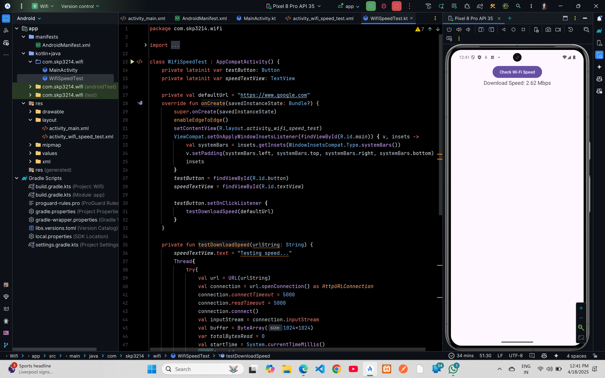

# Wifi Speed Test


## XML Code

### `AndroidManifest.xml`

```xml
<?xml version="1.0" encoding="utf-8"?>
<manifest xmlns:android="http://schemas.android.com/apk/res/android"
    xmlns:tools="http://schemas.android.com/tools">

    <uses-permission android:name="android.permission.ACTIVITY_RECOGNITION" />
    <uses-permission android:name="android.permission.INTERNET" />
    <uses-permission android:name="android.permission.BLUETOOTH_ADMIN" />
    <uses-permission android:name="android.permission.BLUETOOTH_CONNECT" />
    <uses-permission android:name="android.permission.BLUETOOTH" />
    <uses-permission android:name="android.hardware.bluetooth" />
    <uses-permission
        android:name="android.permission.BLUETOOTH_SCAN"
        android:usesPermissionFlags="neverForLocation" />
    <uses-permission android:name="android.permission.ACCESS_FINE_LOCATION" />
    <uses-permission android:name="android.permission.ACCESS_WIFI_STATE" />
    <uses-permission android:name="android.permission.CHANGE_WIFI_STATE" />
    <uses-permission android:name="android.permission.ACCESS_COARSE_LOCATION" />

    <application
        android:allowBackup="true"
        android:dataExtractionRules="@xml/data_extraction_rules"
        android:fullBackupContent="@xml/backup_rules"
        android:icon="@mipmap/ic_launcher"
        android:label="@string/app_name"
        android:roundIcon="@mipmap/ic_launcher_round"
        android:supportsRtl="true"
        android:theme="@style/Theme.Wifi"
        tools:targetApi="31">
        <activity
            android:name=".MainActivity"
            android:exported="false" />
        <activity
            android:name=".WifiSpeedTest"
            android:exported="true">
            <intent-filter>
                <action android:name="android.intent.action.MAIN" />

                <category android:name="android.intent.category.LAUNCHER" />
            </intent-filter>
        </activity>
    </application>

</manifest>
```
### `activity_wifi_speed_test.xml`

```xml
<?xml version="1.0" encoding="utf-8"?>
<androidx.constraintlayout.widget.ConstraintLayout xmlns:android="http://schemas.android.com/apk/res/android"
    xmlns:app="http://schemas.android.com/apk/res-auto"
    xmlns:tools="http://schemas.android.com/tools"
    android:id="@+id/main"
    android:layout_width="match_parent"
    android:layout_height="match_parent"
    tools:context=".WifiSpeedTest">

    <Button
        android:id="@+id/button"
        android:layout_width="wrap_content"
        android:layout_height="wrap_content"
        android:text="Check Wi-Fi Speed"
        app:layout_constraintTop_toTopOf="parent"
        app:layout_constraintStart_toStartOf="parent"
        app:layout_constraintEnd_toEndOf="parent"
        app:layout_constraintHorizontal_bias="0.5"
        app:layout_constraintVertical_bias="0.3" />

    <TextView
        android:id="@+id/textView"
        android:layout_width="wrap_content"
        android:layout_height="wrap_content"
        android:text="Wi-Fi speed will be displayed here"
        android:textSize="18sp"
        app:layout_constraintTop_toBottomOf="@id/button"
        app:layout_constraintStart_toStartOf="parent"
        app:layout_constraintEnd_toEndOf="parent"
        app:layout_constraintHorizontal_bias="0.5"
        app:layout_constraintVertical_bias="0.1" />
</androidx.constraintlayout.widget.ConstraintLayout>
```

## Kotlin Code

### `WifiSpeedTest.kt`

```kt
package com.skp3214.wifi

import android.os.Bundle
import android.widget.Button
import android.widget.TextView
import androidx.activity.enableEdgeToEdge
import androidx.appcompat.app.AppCompatActivity
import androidx.core.view.ViewCompat
import androidx.core.view.WindowInsetsCompat
import java.net.HttpURLConnection
import java.net.URL

class WifiSpeedTest : AppCompatActivity() {
    private lateinit var testButton: Button
    private lateinit var speedTextView: TextView

    private val defaultUrl = "https://www.google.com"
    override fun onCreate(savedInstanceState: Bundle?) {
        super.onCreate(savedInstanceState)
        enableEdgeToEdge()
        setContentView(R.layout.activity_wifi_speed_test)
        ViewCompat.setOnApplyWindowInsetsListener(findViewById(R.id.main)) { v, insets ->
            val systemBars = insets.getInsets(WindowInsetsCompat.Type.systemBars())
            v.setPadding(systemBars.left, systemBars.top, systemBars.right, systemBars.bottom)
            insets
        }
        testButton = findViewById(R.id.button)
        speedTextView = findViewById(R.id.textView)

        testButton.setOnClickListener {
            testDownloadSpeed(defaultUrl)
        }
    }

    private fun testDownloadSpeed(urlString: String) {
        speedTextView.text = "Testing speed..."
        Thread{
            try{
                val url = URL(urlString)
                val connection = url.openConnection() as HttpURLConnection
                connection.connectTimeout = 5000
                connection.readTimeout = 5000
                connection.connect()
                val inputStream = connection.inputStream
                val buffer = ByteArray(1024*1024)
                var totalBytesRead = 0
                val startTime = System.currentTimeMillis()
                while(true){
                    val bytesRead = inputStream.read(buffer)
                    if(bytesRead == -1){
                        break
                    }
                    totalBytesRead += bytesRead
                }
                val endTime = System.currentTimeMillis()
                val duration = (endTime - startTime) / 1000.0
                val downloadSpeed = (totalBytesRead*8.0) / (duration*1024*1024)
                runOnUiThread{
                    speedTextView.text = "Download Speed: ${"%.2f".format(downloadSpeed)} Mbps"
                }
                inputStream.close()
                connection.disconnect()
            }
            catch(_: Exception){
                runOnUiThread{
                    speedTextView.text = "Error testing speed"
                }
            }
        }.start()
    }
}
```