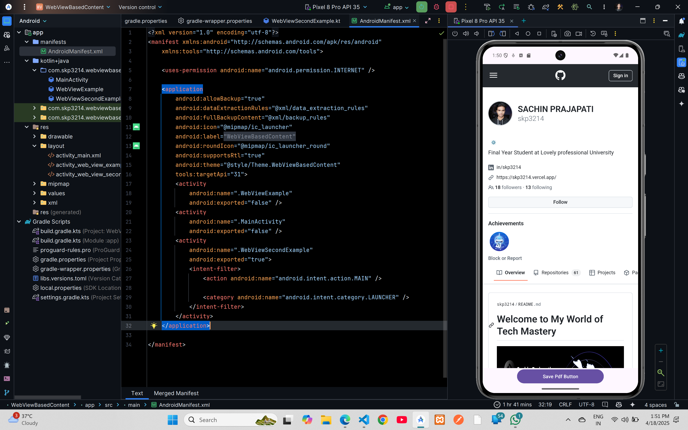

# Print The Web Page 



### XML Code

### `AndroidManifest.xml`

```xml
<?xml version="1.0" encoding="utf-8"?>
<manifest xmlns:android="http://schemas.android.com/apk/res/android"
    xmlns:tools="http://schemas.android.com/tools">

    <uses-permission android:name="android.permission.INTERNET" />

    <application
        android:allowBackup="true"
        android:dataExtractionRules="@xml/data_extraction_rules"
        android:fullBackupContent="@xml/backup_rules"
        android:icon="@mipmap/ic_launcher"
        android:label="@string/app_name"
        android:roundIcon="@mipmap/ic_launcher_round"
        android:supportsRtl="true"
        android:theme="@style/Theme.WebViewBasedContent"
        tools:targetApi="31">

        <activity
            android:name=".MainActivity"
            android:exported="false" />
        <activity
            android:name=".WebViewSecondExample"
            android:exported="true">
            <intent-filter>
                <action android:name="android.intent.action.MAIN" />

                <category android:name="android.intent.category.LAUNCHER" />
            </intent-filter>
        </activity>
    </application>

</manifest>
```

### `activity_web_view_second_example.xml`

```xml
<?xml version="1.0" encoding="utf-8"?>
<androidx.constraintlayout.widget.ConstraintLayout xmlns:android="http://schemas.android.com/apk/res/android"
    xmlns:app="http://schemas.android.com/apk/res-auto"
    xmlns:tools="http://schemas.android.com/tools"
    android:id="@+id/main"
    android:layout_width="match_parent"
    android:layout_height="match_parent"
    tools:context=".WebViewSecondExample">

    <WebView
        android:id="@+id/webView"
        android:layout_width="0dp"
        android:layout_height="0dp"
        app:layout_constraintTop_toTopOf="parent"
        app:layout_constraintBottom_toTopOf="@+id/button2"
        app:layout_constraintStart_toStartOf="parent"
        app:layout_constraintEnd_toEndOf="parent" />

    <Button
        android:id="@+id/button2"
        android:layout_width="250dp"
        android:layout_height="wrap_content"
        android:text="Save Pdf Button"
        app:layout_constraintBottom_toBottomOf="parent"
        app:layout_constraintStart_toStartOf="parent"
        app:layout_constraintEnd_toEndOf="parent" />

</androidx.constraintlayout.widget.ConstraintLayout>
```

## Kotlin Code
### `WebViewSecondExample.kt`

```kotlin
package com.skp3214.webviewbasedcontent

import android.content.Context
import android.os.Bundle
import android.print.PrintAttributes
import android.print.PrintJob
import android.print.PrintManager
import android.webkit.WebView
import android.webkit.WebViewClient
import android.widget.Button
import android.widget.Toast
import androidx.activity.enableEdgeToEdge
import androidx.appcompat.app.AppCompatActivity
import androidx.core.view.ViewCompat
import androidx.core.view.WindowInsetsCompat

class WebViewSecondExample : AppCompatActivity() {
    var printWeb: WebView? = null
    var printJob: PrintJob? = null

    override fun onCreate(savedInstanceState: Bundle?) {
        super.onCreate(savedInstanceState)
        enableEdgeToEdge()
        setContentView(R.layout.activity_web_view_second_example)
        ViewCompat.setOnApplyWindowInsetsListener(findViewById(R.id.main)) { v, insets ->
            val systemBars = insets.getInsets(WindowInsetsCompat.Type.systemBars())
            v.setPadding(systemBars.left, systemBars.top, systemBars.right, systemBars.bottom)
            insets
        }
        val webView: WebView = findViewById(R.id.webView)
        val savePDFBtn: Button = findViewById(R.id.button2)

        webView.webViewClient = object : WebViewClient() {
            override fun onPageFinished(view: WebView?, url: String?) {
                super.onPageFinished(view, url)
                printWeb = webView
            }
        }
        webView.loadUrl("https://github.com/skp3214")
        savePDFBtn.setOnClickListener {
            if (printWeb != null) {
                printTheWebPage(printWeb!!)
            } else {
                Toast.makeText(this, "WebView is Empty", Toast.LENGTH_SHORT).show()
            }
        }
    }

    private var printBtnPressed = false
    private fun printTheWebPage(webView: WebView) {
        printBtnPressed = true
        val printManager = this.getSystemService(Context.PRINT_SERVICE) as PrintManager
        val jobName = getString(R.string.app_name) + " webpage " + webView.url
        val printAdapter = webView.createPrintDocumentAdapter(jobName)
        assert(printManager != null)
        printJob = printManager.print(
            jobName,
            printAdapter,
            PrintAttributes.Builder().build()
        )
    }

    override fun onResume() {
        super.onResume()
        if (printJob != null && printBtnPressed) {
            when {
                printJob!!.isCompleted -> {
                    Toast.makeText(this, "Print Completed", Toast.LENGTH_SHORT).show()
                }
                printJob!!.isFailed -> {
                    Toast.makeText(this, "Print Failed", Toast.LENGTH_SHORT).show()
                }
                printJob!!.isCancelled -> {
                    Toast.makeText(this, "Print Cancelled", Toast.LENGTH_SHORT).show()
                }
                else -> {
                    Toast.makeText(this, "Printing...", Toast.LENGTH_SHORT).show()
                }
            }
            printBtnPressed=false
        }
    }
}
```