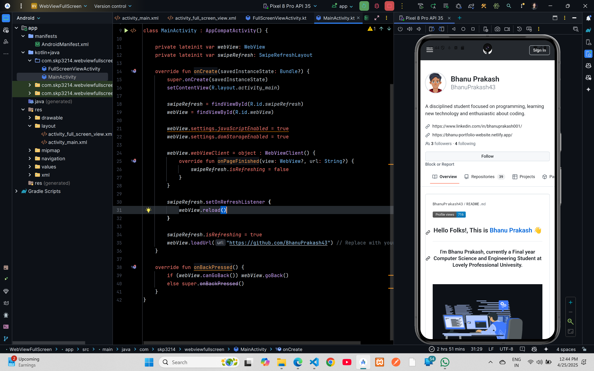

# WebView Refresh Example Code

## XML Code

### `AndroidManifest.xml`

```xml
<?xml version="1.0" encoding="utf-8"?>
<manifest xmlns:android="http://schemas.android.com/apk/res/android"
    xmlns:tools="http://schemas.android.com/tools">

    <uses-permission android:name="android.permission.INTERNET" />

    <application
        android:allowBackup="true"
        android:dataExtractionRules="@xml/data_extraction_rules"
        android:fullBackupContent="@xml/backup_rules"
        android:icon="@mipmap/ic_launcher"
        android:label="@string/app_name"
        android:roundIcon="@mipmap/ic_launcher_round"
        android:supportsRtl="true"
        android:theme="@style/Theme.WebViewFullScreen"
        tools:targetApi="31">
        <activity
            android:name=".MainActivity"
            android:exported="true">
            <intent-filter>
                <action android:name="android.intent.action.MAIN" />

                <category android:name="android.intent.category.LAUNCHER" />
            </intent-filter>
        </activity>
    </application>

</manifest>

### `activity_main.xml`

```xml
<?xml version="1.0" encoding="utf-8"?>
<androidx.swiperefreshlayout.widget.SwipeRefreshLayout xmlns:android="http://schemas.android.com/apk/res/android"
    android:id="@+id/swipeRefresh"
    android:layout_width="match_parent"
    android:layout_height="match_parent">

    <WebView
        android:id="@+id/webView"
        android:layout_width="match_parent"
        android:layout_height="match_parent" />
</androidx.swiperefreshlayout.widget.SwipeRefreshLayout>
```

## Kotlin Code

### `MainActivity.kt`

```kotlin
package com.skp3214.webviewfullscreen

import android.os.Bundle
import android.webkit.WebView
import android.webkit.WebViewClient
import androidx.appcompat.app.AppCompatActivity
import androidx.swiperefreshlayout.widget.SwipeRefreshLayout

class MainActivity : AppCompatActivity() {

    private lateinit var webView: WebView
    private lateinit var swipeRefresh: SwipeRefreshLayout

    override fun onCreate(savedInstanceState: Bundle?) {
        super.onCreate(savedInstanceState)
        setContentView(R.layout.activity_main)

        swipeRefresh = findViewById(R.id.swipeRefresh)
        webView = findViewById(R.id.webView)

        webView.settings.javaScriptEnabled = true
        webView.settings.domStorageEnabled = true

        webView.webViewClient = object : WebViewClient() {
            override fun onPageFinished(view: WebView?, url: String?) {
                swipeRefresh.isRefreshing = false
            }
        }

        swipeRefresh.setOnRefreshListener {
            webView.reload()
        }

        swipeRefresh.isRefreshing = true
        webView.loadUrl("https://github.com/BhanuPrakash43") // Replace with your URL
    }

    override fun onBackPressed() {
        if (webView.canGoBack()) webView.goBack()
        else super.onBackPressed()
    }
}
```