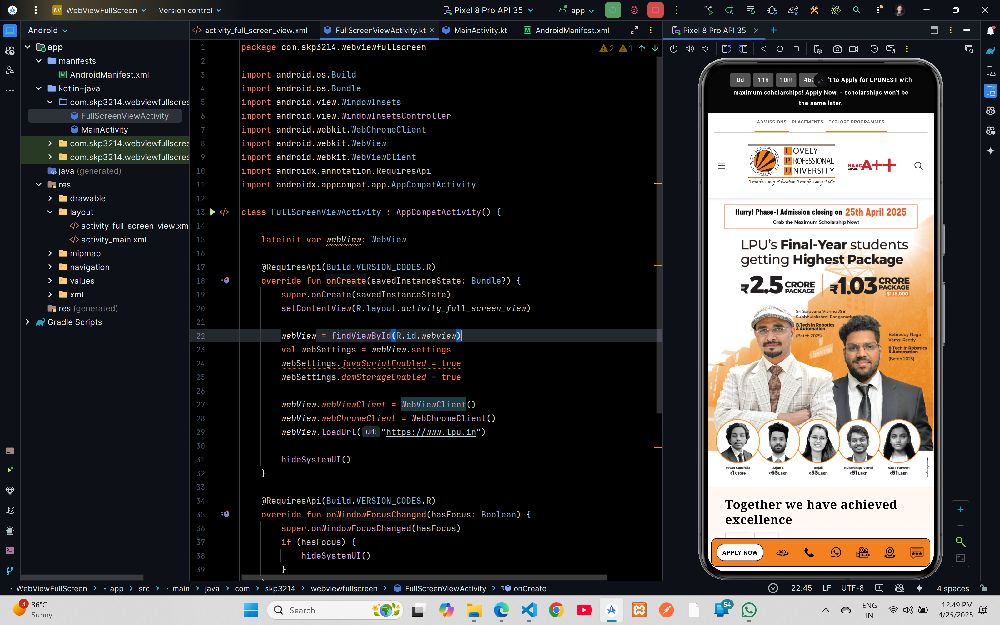

# WebView FullScreen Example



## XML Code

### `AndroidManifest.xml`

```xml

<?xml version="1.0" encoding="utf-8"?>
<manifest xmlns:android="http://schemas.android.com/apk/res/android"
    xmlns:tools="http://schemas.android.com/tools">

    <uses-permission android:name="android.permission.INTERNET" />

    <application
        android:allowBackup="true"
        android:dataExtractionRules="@xml/data_extraction_rules"
        android:fullBackupContent="@xml/backup_rules"
        android:icon="@mipmap/ic_launcher"
        android:label="@string/app_name"
        android:roundIcon="@mipmap/ic_launcher_round"
        android:supportsRtl="true"
        android:theme="@style/Theme.WebViewFullScreen"
        tools:targetApi="31">
        <activity
            android:name=".MainActivity"
            android:exported="false"
            android:theme="@style/Theme.WebViewFullScreen" />
        <activity
            android:name=".FullScreenViewActivity"
            android:exported="true">
            <intent-filter>
                <action android:name="android.intent.action.MAIN" />

                <category android:name="android.intent.category.LAUNCHER" />
            </intent-filter>
        </activity>
    </application>

</manifest>
```

### `activity_full_screen_view.xml`

```xml
<?xml version="1.0" encoding="utf-8"?>
<FrameLayout xmlns:android="http://schemas.android.com/apk/res/android"
    android:layout_width="match_parent"
    android:layout_height="match_parent">

    <WebView
        android:id="@+id/webview"
        android:layout_width="match_parent"
        android:layout_height="match_parent" />
</FrameLayout>
```

## Kotlin Code

### `FullScreenViewActivity.kt`
    
```kotlin
package com.skp3214.webviewfullscreen

import android.os.Build
import android.os.Bundle
import android.view.WindowInsets
import android.view.WindowInsetsController
import android.webkit.WebChromeClient
import android.webkit.WebView
import android.webkit.WebViewClient
import androidx.annotation.RequiresApi
import androidx.appcompat.app.AppCompatActivity

class FullScreenViewActivity : AppCompatActivity() {

    lateinit var webView: WebView

    @RequiresApi(Build.VERSION_CODES.R)
    override fun onCreate(savedInstanceState: Bundle?) {
        super.onCreate(savedInstanceState)
        setContentView(R.layout.activity_full_screen_view)

        webView = findViewById(R.id.webview)
        val webSettings = webView.settings
        webSettings.javaScriptEnabled = true
        webSettings.domStorageEnabled = true

        webView.webViewClient = WebViewClient()
        webView.webChromeClient = WebChromeClient()
        webView.loadUrl("https://www.lpu.in")

        hideSystemUI()
    }

    @RequiresApi(Build.VERSION_CODES.R)
    override fun onWindowFocusChanged(hasFocus: Boolean) {
        super.onWindowFocusChanged(hasFocus)
        if (hasFocus) {
            hideSystemUI()
        }
    }

    @RequiresApi(Build.VERSION_CODES.R)
    private fun hideSystemUI() {
        window.setDecorFitsSystemWindows(false)
        window.insetsController?.let {
            it.hide(WindowInsets.Type.statusBars() or WindowInsets.Type.navigationBars())
            it.systemBarsBehavior =
                WindowInsetsController.BEHAVIOR_SHOW_TRANSIENT_BARS_BY_SWIPE
        }
    }
}
```